### Jenkins - Github Repo 연동

&nbsp;&nbsp;Jenkins 파이프라인을 만들기 위해서는 Jenkins가 프로젝트 레포지토리의 `webhook` 푸시를 감지해 자동 빌드를 할 수 있도록 둘 사이를 연결해주어야 합니다. 이때 Github의 보안 토큰이 필요한데 보안 토큰은 크게 classic과 fine-grained로 나뉩니다.

&nbsp;&nbsp;fine-grained는 특정 레포만을 위한 권한 부여가 가능하므로 저는 fine-grained 토큰을 새로 발급받았으며 토큰의 레포지토리에 대한 권한 설정은 아래와 같이 3가지만 Read-only로 지정해주었습니다.

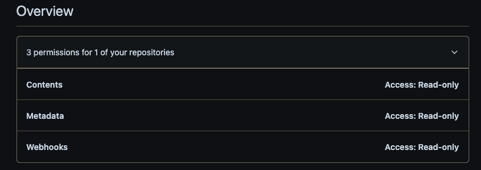

 

&nbsp;&nbsp;이제 발급받은 토큰을 Jenkins에 접속해 등록해줍니다.

 
&nbsp;&nbsp;Github 항목에서 연결할 깃허브 서버를 추가해줍니다. 아래 Credentials의 Add 버튼을 눌러 아까 등록받은 토큰을 Secret Text로 등록합니다.

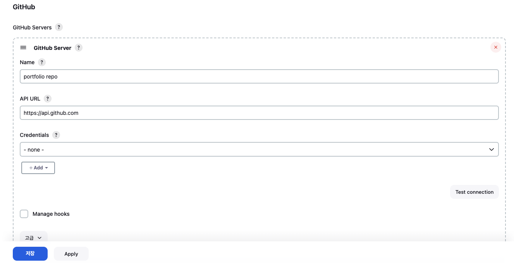

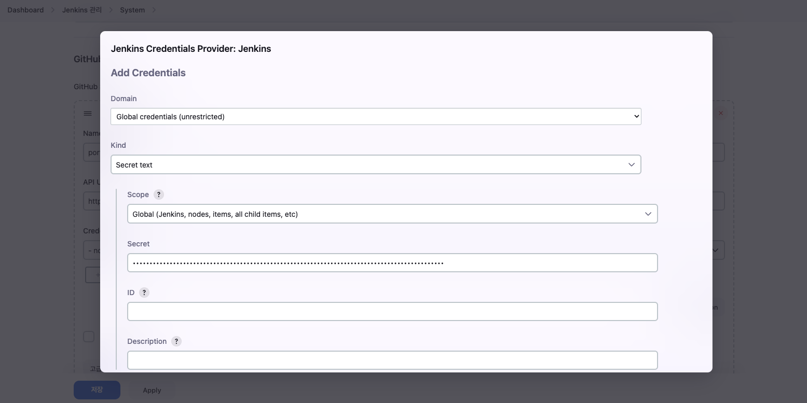

 

&nbsp;&nbsp;등록이 완료되면 Credentials에 등록한 Secret Text를 선택해주고 연결 테스트를 진행해줍니다. 연결이 정상적으로 되었다면 아래와 같이 `Credentials verified for user ... ` 메시지를 확인할 수 있습니다.

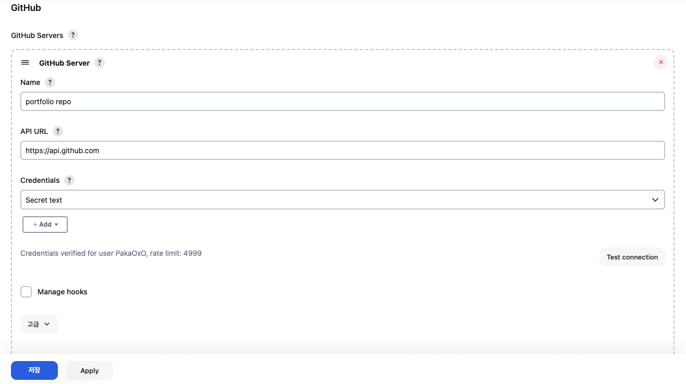

 

### 자동배포 레포 등록

&nbsp;&nbsp;이제는 새로 item을 추가해 자동 배포를 진행할 레포지토리 설정을 진행합니다. 아래 그림과 같이 '새로운 Item'을 선택해 식별하기 쉽게 Repo 이름으로 프로젝트를 pipeline을 선택한 뒤 등록해줍니다.

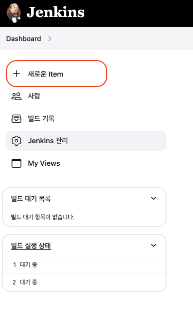

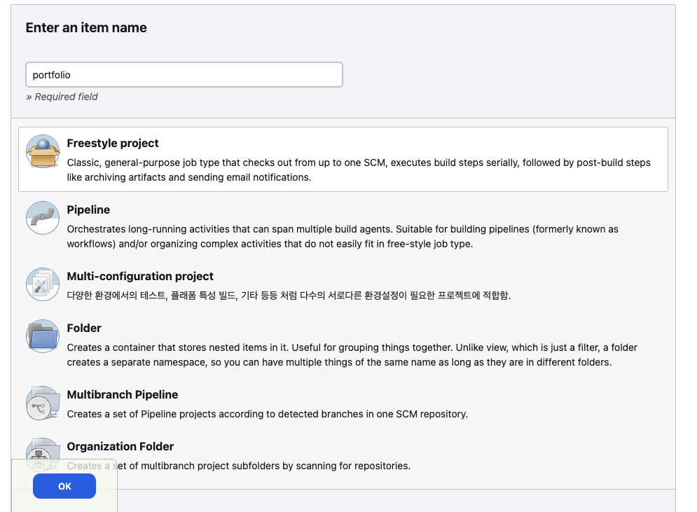

 

&nbsp;&nbsp;먼저 'Build Triggers' 목록에서 "Github hook trigger for GITScm polling"을 체크해주어 Github에서 webhook이 트리거 되었을 때 자동으로 빌드를 유발할 수 있도록 합니다.

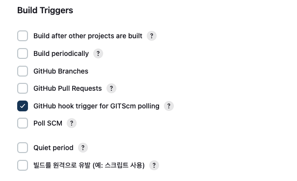

 

&nbsp;&nbsp;추가로 이후 특정 브랜치를 지정해 빌드가 가능하도록 스크립트에 변수를 추가할 수 있도록 아래와 같이 체크를 해두었습니다.

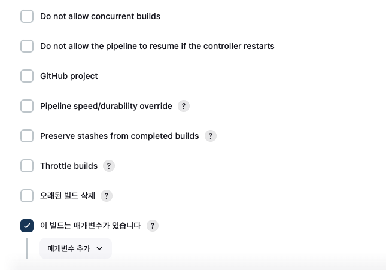

 

**Pipeline Script**

&nbsp;&nbsp;조금 더 아래로 스크롤하다 보면 `pipeline script`칸을 확인할 수 있습니다. `pipeline script`는 `pipeline`을 구성하기 위해 작업 내용을 스크립트 형태로 작성해서 사용합니다. 

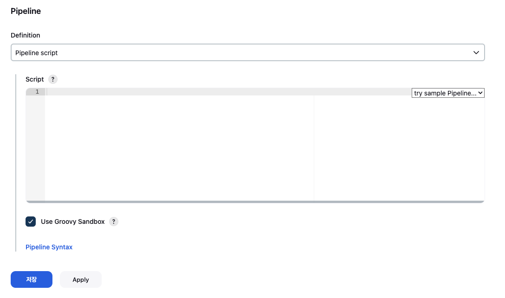

 

>[!tip] Jenkins Job
>
>&nbsp;&nbsp;`Pipeline Script`는 Jenkins가 수행할 빌드, 테스트, 배포 등의 작업, 즉 `Jenkins Job`

 

>[!caution] Credentials에 등록한 설정이 나오지 않을 경우
>
>&nbsp;&nbsp;저의 경우 Secret Text로 등록한 Credential이 목록에 뜨지 않았습니다. 결국 id/pw로 새롭게 Credential을 등록하니 목록에 뜨기 시작해 해당 설정값을 대신 등록해주었습니다.

 
 

### Push Event Webhook 설정

&nbsp;&nbsp;Repo에 새롭게 변경된 코드가 추가되어 push 이벤트가 발생하면 Webhook 설정이 되어 있는 Jenkins는 변경된 코드를 통해 빌드를 자동으로 진행합니다.

&nbsp;&nbsp;'Jenkins 관리'에서 'Available plugins'를 클릭해 'github integration'을 검색한 뒤 설치해준뒤, Jenkins를 재시작합니다.

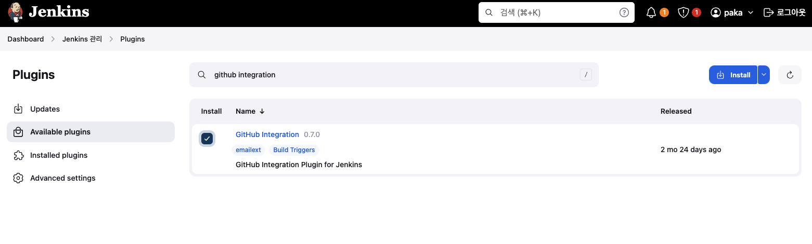

 

### Github repo Webhook 설정

&nbsp;&nbsp;이제 Github repo에 push 이벤트가 발생하면 Webhook 이벤트를 보낼 주소를 지정합니다.

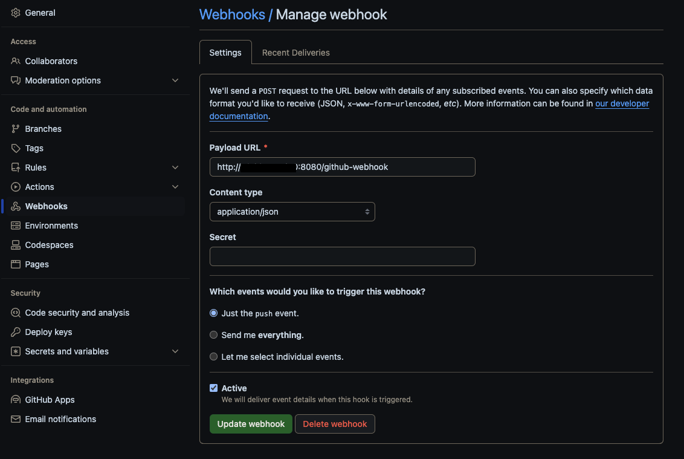

 

**References**
- [Jenkins(젠킨스) CI / CD 구축](https://humanwater.tistory.com/15)
- [AWS 에 Jenkins와 Nginx 이용하여 vue project 올리기](https://zakelstorm.tistory.com/133)
- [Jenkins 공식문서](https://www.jenkins.io/doc/book/installing/linux/)