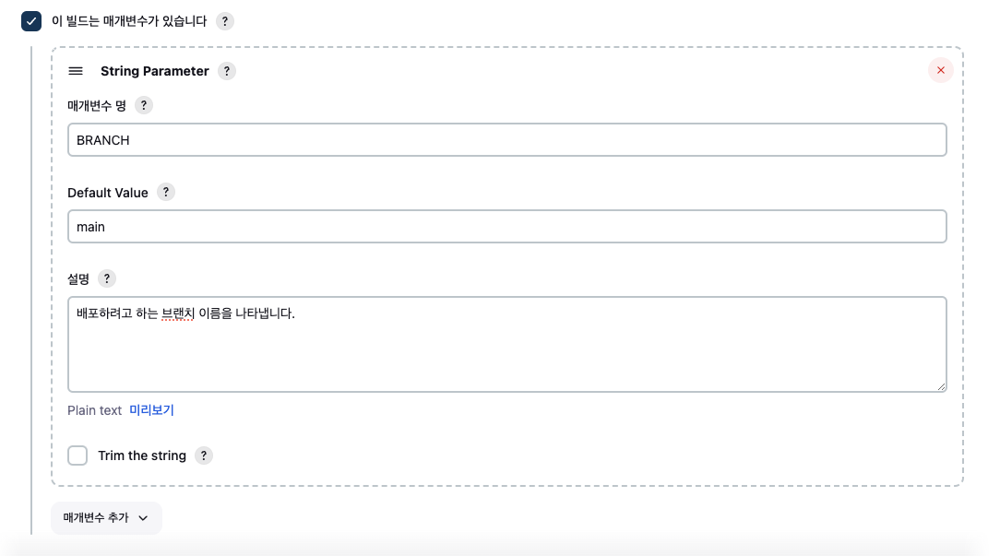

### Jenkins - Github Repo 연동

&nbsp;&nbsp;Jenkins 파이프라인을 만들기 위해서는 Jenkins가 프로젝트 레포지토리의 `webhook` 푸시를 감지해 자동 빌드를 할 수 있도록 둘 사이를 연결해주어야 합니다. 이때 Github의 보안 토큰이 필요한데 보안 토큰은 크게 classic과 fine-grained로 나뉩니다.

&nbsp;&nbsp;fine-grained는 특정 레포만을 위한 권한 부여가 가능하므로 저는 fine-grained 토큰을 새로 발급받았으며 토큰의 레포지토리에 대한 권한 설정은 아래와 같이 3가지만 Read-only로 지정해주었습니다.


<br>

&nbsp;&nbsp;이제 발급받은 토큰을 Jenkins에 접속해 등록해줍니다.


<br>
&nbsp;&nbsp;Github 항목에서 연결할 깃허브 서버를 추가해줍니다. 아래 Credentials의 Add 버튼을 눌러 아까 등록받은 토큰을 Secret Text로 등록합니다.


<br>

&nbsp;&nbsp;등록이 완료되면 Credentials에 등록한 Secret Text를 선택해주고 연결 테스트를 진행해줍니다. 연결이 정상적으로 되었다면 아래와 같이 `Credentials verified for user ... ` 메시지를 확인할 수 있습니다.


<br>

### 자동배포 레포 등록

&nbsp;&nbsp;이제는 새로 item을 추가해 자동 배포를 진행할 레포지토리 설정을 진행합니다. 아래 그림과 같이 '새로운 Item'을 선택해 식별하기 쉽게 Repo 이름으로 프로젝트를 pipeline을 선택한 뒤 등록해줍니다.


<br>

&nbsp;&nbsp;먼저 'Build Triggers' 목록에서 "Github hook trigger for GITScm polling"을 체크해주어 Github에서 webhook이 트리거 되었을 때 자동으로 빌드를 유발할 수 있도록 합니다.


<br>

&nbsp;&nbsp;추가로 이후 특정 브랜치를 지정해 빌드가 가능하도록 스크립트에 변수를 추가할 수 있도록 아래와 같이 체크를 해두었습니다. 매개변수는 이후 `pipeline script`에서 `{BRANCH}`와 같은 형태로 접근할 수 있습니다.



<br>

**Pipeline Script**

&nbsp;&nbsp;조금 더 아래로 스크롤하다 보면 `pipeline script`칸을 확인할 수 있습니다. `pipeline script`는 `pipeline`을 구성하기 위해 작업 내용을 스크립트 형태로 작성해서 사용합니다. 

&nbsp;&nbsp;`Pipeline Script`는 Jenkins가 수행할 빌드, 테스트, 배포 등의 작업, 즉 `Jenkins Job`을 스크립트 형태로 작성하기 위해 사용됩니다.


<br>

&nbsp;&nbsp;아래 `pipeline script`는 다른 분의 [블로그](https://velog.io/@kimsehwan96/Jenkins-Github%EC%9D%84-%EC%9D%B4%EC%9A%A9%ED%95%9C-%EB%A6%AC%EC%95%A1%ED%8A%B8-%EC%95%B1-%EC%9E%90%EB%8F%99-%EB%B0%B0%ED%8F%AC-with-aws-S3)에서 가져온 간단한 스크립트입니다. `pipeline script`는 `stage`로 구분되며 각 stage별로 수행할 작업을 스크립트로 작성할 수 있습니다.

&nbsp;&nbsp;`prepare`단계는 이후 `git clone` 및 `npm install`을, `build`단계에는 `CI=false npm run build` 등 리액트 프로덕션 빌드, `deploy`단계에는 `aws cli`등을 활용해 빌드된 파일을 S3 버킷에 업로드해 정적 호스팅이 가능하도록 각각 필요한 명령어를 수행할 것입니다.

```groovy
pipeline {
    agent any

    stages {
        stage('prepare') {
            steps {
                echo 'prepare'
            }
        }
        stage('build') {
            steps {
                echo 'build'
            }
        }
        stage('deploy') {
            steps {
                echo 'deploy'   
            }
        }
    }
}
```

<br>

### Jenkins Tool 설정 (git, node)

&nbsp;&nbsp;Jenkins 파이프라인은 이후 프로덕션 빌드나 깃 명령어를 수행하기 위해 플러그인이 설치되어 있어야 합니다. 'Jenkins 관리'의 'Plugins'를 선택해 아래와 같이 NodeJS 플러그인을 설치합니다.


<br>

&nbsp;&nbsp;다음은 설치되어 있는 Git과 NodeJS 툴을 위한 설정을 위해 'Jenkins 관리'의 'Tools'를 선택해 설정 페이지로 이동합니다. 이후 아래와 같이 설정을 변경해줍니다. `Name`은 `pipeline script`에서 어떤 이름으로 사용할지 결정하는 내용이므로 평소에 사용하는 명칭으로 각각 `git`과 `node19`(제가 사용하는 프로젝트의 버전에 맞추어 주었습니다)로 지정했습니다.


<br>

&nbsp;&nbsp;설정이 완료되었다면 'Save'를 클릭해 설정값을 저장합니다.

<br>

### Push Event Webhook 설정

&nbsp;&nbsp;Repo에 새롭게 변경된 코드가 추가되어 push 이벤트가 발생하면 Webhook 설정이 되어 있는 Jenkins는 변경된 코드를 통해 빌드를 자동으로 진행합니다. Webhook을 Jenkins에 추가하기 위해 'Jenkins 관리'에서 'Available plugins'를 클릭해 'github integration'을 검색한 뒤 설치해준뒤, Jenkins를 재시작합니다.


<br>

### Github repo Webhook 설정

&nbsp;&nbsp;다음으로 Github repo에 push 이벤트가 발생하면 Webhook 이벤트를 보낼 주소를 지정합니다.


<br>

### Pipeline Script 마무리

&nbsp;&nbsp;이제 본격적으로 `pipeline script`를 통해 Jenkins가 Repo를 클론하고, 의존성을 설치하며, 빌드까지 자동으로 수행하도록 작성해보겠습니다.

```groovy
pipeline {
    agent any
    options { timeout(time: 5, unit: 'MINUTES') }
    tools {
        nodejs "node19"
        git "git"
    }
    stages {
        stage('prepare') {
            steps {
                echo 'prepare'
                 git branch: "${BRANCH}", credentialsId: "CREDENTIAL_ID", url: 'https://github.com/PakaOxO/portfolio.git'
                 sh  'ls -al'
            }
        }
        stage('build') {
            steps {
                    dir('portfolio-client'){
                        sh 'ls -al'
                        sh "npm install"
                        sh "CI=false npm run build"
                }
            }
        }
        stage('deploy') {
            steps {
                sh "ls -al"
                echo 'deploy'   
            }
        }
    }
}
```

<br>

&nbsp;&nbsp;잠깐 스크립트를 살펴보면 모든 단계에서 작성된 `sh 'ls -al`은 각 작업 중인 디렉토리의 구조를 파악하기 위해 작성되었으며, `build`단계의 `dir('portfolio-client`는 작업 대상인 Repo의 React 프로젝트인 portfolio-client 내부로 이동한 뒤 `npm install` 명령어를 수행합니다.

&nbsp;&nbsp;`deploy`단계는 아직 작성되어 있지 않지만 `sh "ls -al"`로 확인된 디렉토리 구조를 보면 `prepare`단계에서의 구조와 동일한 것을 확인할 수 있습니다. 이는 Jenkins job은 Jenkins 내부 `workspace` 공간 내부에서 이루어지기 때문인데, `deploy`단계의 스크립트는 추가로 작성하지 않으며 이번 테스트에서는 S3를 활용한 정적 호스팅을 사용하지 않기 때문에 nginx의 라우팅을 통해 `80`포트로 요청이 들어왔을 때 Jenkins에 의해 빌드된 위치의 `index.html`를 반환하도록 설정했습니다.

<br>

>[!caution] Credentials에 등록한 설정이 나오지 않을 경우
>
>&nbsp;&nbsp;저의 경우 Secret Text로 등록한 Credential이 목록에 뜨지 않았습니다. 결국 id/pw로 새롭게 Credential을 등록하니 목록에 뜨기 시작해 해당 설정값을 대신 등록해주었습니다.

<br>

**References**
- [Jenkins(젠킨스) CI / CD 구축](https://humanwater.tistory.com/15)
- [AWS 에 Jenkins와 Nginx 이용하여 vue project 올리기](https://zakelstorm.tistory.com/133)
- [Jenkins 공식문서](https://www.jenkins.io/doc/book/installing/linux/)
- [Jenkins Github를 이용한 리액트 앱 자동 배포](https://velog.io/@kimsehwan96/Jenkins-Github%EC%9D%84-%EC%9D%B4%EC%9A%A9%ED%95%9C-%EB%A6%AC%EC%95%A1%ED%8A%B8-%EC%95%B1-%EC%9E%90%EB%8F%99-%EB%B0%B0%ED%8F%AC-with-aws-S3)