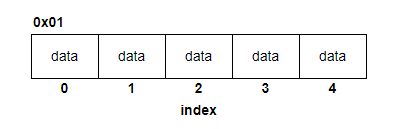
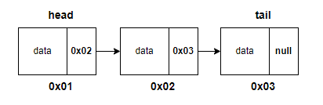
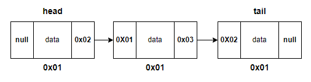

# 📄 **LinkedList**

## **List**

&nbsp;&nbsp;리스트는 크게 배열 기반의 <u>**순차리스트**</u>와 메모리 동적할당을 기반으로 한 <u>**연결리스트**</u>로 구분된다.
<br/><br/>

### **순차리스트(Sequential List)**

- 저장할 데이터를 논리적 순서에 따라 메모리에 연속된 구조로 저장.
- 논리적 구조와 물리적 구조가 일치
- 데이터를 저장할 때 지정된 메모리 영역 안에 연속적으로 빈 자리 없이 저장.
  <br/><br/>

<p align="center">
    
    <p style="text-align:center; font-size: 11px">순차 리스트</p>
</p></br>

#### **장점**

- 배열을 사용하기 때문에 구현이 쉽다.
- 메모리에 연속적으로 저장되기 때문에 <u>**인덱스를 활용**</u>해 빠른 조회가 가능하다.
  <br/><br/>

#### **단점**

- 일반적으로 처음에 할당된 메모리 크기만큼 데이터를 저장하기 때문에 <u>**동적으로 크기를 변경하기 어렵다**</u>.
- 메모리에 연속적으로 저장되기 구조 특성상 <u>데이터의 추가, 삭제가 빈번하게 이루어지는 경우</u>에는 데이터 정렬을 위한 작업이 추가되기 때문에 메모리 활용이 비효율적이다.
  <br/><br/>

### **연결리스트(Sequential List)**

- 메모리의 물리적 위치나 순서에 관계 없이 연결(Link)에 의해 논리적으로 표현된다.
- 논리적 구조와 물리적 구조가 일치하지 않는다.
- 각각의 <u>**데이터는 링크를 통해 연결**</u>되기 때문에 메모리에 연속적으로 저장되지 않는다.
  <br/><br/>

<p align="center">
    
    <p style="text-align:center; font-size: 11px">연결 리스트</p>
</p></br>

#### **장점**

- 링크를 사용해 요소에 접근하기 때문에 데이터의 <u>추가, 삭제가 이루어졌을 때</u> 메모리에 물리적인 순서에 따라 저장할 필요가 없다.
- 크기를 동적으로 조절할 수 있어 <u>**메모리를 효율적으로 사용할 수 있다**</u>.
  <br/><br/>

#### **단점**

- 순차리스트에 비해 구현이 어렵다.
  <br/><br/>

## **LinkedList**

&nbsp;&nbsp;LinkedList는 각 요소가 이전(prev) 또는 다음(next) 요소와 연결(Link)되어 있어 <u>앞 또는 뒤의 요소를 통해</u> 타겟 요소에 접근할 수 있는 자료구조이다. 각 요소가 연결되는 방식에 따라 크게 <u>**단순 연결리스트(SinglyLinkedList)**</u>와 <u>**이중 연결리스트(DoublyLinkedList)**</u>로 구분할 수 있다.
<br/><br/>

### **SinglyLinkedList**

&nbsp;&nbsp;단순 연결리스트는 각 요소가 링크된 <u>다음 요소를 가리키는 포인터를 가진 구조</u>이다. 데이터 조회 시에 뒤의 요소에 접근하기 위해서는 맨 앞 요소인 head부터 차례로 순회하여 접근해야 한다.
<br/><br/>

<p align="center">
    
</p></br>

### **DoublyLinkedList**

&nbsp;&nbsp;이중 연결리스트는 각 요소가 <u>앞/뒤의 요소를 가르키는 포인터를 둘 다 가지고 있는 구조</u>이다. 양쪽 방향으로 순회가 가능하기 때문에 head 혹은 tail부터 데이터를 순회하는 것이 가능하다.
<br/><br/>

<p align="center">
    
</p></br>

### **SinglyLinkedList 구현 (Java)** &nbsp;[[전체코드]](code/SinglyLinkedList.java)

#### **Node**

```java
// link값으로 뒤 요소를 가지고 있음
public class Node<E> {
	E data;
	Node<E> next;

	Node(E data) {
		this.data = data;
	}
}
```

</br>

#### **조회**

```java
E getData(int idx) {
    if (isEmpty()) return null;
    if (idx < 0 || idx >= this.size) return null;
    int i = 0;
    Node<E> curr = head;
    while (i < idx) {
        curr = curr.next;
        i++;
    }
    return curr.data;
}
```

</br>

#### **추가**

```java
void add(E data, int idx) {
    Node<E> node = new Node<>(data);
    Node<E> prev = this.head;
    int i = 1;
    while (i < idx) {
        prev = prev.next;
        i++;
    }
    node.next = prev.next;
    prev.next = node;
    this.size++;
}

```

</br>

#### **삭제**

```java
void remove(int idx) {
    if (isEmpty()) return;
    if (idx == 0) {
        removeHead();
        return;
    }
    if (idx >= this.size()) {
        removeTail();
        return;
    }

    Node<E> prev = this.head;
    int i = 1;
    while (i < idx) {
        prev = prev.next;
        i++;
    }
    prev.next = prev.next.next;
    this.size--;
}

```

</br>

### **DoublyLinkedList 구현 (Java)** &nbsp;[[전체코드]](code/DoublyLinkedList.java)

#### **Node**

```java
// link값으로 앞/뒤 요소를 가지고 있음
class Node<E> {
	E data;
	Node<E> prev;
	Node<E> next;

	Node(E data) {
		this.data = data;
	}
}
```

</br>

#### **조회**&nbsp;:&nbsp;입력 인덱스에 따라 앞/뒤에서 접근

```java
E getData(int idx) {
    if (isEmpty()) return null;
    if (idx < 0 || idx >= this.size) return null;
    // 앞에서 접근
    if (idx < this.size / 2) {
        Node<E> curr = this.head;
        int i = 0;
        while (i < idx) {
            curr = curr.next;
            i++;
        }
        return curr.data;
    // 뒤에서 접근
    } else {
        Node<E> curr = this.tail;
        int i = this.size - 1;
        while (i > idx) {
            curr = curr.prev;
            i--;
        }
        return curr.data;
    }
}
```

</br>

#### **추가**&nbsp;:&nbsp;입력 인덱스에 따라 앞/뒤에서 접근

```java
void add(E data, int idx) {
    if (idx < 0) return;

    if (idx == 0) {
        addAtFirst(data);
        return;
    }

    if (idx >= this.size) {
        addAtLast(data);
        return;
    }

    Node<E> node = new Node<>(data);
    if (isEmpty()) {
        this.head = node;
        this.size++;
        return;
    }
    // 앞에서 접근
    if (idx < this.size / 2) {
        Node<E> curr = this.head;
        int i = 0;
        while (i < idx) {
            curr = curr.next;
            i++;
        }
        node.next = curr;
        node.prev = curr.prev;
        node.next.prev = node;
        node.prev.next = node;
        this.size++;
    // 뒤에서 접근
    } else {
        Node<E> curr = this.tail;
        int i = this.size() - 1;
        while (i > idx) {
            curr = curr.prev;
            i--;
        }
        node.next = curr;
        node.prev = curr.prev;
        node.prev.next = node;
        node.next.prev = node;
        this.size++;
    }
}

```

</br>

#### **삭제**&nbsp;:&nbsp;입력 인덱스에 따라 앞/뒤에서 접근

```java
void remove(int idx) {
    // 앞에서 접근
    if (idx < this.size / 2) {
        int i = 0;
        Node<E> curr = this.head;
        while (i < idx) {
            curr = curr.next;
            i++;
        }
        curr.prev.next = curr.next;
        curr.next.prev = curr.prev;
        this.size--;
    // 뒤에서 접근
    } else {
        int i = this.size - 1;
        Node<E> curr = this.tail;
        while (i > idx) {
            curr = curr.prev;
            i--;
        }
        curr.prev.next = curr.next;
        curr.next.prev = curr.prev;
        this.size--;
    }
}

```

</br>
