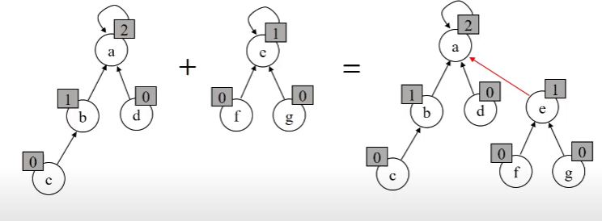

&nbsp;&nbsp;서로소 또는 상호배타 집합은 <u>서로 중복 포함된 원소가 없는 집합</u>이며 바꿔 말하면 교집합이 없는 관계의 집합이라고 할 수 있다. 집합에 속한 하나의 특정 요소를 통해 각 집합을 구분하며 이를 <u>대표자(representative)</u>라 부른다.

 

### **상호배타 집합 연산**

- **makeSet(x)** : x 라는 요소를 대표자로 만드는 연산
- **findSet(x)** : 요소 x가 포함된 집합의 대표자를 가져오는 연산
- **union(x, y)** : 요소 x와 y가 포함된 집합에 대한 합집합 연산, 먼저 연산을 시작하기 전에 대표자를 찾아야 하므로 findSet 연산이 선행되어야 함.
  
   

### **상호배타 집합 연산의 효율성 향상**

1. 현재 노드를 루트로 하는 subtree의 높이를 rank로 지정하여 두 집합을 합칠 때 rank가 낮은 tree를 rank가 높은 tree에 붙일 수 있다.
  

 

2. 해당 집합의 부모 노드를 찾으려 할때 자신의 부모 노드로 반복적으로 이동하는데 있어서 최상위 노드(대표자 노드)를 찾을 때까지의 연산을 반복할 수 있다. 각각의 find-set을 실행하는 과정에서 해당 루트 노드를 구하면 <u>**자신의 부모 노드를 루트 노드로 변경**</u>하여 자신의 자식 노드가 루트 노드를 찾을 때 루트 노드를 돌려주는 방법을 사용하여 효율성을 올릴 수 있다. 이를 **Path Compression**이라 부른다.

 

## **상호배타 집합 표현**

### **연결 리스트**

- 같은 집합의 원소들은 하나의 연결리스트로 관리
- 연결리스트의 맨 앞의 원소를 집합의 대표 원소로 사용
- 각 원소는 집합의 대표 원소를 가리킴

 

### **트리**

- 하나의 집합은 하나의 트리로 표현
- 루트 노드가 대표자로 사용
- 자식노드는 부모 노드를 가리킴
