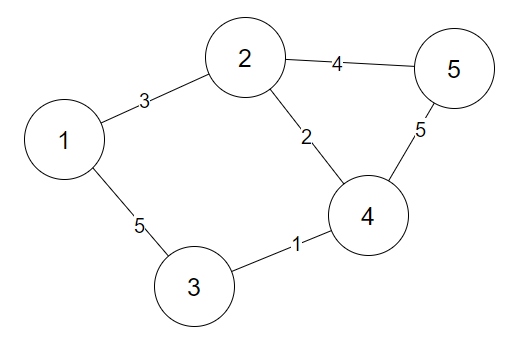
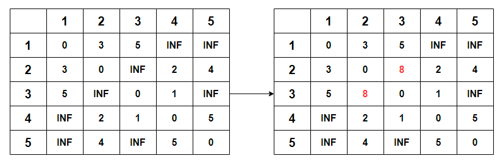

&nbsp;&nbsp;모든 시작정점에서 출발하여 모든 도착정점에 도착하기까지의 최단거리를 구하는 방법으로 <u>Dynamic Programming 방법을 사용</u>하여 부분 최적해를 통한 최종적으로 최단경로를 찾는다. 다익스트라에서 음의 가중치의 대한 해는 구하지 못하지만 플로이드-워셜에서는 <u>음의 가중치에 대한 해를 구하는 것도 가능</u>하다.

<br>

### **과정**



1. 먼저 인접 노드에 대한 간선의 정보를 인접 행렬에 저장한다
2. dist 배열을 만들어 값을 초기화 한다. 시작 정점과 도착 정점이 같으면 0, 도착할 수 없으면 큰 수(INF), 도착할 수 있다면 인접 행렬의 가중치만큼의 값으로 초기화
3. 각각의 노드들을 중간 노드로 하는 최단 경로를 구해 경로값을 갱신한다. (중간 노드는 V개 있으므로 V번 반복)
4. 3의 과정을 모든 시작 정점(V개)와 끝 정점(V개)에 대하여 반복하면서 최단 경로 최적해를 찾는다. 전체 알고리즘은 V x V x V 횟수만큼 진행되므로 시간 복잡도는 $O(V^3)$ 이다
   
<br>

**중간 지점 1을 거쳐 2에서 3으로 도착하는 최단 경로**



<br>

### **Floyed-Warshell 코드**

```java
/* dist 배열 초기화 */
for (int i=1; i<=V; i++) {
    for (int j=1; j<=V; j++) {
        if (i == j) dist[i][j] = 0;
        else if (adjArr[i][j] > 0) dist[i][j] = adjArr[i][j];
        else dist[i][j] = INF;
    }
}

/* 플로이드-워셜 */
for (int k=1; k<=V; k++) {
    for (int i=1; i<=V; i++) {
        for (int j=1; j<=V; j++) {
            dist[i][j] = Math.min(dist[i][j], dist[i][k] + dist[k][j]);
        }
    }
}
```
