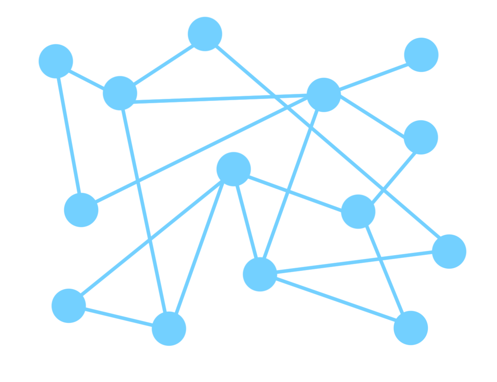
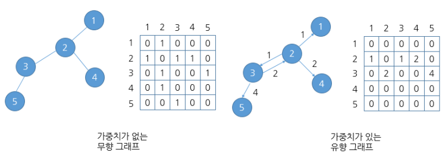
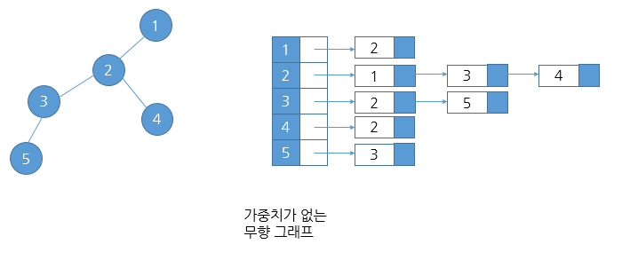

# 📄 **Graph**

## **Graph**

&nbsp;&nbsp;정점(vertex)들의 집합과 이들을 연결하는 간선(edge)들의 집합으로 구성된 자료구조로 선형자료구조나 트리자료구조로 표현하기 어려운 M:N의 관계를 표현할 수 있다.
  

 

### **Graph 용어**

- **정점(node or vertex)** : 데이터를 담는 요소
- **간선 (edge)** : 정점간의 연결관계
- **인접 (adjacent)** : 두 정점 사이에 간선이 존재
- **차수 (degree)** : 하나의 정점에 이어져 있는 간선의 수
- **경로 (path)** : 이어진 정점들의 간선들을 순서대로 나열한 것
    

### **Graph 분류**

1. **무향 그래프 (Undirected Graph) & 유향 그래프 (Directed Graph)**
2. **가중치 그래프 (Weighted Graph)**
3. **순환 그래프 (Cycle Graph)**
4. **사이클 없는 방향 그래프 (DAG, Directed Asyclic Graph)**
    

- 완전 그래프 : 정점들에 대해 가능한 모든 간선들을 가진 그래프
- 부분 그래프 : 원본 그래프에서 일부의 정점이나 간선을 제외한 그래프
  
   

## **Graph의 표현**

### **인접 행렬 (Adjacent Matrix)**

- V X V 크기의 2차원 배열을 이용해 간선의 정보를 저장
- 간선의 수가 적으면 낭비되는 메모리의 공간이 많음
- 두 정점 간 연결 여부를 확인하기에 유리(조회가 빠름)
  
   

### **인접 리스트 (Adjacent List)**

- 각 정점마다 해당 정점으로 가는 간선의 정보를 저장
- 탐색 속도가 빠름(연결된 정점만 체크)

 

### **간선의 배열 (Edge Array)**

- 간선(시작 정점 & 끝 정점)을 배열에 연속적으로 저장
