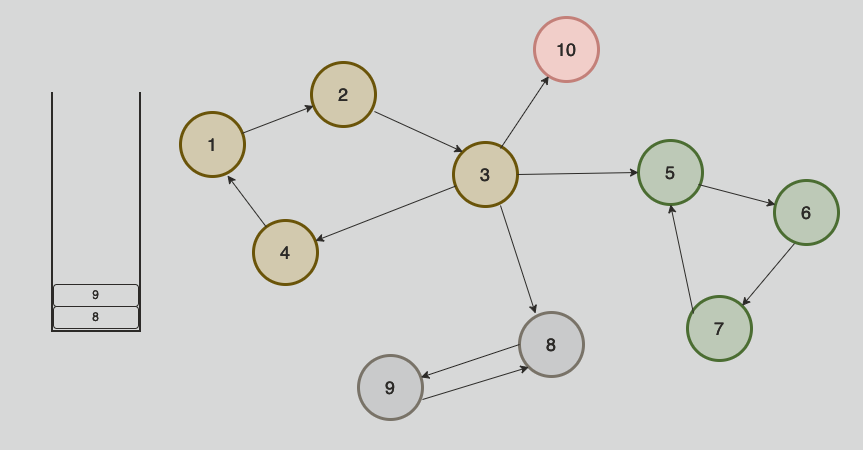

&nbsp;&nbsp;`SCC(Strongly Connected Component)`는 유향 그래프에서 서로 강하게 연결되어있는 부분집합을 가리킵니다. 여기서 강하게 연결 되었음은 사이클에 의해 서로 다른 두 정점이 서로에게 도달할 수 있는 경로가 직접적(혹은 간접적)으로 존재한다는 것을 의미합니다.

&nbsp;&nbsp;무향 그래프에서도 `SCC`를 정의하는 것은 가능합니다. 다만 모든 정점에 대해 양방향 이동이 가능하기 때문에 그래프 전체가 하나의 `SCC`로 묶이게 됩니다.

<br>

### Tarjan 알고리즘

&nbsp;&nbsp;`Tarjan's Algorithm`은 유향 그래프에서서 `SCC`를 그룹화하는 알고리즘 중 하나로 다음과 같은 과정을 거쳐 `SCC`를 그룹화합니다.

1. DFS 그래프 순회를 통해 각 정점을 방문하며 `stack`에 넣고, `이전 방문 여부`와 `SCC 생성 여부`를 확인합니다.
2. 만일 1의 과정 수행 중, 이전에 방문한 노드이면서, SCC로 그룹화 되지 않은 정점을 재방문 하려 한다면 해당 정점을 새로운 SCC의 대표 정점으로 세우고, `stack`을 pop하면서 대표 정점이 나올 때까지의 모든 정점을 하나의 SCC로 그룹화 합니다.

<br>

간단하게 예시를 통해 SCC가 어떻게 생성되는지 과정을 살펴보겠습니다.


&nbsp;&nbsp;정점 1부터 시작하여 그래프를 따라 2,3,4 정점 순서로 방문합니다. 4번 정점에서 다시 1번 정점으로 방문하려는 경우, 1번 정점은 이전 방문을 통해 방문 처리가 되어 있으며, SCC가 아니기 때문에 `stack`에서 1번 정점이 나올 때까지 pop되는 모든 정점을 하나의 SCC로 묶습니다.


&nbsp;&nbsp;`DFS`로 순회 중이므로, 더 이상 방문할 정점이 없는 4번 정점은 `DFS Stack`에서 pop되고, 다시 3번 정점에서 5번 정점으로 이동합니다. 5번 정점에서 다시 위의 과정을 반복하여 5,6,7 정점이 `stack`에 쌓이게 되고, 7번 정점에서 5번 정점을 방문하려 할때 5번 정점은 이미 방문처리가 되어 있기 때문에 `stack`에서 5번 정점이 빠져 나올 때까지 pop되는 모든 정점을 하나의 SCC로 묶습니다.



&nbsp;&nbsp;7번은 더 이상 방문할 정점이 없으므로 `DFS Stack`에서 빠져나와 다시 3번 정점으로 돌아갑니다. 3번 정점은 다음으로 8번 정점으로 이동하고, 9번 정점으로 이동했다가 9번 정점에서 다시 8번 정점으로 이동하려 할 때, 8번 정점의 방문 여부와 SCC 생성 여부를 확인해 다시 8번 정점이 pop될 때까지 `stack`에서 제거된 모든 정점을 SCC로 그룹화합니다.

&nbsp;&nbsp;마지막으로 `DFS Stack`에 의해 다시 3번 정점으로 돌아와 10번 정점으로 이동하는데, 10번 정점과 같이 더 이상 이동할 정점이 없는 경우 1개의 자기 노드만을 포함한 SCC로 그룹화 합니다.

<br>

보다 자세한 과정은 아래 Javascript 코드를 통해 살펴볼 수 있습니다.

```javascript
// N은 정점의 개수, adjList는 각 정점의 인접 리스트
const tajanAlgorithm = (N, adjList) => {
	const scc = []; // 그룹화된 scc
	let count = 0; // 정점 방문 순서를 기억
	const stack = [];
	const visit = new Array(N + 1).fill(0);
	const sccPointer = new Array(N + 1).fill(-1); // 몇 번 scc에 속해있는지 체크

	// dfs 시작
	visit[1] = true;
	dfs(1);

	return { scc, sccPointer }

	// dfs
	function dfs(node) {
		visit[node] = ++count; // 내가 방문한 순서를 기억
		stack.push(node);
		let minCount = visit[node]; // 가장 먼저 스택에 들어간 부모의 정점 순서를 찾기 위함
	
		for (const next of adjList[node]) {
			if (!visit[next]) { // 다음 정점을 방문한 적이 없음
				minCount = Math.min(minCount, dfs(next));
			} else if (sccPointer[next] < 0) { // scc로 그룹화 되지는 않음
				minCount = Math.min(minCount, visit[next]);
			}
		}

		const group = [];
		while (stack.length > 0) {
			const top = stack.pop();
			group.push(top);
			sccPointer[top] = scc.length;

			if (visit[top] === minCount) break;
		}

		if (group.length > 0) {
			group.sort((a, b) => a - b);
			scc.push(group);
		}
	}
}

/*
실행 결과 : {
  scc: [ [ 1, 2, 3, 4 ], [ 5, 6, 7 ], [ 8, 9 ], [ 10 ] ],
  sccPointer: [
    -1, 0, 0, 0, 0,
     1, 1, 1, 2, 2,
     3
  ]
}
*/
```