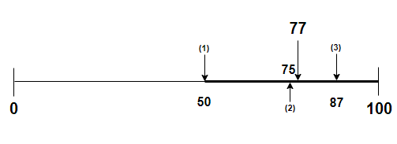

# 📄 **기본 정렬**

## **정렬과 탐색**

&nbsp;&nbsp;정렬은 주어진 일련의 데이터들을 일정한 규칙에 맞게 순서대로 나열하는 것을 의미한다. 잘 알려진 정렬 방식은 아래와 같다.
<br/><br/>

#### **시간 복잡도 : $O(N^2)$**

- [버블 정렬 (Bubble Sort)](BubbleSort.md)
- [선택 정렬 (Selection Sort)](SelectionSort.md)
- [삽입 정렬 (Insertion Sort)](InsertionSort.md)

#### **시간 복잡도 : $O(NlogN)$**

- [병합정렬 (Bubble Sort)]()
- [힙 정렬 (Heap Sort)]()
- [퀵 정렬 (Quick Sort)]()
- [트리 정렬 (Tree Sort)]()
  <br/><br/>

### **이진 탐색 (Binary Search)**

&nbsp;&nbsp;정렬된 데이터는 탐색 효율성에 많은 영향을 끼친다. 가장 두드러진 예가 <u>**이진탐색(Binary Search)**</u>인데 이진 탐색은 주어진 데이터 범위의 앞 또는 뒤쪽부터 차례로 확인해 나가는 <u>선형 탐색</u>과는 달리 매 탐색 마다 탐색 범위를 절반으로 줄여 간다는 특징이 있다.
</br></br>

<p align="center">
    
</p></br>

&nbsp;&nbsp;선형 탐색의 경우 N개의 데이터를 대상으로 하나씩 모든 데이터를 조회하기 때문에 시간 복잡도는 $N$인 반면 이진 탐색은 매 탐색마다 탐색 범위를 $N/2$로 줄여나가기 때문에 밑이 2인 $logN$의 시간 복잡도를 가진다.
<br/><br/>

### **이진탐색 구현 (Java)** &nbsp;[[전체코드]](code/BinarySearch.java)

```java
/**
    이진 탐색으로 배열에서 목표값(target)의 인덱스를 반환
*/
public int binarySearch(int target, int left, int right) {
    int mid = -1;
    while (left <= right) {
        mid = (left + right) / 2;
        if (target > arr[mid]) {
            left = mid + 1;
        } else {
            if (target == arr[mid]) break;
            right = mid - 1;
        }
    }

    return mid;
}
```

<br/><br/>
