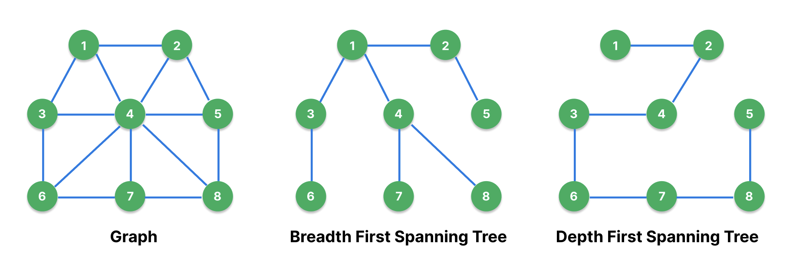

## MST(Minimum Spanning Tree)

### Spanning Tree(신장 트리)

&nbsp;&nbsp;신장 트리는 그래프의 일종으로 다음과 같은 조건을 만족하는 트리를 가리킵니다.

**Spanning Tree 조건**

- 연결 그래프의 부분 그래프로 모든 정점을 포함합니다.
- 모든 정점은 서로 연결되어 있어야 합니다.
- 사이클이 존재해서는 안됩니다.
- 연결 그래프에서 신장트리는 1개 이상 존재할 수 있습니다.

&nbsp;&nbsp;신장 트리의 간선의 개수는 정점(V)의 개수 -1만큼의 개수를 가집니다.

<br>

### 너비 우선 신장트리, 깊이 우선 신장트리

<figure align="center" style="width: 100%">
  
</figure>

&nbsp;&nbsp;위의 그림과 같은 `그래프(Graph)`가 있다고 가정했을 때, 이 그래프에서 그릴 수 있는 신장트리의 종류에는 너비 우선 탐색으로 그려지는 `너비 우선 신장트리(Breadth-First Spanning Tree)`와 깊이 우선 탐색으로 그려지는 `깊이 우선 신장트리(Depth-First Spanning Tree)`가 있습니다. 위의 예시에서는 현재 정점을 기준으로 방문할 수 있는 정점 중 가장 작은 번호를 가진 정점을 우선으로 탐색하여 그려지는 신장트리입니다.

<br>

### 최소 비용 신장트리(Minimum Cost Spanning Tree, MST)

&nbsp;&nbsp;만약 그래프의 간선에 가중치가 있을 때 신장트리 중 가장 작은 가중치 합으로 그려지는 신장트리를 `최소 비용 신장트리(MST)`라고 부르며 MST 알고리즘은 철도망, 통신망 등을 구축하기 위해 사용됩니다.

&nbsp;&nbsp;만약 정점과 간선, 그리고 간선에 대한 가중치가 주어졌을 때 MST의 최소 가중치 합을 구하는 가장 유명한 알고리즘으로는 `크루스칼(Kruskal)` 알고리즘과 `프림(Prim)` 알고리즘이 있습니다.

<br>

### 크루스칼(Kruskal) 알고리즘

&nbsp;&nbsp;`크루스칼(Kruskal)` 알고리즘은 간선 중심의 알고리즘으로 간선에 대해 가중치를 기준으로 오름차순으로 정렬하고, 사이클이 발생하지 않는 선에서 선택된 간선의 개수가 `V-1`개가 될 때까지 선택을 반복하는 알고리즘입니다.

<br>

> ❓ 사이클이 발생하는지 어떻게 판단하나요
>
> &nbsp;&nbsp;크루스칼 알고리즘에서 사이클을 판단하기 위해 `서로소 집합(Disjoint set)`을 판단하기 위한 방법인 `Union-Find` 알고리즘을 활용합니다.
>
> &nbsp;&nbsp;`Union-Find` 알고리즘은 두 집합을 병합하기 위한 `Union` 연산과 각 집합의 원소가 속해있는 최상위 부모를 찾기 위한 `Find` 연산으로 구성되어 있습니다. 만약 두 정점을 하나의 집합으로 병합하려는데 두 정점의 최상위 부모가 같다면 이미 하나의 집합에 속해 있으므로 사이클이 발생하겠지요.

**Union-Find Algorithm With JS**

```javascript
/* Union-Find */
const parent = Array.from({ length: V }, (_, idx) => idx); // 자기 자신을 부모로 가지도록 초기화

function find(x) {
  if (parent[x] === x) return x;
  parent[x] = find(parent[x]); // 자신이 최상위 부모가 아니면 상위로 타고 올라감
  return parent[x];
}

function union(x, y) {
  let [px, py] = [find(x), find(y)]; // 병합할 두 정점의 최상위 부모를 찾음
  if (px === py) return false; // 이미 병합되어 있으면 병합 X

  if (px < py) {
    parent[py] = px;
  } else {
    parent[px] = py;
  }
  return true;
}
```

<br>

**Kruskal Algorithm With JS**

```javascript
function Kruskal() {
  edges.sort((a, b) => a.weight - b.weight); // 가중치 기준 오름차순 정렬

  let count = 0;
  let dist = 0;
  // 선택한 간선의 개수가 V - 1이 될 때까지 간선 순회
  for (let i = 0; i < E && count < V - 1; i++) {
    const edge = edges[i];
    // 병합이 완료(사이클 X)
    if (union(edge.prev, edge.next)) {
      count++;
      dist += edge.weight;
    }
  }

  return dist;
}
```

<br>

### 프림(Prim) 알고리즘

&nbsp;&nbsp;`프림(Prim)` 알고리즘은 정점 중심의 알고리즘으로 현재 정점을 기준으로 이동할 수 있는 간선 중 가장 가중치가 낮은 간선으로 우선적으로 이동해 다음 정점에 방문하는 알고리즘입니다. 방문한 정점은 방문처리를 통해 중복 방문을 방지하며, 사이클을 제거합니다.

&nbsp;&nbsp;프림 알고리즘은 `다익스트라(Dijkstra)` 알고리즘을 접해본 사람이라면 아주 익숙하게 느껴질 수 있는 알고리즘입니다. 다익스트라 역시 최단 거리 탐색을 위해 현재 정점을 기준으로 가장 거리가 짧은 간선을 찾아 이동하는 그리디(greedy)한 로직을 사용하기 때문입니다.

<br>

**Prim Algorithm With JS**

```javascript
function prim(start, V) {
  const minHeap = new Heap();
  const v = Array.from({ length: V }, () => false);
  let dist = 0;
  let count = 0;
  // 첫 정점은 가중치 0으로 방문했다고 가정하고 삽입
  minHeap.offer(new Edge(start, 0));

  while (minHeap.size > 0) {
    const currEdge = minHeap.poll();
    if (v[currEdge.next]) continue;

    v[currEdge.next] = true; // 방문 처리
    count++; // 방문 정점의 개수 카운트
    dist += currEdge.weight; // 가중치 누적
    if (count === V) break; // 모든 정점을 방문했다면 Stop

    for (const edge of adjList[currEdge.next]) {
      if (v[edge.next]) continue;
      minHeap.offer(edge);
    }
  }

  return dist;
}
```

<br>

