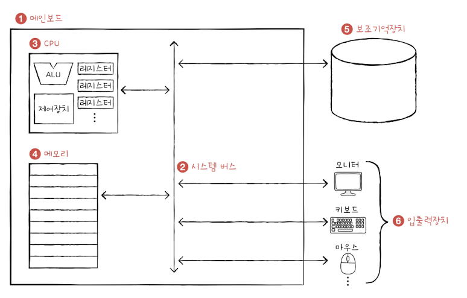
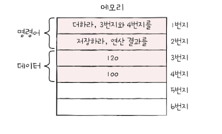
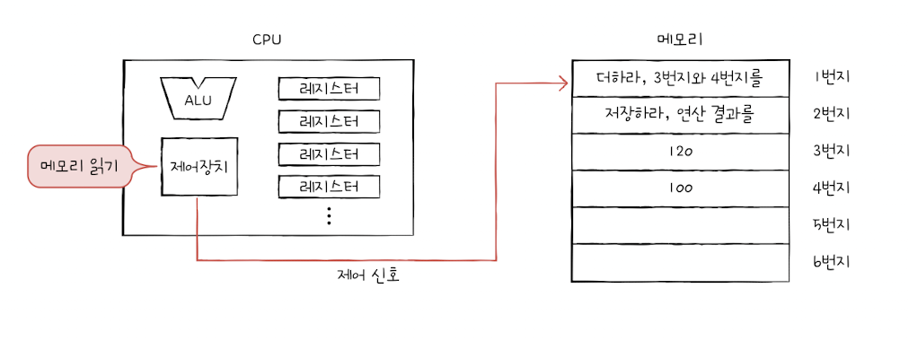
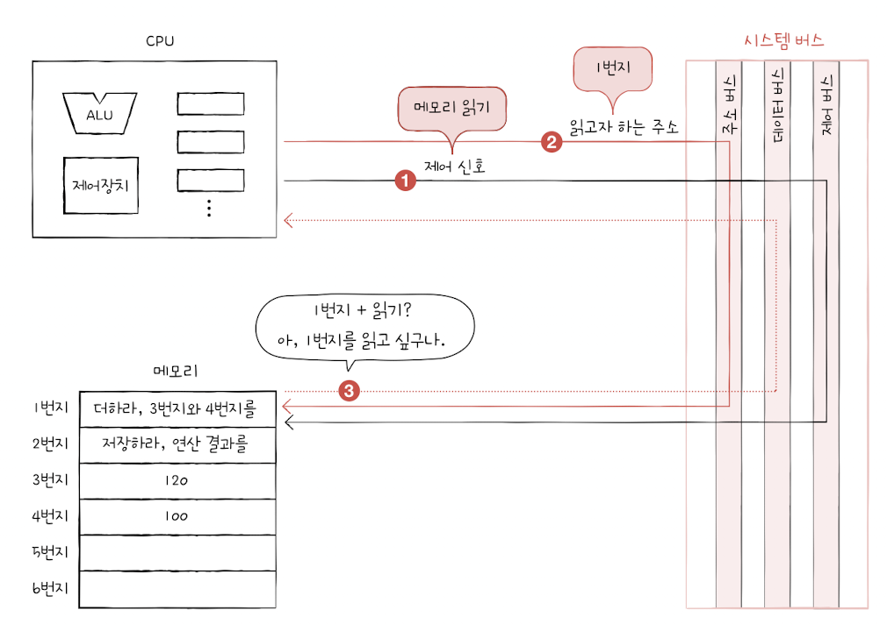

## 1.2 컴퓨터 구조의 큰 그림

&nbsp;&nbsp;이 장에서 저자는 개발자가 알아야 할 컴퓨터 구조 지식을 '컴퓨터가 이행하는 정보'와 '컴퓨터의 네 가지 핵심 부품'으로 정리합니다. 각각에 대해 하나씩 짚어 가보도록 하겠습니다.

 

### 컴퓨터가 이해하는 정보

&nbsp;&nbsp;우리는 컴퓨터가 0과 1로 표현된 정보를 이해한다는 것을 알고 있습니다. 0과 1로 표현되는 정보에는 크게 '데이터'와 '명령어'로 나눌 수 있습니다.

&nbsp;&nbsp;이 책의 저자는 컴퓨터를 한마디로 정의했을 때 "컴퓨터는 명령어를 처리하는 기계"로 표현하는 만큼 저자는 데이터와 명령어 중에 컴퓨터를 실제로 동작하게 하는 더 중요한 정보로 명령어를 꼽았습니다. 이 책에서 표현하는 데이터와 명령어의 정의는 아래와 같습니다.

1. 데이터 : 컴퓨터가 이해하는 숫자, 문자, 이미지, 동영상과 같은 정적인 정보, 또는 컴퓨터와 주고받는 정보나 컴퓨터에 저장된 정보

2. 명령어 : 데이터를 움직이고 컴퓨터를 작동시키는 정보

    

### 컴퓨터의 네 가지 핵심 부품

1. CPU(중앙처리장치)
2. 메모리(주기억장치)
3. 보조기억장치
4. 입출력장치

&nbsp;&nbsp;주기억장치는 크게 RAM(Random access Memory)와 ROM(Read Only Memory) 두 가지가 있습니다. 컴퓨터의 작동원리를 파악하기 위해 알아두어야 할 '메모리'는 일반적으로 RAM을 가리킵니다.

 

**컴퓨터 구조**

  

&nbsp;&nbsp;위 그림은 이 책에서 표현하는 4가지 핵심 부품을 설명하기 위한 예시입니다. 그림의 각 번호는 아래와 같이 설명됩니다.

1. 가장 큰 사각형은 메인보드입니다.
2. 메인보드 안에 시스템 버스(양방향 수직 화살표)가 있습니다.
3. CPU 내부에는 ALU(산술논리연산장치), 제어장치와 여러 레지스터가 있습니다. CPU는 메인보드 내 시스템 버스와 연결되어 있습니다.
4. 메모리는 메인보드 내 시스템 버스와 연결되어 있습니다.
5. 보조기억장치는 메인보드 내 시스템 버스와 연결되어 있습니다.
6. 모니터, 키보드, 마우스 등은 메인보드 내 시스템 버스와 연결되어 있습니다. 이들을 입출력장치라고 부릅니다.

 

**메모리**

  

- 메모리는 현재 실행되는 프로그램의 명령어와 데이터를 저장하는 장치.
- 프로그램이 실행되기 위해서는 반드시 메모리에 저장되어 있어야 함.
- 메모리에 저장된 값에 빠르고 효율적으로 접근하기 위해 주소(Address)라는 개념이 사용.

 

**CPU**

  

- CPU는 메모리에 저장된 명령어를 읽어 들이고, 읽어 들인 명령어를 해석하고, 실행하는 부품.
- CPU는 ALU(산술논리연산장치), 레지스터, 제어장치로 구성.
- ALU : 컴퓨터 내부에서 수행되는 계산을 수행하는 부품.
- 레지스터 : 프로그램을 실행하는 데 필요한 값들을 임시로 저장하는 장치.
- 제어장치 : \*\*제어신호라는 전기 신호를 내보내고 명령어를 해석하는 장치.

\*\* 제어 신호는 컴퓨터 부품들을 관리하고 작동시키기 위한 일종의 전기신호입니다.

 

**보조기억장치**

- 메모리가 가격이 비싸 저장용량이 작고, 전원이 꺼지면 저장된 내용을 잃는다는 단점을 보완하기 위한 저장장치.
- 하드디스크, SSD, USB 메모리, DVD, CD-ROM 등.

 

**입출력장치**

- 마이크, 스피커, 프린터, 마우스, 키보드와 같이 컴퓨터 외부에 연결되어 컴퓨터 내부와 정보를 교환하는 장치.

 

**메인보드와 시스템 버스**

- 위에 설명된 컴퓨터의 핵심 부품을 담는 기판.
- 메인보드 내부 버스(Bus)라는 통로를 사용하여 부품 간 정보를 교환하며, 네 가지 핵심 부품을 연결하는 메인이 되는 버스는 시스템 버스(System Bus).
- 시스템 버스는 주소를 주고받는 통로인 주소 버스, 명령어와 데이터를 주고받는 통로인 데이터 버스, 제어신호를 주고 받는 통로인 제어 버스로 구성.

  

- CPU가 메모리에 저장된 데이터를 읽기 위해서는 제어 버스로 '메모리 읽기'라는 제어신호와 함께, 주소 버스로 읽고자 하는 데이터가 담긴 메모리의 주소를 보냄.

 
