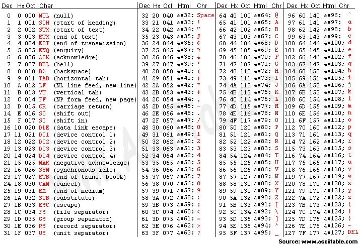
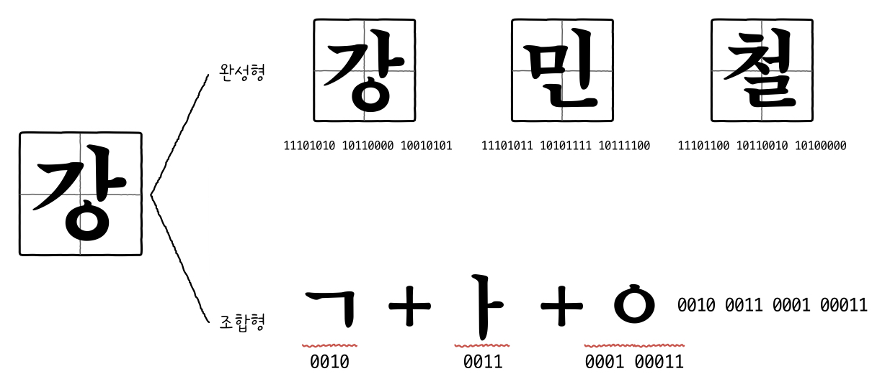
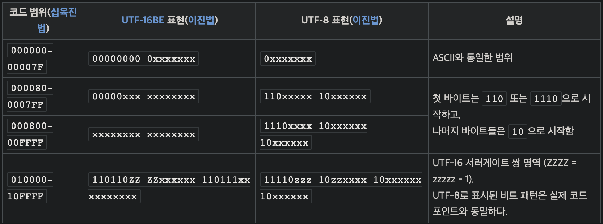

## 02.2 0과 1로 문자를 표현하는 방법

### 문자 집합과 인코딩

- **문자 집합(Character Set)** : 컴퓨터가 인식하고 표현할 수 있는 문자의 모음을 의미합니다.
- 컴퓨터는 문자 집합에 속해 있는 문자는 이해할 수 있지만 문자 집합에 속해 있지 않은 문자는 이해할 수 없습니다.
- **문자 인코딩(Character Encoding)** : 문자 집합에 속한 문자라도 컴퓨터가 이해할 수 있는 0과 1의 데이터로 변환이 필요합니다. 이러한 변환 과정을 `문자 인코딩`이라 부르며, 반대의 과정은 `문자 디코딩(Character Decoding)`이라 부릅니다.

 

### 아스키 코드

- 초창기 문자 집합 중 하나인 아스키 코드는 영어 알파벳과, 아라비아 숫자, 일부 특수 문자를 포함하는 문자 집합입니다.
- 아스키 코드는 7비트 문자 집합으로 <mark>128개($2^7$)의 문자를 표현</mark>할 수 있습니다.
- 아스키 코드는 <mark>128개의 문자 밖에 표현하지 못한다는 단점</mark>이 있습니다. 이를 해결하기 위해 `확장 아스키(Extended ASCII)`가 등장했지만 이 역시 256개라는 제한된 문자만을 지원합니다.

 

> 사실 아스키 문자 하나는 8비트입니다. 문자를 나타내는 7비트 외의 1비트는 `패리티 비트(parity bit)`로 오류 검출을 위해 사용되는 비트입니다.

 

**아스키 코드표**

<figure align="center">
  
</figure>

 

> 위 코드표와 같이 아스키 문자는 일대일로 이진수 혹은 십육진수 값과 일대일로 대응됩니다. 이렇게 하나의 문자에 부여된 고유의 값을 `코드 포인트(Code Point)`라고 합니다.

 

### EUC-KR

- EUC-KR은 KS X1001, KS X 1003이라는 문자 집합을 기반으로 하는 완성형 인코딩 방식입니다.
- 초성, 중성, 종성의 조합으로 완성된 하나의 한글 글자에 <mark>2바이트</mark> 크기의 코드를 부여합니다.
- 한 글자에 2바이트, 즉 16비트의 크기를 가지므로 EUC-KR로 인코딩된 한글 한 글자는 4자리씩 끊어 <mark>4자리의 16진수로 표현</mark>할 수 있습니다.
- EUC-KR 인코딩 방식으로는 2350개 정도의 한글 단어를 표현할 수 있습니다.
- EUC-KR 문자 집합은 모든 한글을 표현할 수 있는 것은 아니기 때문에 이를 보완하기 위한 마이크로소프트의 `CP949(Code Page 949)`가 있으나 이 역시 모든 한글을 표현하지는 못합니다.

 

**❗️ 완성형 인코딩과 조합형 인코딩**

<figure align="center">
  
</figure>

 

&nbsp;&nbsp;`완성형 인코딩` 방식은 초성, 중성, 종성의 조합으로 이루어진 하나의 글자에 고유한 코드를 부여하는 인코딩 방식이며, `조합형 인코딩` 방식은 초성, 중성, 종성 각각에 비트열을 할당하고 이들의 조합으로 하나의 글자 코드를 완성하는 인코딩 방식입니다.

 

### 유니코드와 UTF-8

- 유니코드 문자 집합은 모든 언어를 아우르는 문자 집합과 통일된 표준 인코딩 방식을 적용한 문자 집합입니다.
- 대부분의 나라의 문자와, 특수문자, 화살표나 이모티콘까지 표현이 가능합니다.
- 현대 문자를 표현하기 위해 <mark>가장 많이 사용되는 표준 문자 집합</mark>입니다.
- 아스키 코드나 EUC-KR은 각 문자마다 부여된 값을 그대로 코드 포인트로 사용하는 반면 유니코드에서는 이 값을 UTF-8, UTF-16, UTF-32 등 다양한 방식으로 인코딩하여 사용합니다. 이들 중 가장 대중적인 방식은 `UTF-8`입니다.

 

**UTF-8 인코딩**

<figure align="center">
  
</figure>

 

&nbsp;&nbsp;UTF-8 방식의 인코딩은 1에서 4바이트 범위의 인코딩 값을 가지게 됩니다.
이 값은 유니코드 문자에 부여된 값의 범위에 따라 결정되는데 위 표에서 부여된 코드 값의 범위에서 `xxxx`로 표기된 부분을 코드 값을 이진수로 변환한 값으로 대체하면 UTF-8로 인코딩된 값을 가리키게 됩니다.

 
