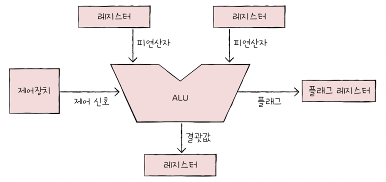
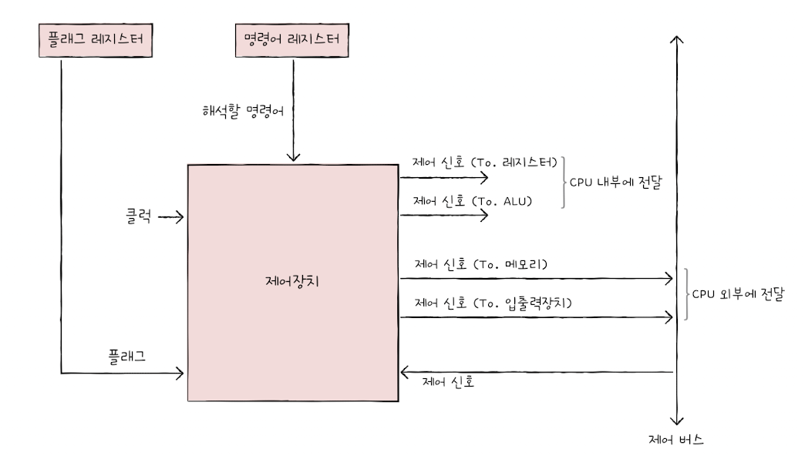

## 04.1 ALU와 제어장치

&nbsp;&nbsp;CPU는 ALU와 제어장치, 레지스터로 구성되어 있으며 그 중에서 ALU는 계산을, 제어장치는 명령어를 해석하여 ALU에 전달하는 역할을 한다고 이전 장에서 다루었습니다. 이번 챕터에서는 이 챕터에서는 ALU와 제어장치가 받아들이고, 내보내는 정보에 대해 다룹니다.

 

### ALU

<figure align="center">
  
</figure>

**받아 들이는 정보**

1. **피연산자** : ALU는 레지스터로부터 계산에 사용되는 `피연산자`를 받습니다.

2. **제어신호** : ALU는 실제로 연산을 하기 위해 제어장치로부터 해석된 연산에 대한 정보를 `제어신호`로서 받아들입니다. 제어신호에 따라 ALU는 산술 연산, 논리 연산 등의 연산을 수행합니다.

 

**내보내는 정보**

1. **연산 결과** : ALU는 `연산에 대한 결과`를 레지스터로 내보냅니다. ALU가 레지스터에 접근하는 속도는 메모리에 접근하는 속도보다 훨씬 빠르기 때문에 실제 결과값은 메모리에 저장되기 전에 레지스터에 먼저 보내지게 됩니다.

2. **플래그(flag)** : ALU는 연산에 대한 결과에 대한 부가 상태 정보를 내놓을 때가 있습니다. 이 부가정보는 `플래그`라 불리며 플래그 레지스터에 저장됩니다. 플래그의 종류는 아래와 같습니다.

 

- **부호 플래그** : 연산한 결과의 부호를 나타냅니다. 연산 결과가 음수이면 1, 양수일 경우에는 0이 반환됩니다.

- **제로 플래그** : 연산한 결과의 값이 0이면 1, 0이 아니면 0이 반환됩니다.

- **캐리 플래그** : 연산 결과 올림수 또는 빌림수가 발생했을 경우 1이 반환됩니다.

- **오버플로우 플래그** : 오버플로우가 발생했으면 1이 반환됩니다.

- **인터럽트 플래그** : 인터럽트가 가능한지 여부를 의미하며 1일 경우 인터럽트가 가능합니다.

- **슈퍼바이저 플래그** : 1이면 커널모드, 0이면 사용자 모드로 실행되고 있음을 나타냅니다.

 

> 💡 **올림수와 빌림수**
>
> 올림수와 빌림수는 각각 가산기 또는 감산기에 의해 연산이 발생할 때 가산에 의해 `자리 수가 증가할 때 발생하는 수`와 감산을 위해 `윗 자리에서 수를 빌려오는 수`를 의미합니다.

 

### 제어장치

&nbsp;&nbsp;제어장치는 명령어를 해석하고 전기신호인 제어신호를 내보내는 장치입니다. 제어장치는 CPU에서 가장 정교하게 설계된 장치라는 것을 기억하고 제어장치에서 받아들이고, 내보내는 정보에 대해 알아보겠습니다.

 

<figure align="center">
  
</figure>

 

**받아 들이는 정보**

1. **클럭 신호** : 제어장치는 `클럭 신호`를 받아들입니다. 이 책에서는 클럭을 <mark>컴퓨터의 모든 부품을 일사분란하게 움직이는 단위</mark>로 표현했습니다. 컴퓨터의 부품들은 똑-딱하는 클럭 신호에 맞추어 동작을 하게 되는데 꼭 한 클럭마다 동작하는 것은 아닙니다. CPU에서는 클럭 주기에 맞춰 레지스터에서 레지스터로 데이터를 전달하거나 ALU가 연산을 수행하는 등의 작업을 합니다.

2. **명령어** : 제어장치는 컴퓨터 장치들이 수행할 명령을 위해 `명령어`를 명령어 레지스터로부터 가져와 해석하고 제어신호를 각 명령을 수행할 장치들로 내보냅니다.

3. **플래그** : 위에서 언급했듯 연산에는 부가 상태 정보인 `플래그`가 필요합니다. 제어장치는 플래그를 받아 이를 참고하여 제어신호를 발생시킵니다.

4. **제어신호** : 제어신호는 CPU 이외에도 입출력 장치 등에 의해 발생될 수도 있습니다. 제어장치는 외부에서 받아 들인 제어신호를 기반으로 제어신호를 발생시키기도 합니다.

 

> 💡 **제어신호의 이동**
>
> 제어신호는 시스템 버스 중 `제어버스`를 통해 이동합니다.

 

**내보내는 정보**

1. **제어신호** : 제어장치는 해석한 명령을 수행하게 하기 위해 ALU로 제어신호를 보내거나 레지스터 간 데이터 이동이나 레지스터에 저장된 명령어를 읽기 위해 레지스터로 제어신호를 보냅니다.

 
