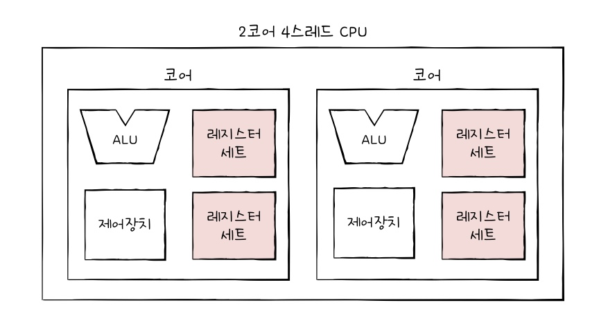

## 05.1 빠른 CPU를 위한 설계 기법

### 클럭

&nbsp;&nbsp;가장 먼저 빠른 CPU를 위해서는 클럭 속도가 빠른 CPU를 설계하는 방법이 있습니다. 클럭에 대해 살펴보기에 앞서 이전에 다루었던 내용을 정리하면 아래와 같이 정리됩니다.

 

> 💡 이전 내용 정리
>
> 1. 컴퓨터 부품들은 `클럭 신호`에 맞춰 일사불란하게 움직입니다.
> 2. CPU는 `명령어 사이클`이라는 정해신 흐름에 맞춰 명령어들을 실행합니다.

 

&nbsp;&nbsp;일반적으로 빠른 CPU일 수록 클럭 속도가 빠른 CPU를 의미합니다. CPU의 `클럭 속도`는 헤르츠(Hz) 단위로 1초에 클럭이 몇 번 반복되는지를 나타냅니다.

&nbsp;&nbsp;일반적으로 CPU의 속도는 일정하지 않습니다. 실제로 CPU 제품 스펙을 살펴보면 기본 클럭 속도(Base)와 최대 클럭 속도(Max)를 구분하고 있습니다. CPU는 고성능을 요구하는 작업을 실행할 때는 최대 클럭 속도만큼의 클럭 속도까지 증가할 수 있으며, 만약 오버클럭을 한 제품이라면 최대 클럭 이상의 속도를 낼 수도 있습니다.

 

### 코어와 멀티코어

&nbsp;&nbsp;지금까지 살펴본 CPU는 모두 코어가 1개인 싱글코어 CPU로 설명되었습니다. 현대적인 관점에서 CPU는 내부에 <mark>명령어를 실행하는 부품</mark>을 여러 개 둘 수 있게 되었습니다. 이 부품을 오늘날 `코어(core)`라 부르는데 2개 이상의 코어를 가진 CPU를 `멀티코어(multi-core) CPU` 또는 `멀티코어 프로세서`라고 부릅니다.

 

> ❗️ 코어 수와 처리 속도
>
> &nbsp;&nbsp;그렇다면 CPU의 코어 개수가 많을 수록 처리 속도도 그만큼 증가할까요? 정답은 "그렇지 않다"입니다. 코어 개수는 처리 속도에 영향을 끼치기는 하지만 가장 중요한 것은 처리할 명령어들을 각 코어에 어떻게 적절하게 분배하느냐 입니다.

 

### 스레드와 멀티스레드

&nbsp;`스레드(thread)`의 사전적인 의미는 "<mark>실행 흐름의 단위</mark>"입니다. CPU에서 사용되는 스레드는 `하드웨어적 스레드`, 프로그래밍 관점에서 사용되는 스레드는 `소프트웨어적 스레드`로 부릅니다.

 

**하드웨어적 스레드**

- <mark>하나의 코어가 동시에 처리하는 명령어 단위</mark>입니다.
- CPU 제품 스펙에서 표기되어 있는 스레드는 하드웨어적 스레드를 의미합니다.
- 일반적으로 시판되는 CPU는 하나의 코어로도 여러 개의 명령어를 처리할 수 있는데 이를 `멀티스레드(multi-thread) 프로세서` 또는 `멀티스레드 CPU`라고 합니다.
- 인텔에서는 멀티스레드 기술을 `하이퍼스레딩(hyper-threading)`이라는 용어로 부릅니다.

 

**소프트웨어적 스레드**

- <mark>하나의 프로그램에서 독립적으로 실행되는 단위</mark>입니다.
- 1코어 1스레드 CPU도 여러 개의 소프트웨어적 스레드를 실행하는 것이 가능합니다.

 

### 멀티스레드 프로세서

&nbsp;&nbsp;CPU에서 말하는 멀티스레드는 하드웨어적 스레드를 의미합니다. 하나의 코어는 여러 명령어를 처리하기 위해 멀티스레드를 지원하고, 이를 설계하기 위해서는 레지스터에 대해 다시 짚고 넘어가야 합니다.

 

<figure align="center">
  
</figure>

 

&nbsp;&nbsp;앞 장에서 레지스터의 종류에 대해 살펴보았습니다. 만약 하나의 코어에 프로그램 카운터(PC)가 두 개 있다면 메모리에서 가져올 명령어의 주소를 한번에 두 개, 스택 포인터가 두 개 있다면 한번에 두 개의 스택을 관리할 수 있습니다.

&nbsp;&nbsp;만약 위 그림과 같이 하나의 코어에 레지스터가 2개씩 있는 구조라면 실제로는 2코어 4스레드의 CPU지만 프로그램의 입장에서는 명령어를 한번에 1개씩 처리하는 프로세서가 4개 있는 것으로 인식됩니다. 이 때문에 하드웨어 스레드는 `논리 프로세서(logical processor)`라고도 부릅니다.

 

> 💡 멀티코어 프로세서, 멀티스레드 프로세서
>
> &nbsp;&nbsp;정리하자면 멀티코어 프로세서는 '명령어를 처리하는 부품'이 CPU 안에 2개 이상 있음을 의미하며 멀티스레드 프로세서는 하나의 코어가 한 번에 처리할 수 있는 명령어가 2개 이상임을 의미합니다.

 
