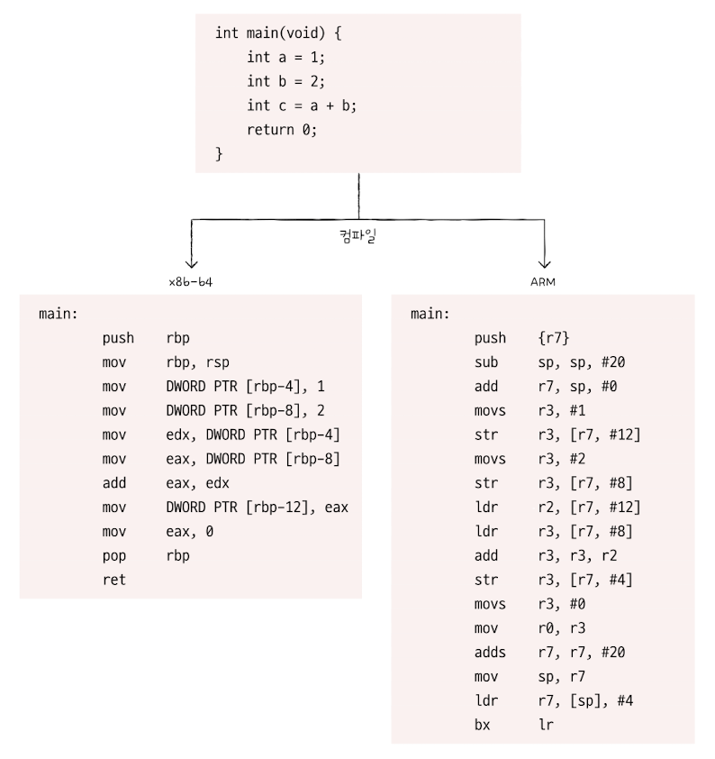

## 05.3 CISC와 RISC

&nbsp;&nbsp;명령어 파이프라이닝과 슈퍼 스칼라 기법을 CPU에 적용하기 위해서는 명령어가 파이프라이닝에 최적화되어 있어야 합니다.
명령어의 구조를 이해하기 위해 CPU의 언어인 `ISA`와 ISA 기반으로 설계된 CISC, RISC에 대해 살펴보겠습니다.

 

### 명령어 집합

- CPU마다 실행하는 명령어에는 조금씩 차이가 있습니다. CPUrㅏ 이해할 수 있는 명령어의 모음을 `명령어 집합(instruction set)` 또는`명령어 집합 구조(instruction set architecture, ISA)`라고 합니다.

- ISA가 다르면 컴퓨터가 이해할 수 있는 명령어가 다르고, 명령어가 달라지면 어셈블리어도 달라집니다. 때문에 ISA는 일종의 CPU의 언어로 이해할 수 있습니다.

 

<figure align="center">
  
</figure>

 

> 💡 ISA(Instruction Set Architecture)
>
> 인텔 CPU는 x86 또는 x86-64 ISA를, 애플의 아이폰은 ARM ISA를 이해합니다. 따라서 인텔 CPU로 만들어진 CPU는 이해할 수 있는 명령어가 다르기 때문에 애플의 아이폰에서는 실행될 수 없습니다.

 

&nbsp;&nbsp;ISA의 종류에 따라 명령어 병렬 처리를 사용하기에 유리한 명령어 집합일 수도 있고 아닐 수도 있습니다. 명령어 병렬 처리에 유리한 ISA 중 `CISC`와 `RISC`에 대해 이제부터 알아보겠습니다.

 

### CISC

- Complex Instruction Set Computer의 약자로 <mark>복잡한 명령어 집합을 활용하는 컴퓨터</mark>를 의미합니다.

- 대표적으로 인텔의 x86, x86-64가 CISC 기반의 ISA입니다.

- 다양하고 강력한 기능의 명령어 집합을 활용하기 때문에 명령어의 형태와 크기가 다양한 `가변 길이 명령어`를 활용하기 때문에 상대적으로 <mark>적은 수의 명령어로도 프로그램을 실행</mark>할 수 있습니다.

- 명령어의 수가 적다는 것은 컴파일된 프로그램의 크기가 작다는 것을 의미합니다. 때문에 메모리를 효율적으로 사용해야 했던 과거에는 CISC의 인기가 높았습니다.

 

**단점**

- 명령어가 복잡하고 다양한 기능을 제공하는 탓에 명령어의 크기와 실행되기까지의 시간이 일정하지 않습니다.

- 복잡한 명령어 때문에 명령어 하나를 실행하는 데에 여러 클럭 주기를 필요하게 됩니다.

- 명령어 실행 시간이 길고, 길이가 가변적일 수 있기 때문에 명령어의 규격화가 어려워 파이프라이닝을 효율적으로 처리하기 어렵습니다.

- 복잡한 명령어들을 지원하지만 전체 명령어 중 20%의 명령어가 전체 명령어의 80%를 차지하는 만큼 실제로는 자주 사용되는 명령어만 사용된다고 합니다.

- 이러한 이유들로 CISC 기반 CPU는 성장에 한계가 있습니다.

 

### RISC

- Reduced Instruction Set Computer의 약자로 <mark>CISC에 비해 명령어의 종류가 적고, 짧고 규격화된 명령어로 대부분 1클럭 내외로 실행되는 명령어를 지향</mark>합니다.

- `고정 길이 명령어`를 활용하기 때문에 RISC 명령어 집합은 파이프라이닝에 최적화 되어 있습니다.

- 대표적인 ISA로 애플의 ARM이 있습니다.

- 메모리에 직접 접근하는 명령어를 `load`, `store` 두 개로 제한하여 메모리 접근을 단순화하고 최소화를 추구하며 `load-store 구조`라고 부르기도 합니다.

- 메모리 접근을 최소화하는 대신 레지스터를 적극 활용하여, CISC에 비해 레지스터를 이용하는 연산이 많고, CISC보다 주소 지정 방식의 종류가 적은 경우가 많습니다.

 
