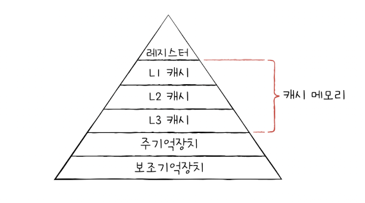

### 06.3 캐시 메모리

&nbsp;&nbsp;CPU는 메모리에 저장된 데이터를 빈번하게 사용하는데 CPU에서 메모리에 접근하는 속도는 CPU의 연산 속도보다 느리기 때문에 이를 극복하기 위한 장치가 필요하게 되었습니다.

 

### 저장 장치 계층 구조

&nbsp;&nbsp;컴퓨터에서 저장장치는 CPU에 얼마나 가까운가를 기준으로 계층 구조로 표현할 수 있습니다. 이를 `저장 장치 계층 구조`라고 부르며, 저장 장치 계층 구조는 다음과 같은 명제를 따릅니다.

 

1. CPU에 가까운 저장장치일 수록 빠르다.
2. 빠른 저장 장치는 저장 용량이 작으며, 비싸다.

 

### 캐시 메모리

&nbsp;&nbsp;CPU가 메모리에 접근하는 속도는 레지스터에 접근하는 속도보다 느리지만 프로그램을 실행하기 위해서는 메모리에 빈번하게 접근할 필요가 있습니다. 이러한 문제를 해결하기 위해 등장한 것이 `캐시 메모리(cache memory)`입니다. 캐시 메모리의 특징을 정리하면 다음과 같습니다.

 

**캐시 메모리 특징**

- 레지스터보다 용량이 크며, 메모리(RAM)보다 빠른 SRAM 기반의 저장 장치입니다.
- CPU에서 사용할 데이터의 일부를 메모리에서 미리 가져와 사용함으로 메모리 접근 빈도를 줄여 속도를 향상시킬 수 있습니다.
- 캐시 메모리는 CPU와 가까운 순서대로 L1, L2, L3 계층을 구성합니다.

 

<figure align="center">
  
</figure>

 

> 💡 캐시 메모리 계층 구조
>
> &nbsp;&nbsp;캐시 메모리는 CPU와 가까운 순서대로 L1 ~ L3의 계층으로 나뉩니다. 저장 장치 계층 구조와 마찬가지로 캐시 메모리 또한 CPU와 가까운 계층일 수록 저장 용량이 작고, 속도가 빠르며, 비싸집니다.
>
> &nbsp;&nbsp;멀티 코어 프로세서에서 캐시 메모리는 L1캐시와 L2캐시는 각 코어에 고유한 캐시 메모리로 할당됩니다. 반면 L3캐시는 모든 코어가 공유하는 형태로 사용됩니다.

 

> ❗️ 분리형 캐시
>
> &nbsp;&nbsp;코어에 가장 가까운 L1캐시는 접근 속도를 조금이라도 빠르게 만들기 위해 명령어만을 저장하는 L1I캐시와 데이터만을 저장하는 L1D캐시로 분리하는 경우도 있습니다. 이러한 형태를 `분리형 캐시`라고 부릅니다.

 

### 참조 지역성의 원리

&nbsp;&nbsp;캐시 메모리는 메모리에 비해 용량이 매우 작기 때문에 메모리에 있는 데이터를 가져오는 빈도를 줄여야 속도를 향상시킬 수 있습니다. 자주 사용되는 데이터를 미리 예측하여 캐시 메모리에 저장하는 것이 중요한데, 이와 관련된 내용에 대해 먼저 용어를 정리해보겠습니다.

 

1. `캐시 히트(cache hit)` : 캐시에 가져온 데이터가 실제로 CPU에서 사용되었을때
2. `캐시 미스(cache miss)` : 예측에 실패하여 메모리에서 캐시로 데이터를 가져와야 할 때
3. `캐시 적중율(cache hit ratio)` : (캐시 히트 횟수) / (캐시 히트 횟수 + 캐시 미스 횟수)

 

&nbsp;&nbsp;우리가 일반적으로 사용하는 컴퓨터의 CPU 캐시 적중율은 85~95% 이상 입니다. 캐시 메모리의 이점을 제대로 활용하기 위해서는 캐시 적중율을 높여야 하는데 이를 위해 캐시 메모리는 `참조 지역성의 원리(locality of reference)`에 따라 메모리로부터 가져올 데이터를 결정합니다.

 

**참조 지역성의 원리**

- CPU가 메모리에 접근할 때의 경향을 바탕으로 만들어진 원리입니다.
- 첫째, CPU는 최근에 접근했던 메모리 공간에 다시 접근하려는 경향이 있습니다. 이를 `시간 지역성(temporal locality)`이라고 합니다.
- 둘째, CPU는 접근한 메모리 근처에 접근하려는 경향이 있습니다. 이를 `공간 지역성(spacial locality)`이라고 합니다.

 

> 💡 시간 지역성과 공간 지역성
>
> &nbsp;&nbsp;일반적으로 프로그램을 실행하면 최근 사용되는 변수가 자주 사용되는 경향이 있습니다. 본문에서는 시간 지역성에 대해 loop문을 사용한 구구단 프로그램을 예시로 현재 단수를 나타내는 x와 곱셈을 하기 위한 loop문의 i라는 변수가 자주 사용 됨을 보여주고 있습니다. 이것이 바로 `시간 지역성`의 특징을 보여줍니다.
>
> &nbsp;&nbsp;또 하나의 프로그램을 사용할 때, 해당 프로그램과 관련된 명령어와 데이터는 메모리 상에 인접한 위치에 저장됩니다. 따라서 실행되는 프로그램과 관련된 인접 메모리의 데이터를 캐시에 저장하면 캐시 히트율을 높일 수 있다는 경향을 가지며 이것이 바로 `공간 지역성`의 특징을 보여줍니다.

 
