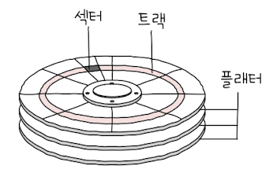
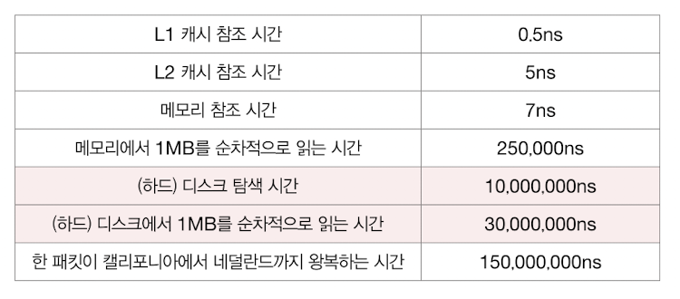
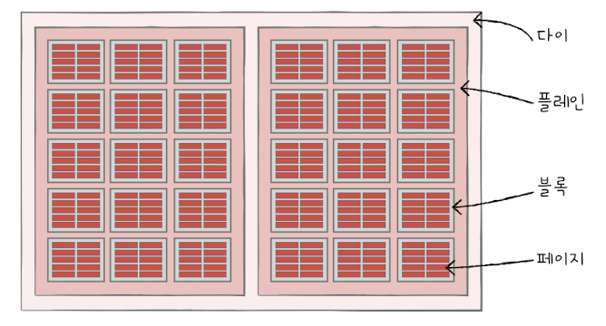
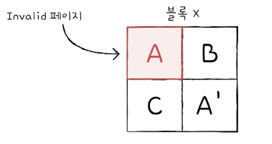

## 07.1 다양한 보조기억장치

### 하드 디스크

- `하드 디스크(hard disk)`는 자기적인 방식으로 데이터를 읽고 저장하는 보조기억장치로 자기 디스크의 일종으로 지칭하기도 합니다.
- **플래터(flatter)** : 데이터가 저장되는 자성을 띄는 원판 모양의 물체입니다.
- **스핀들(spindle)** : 원판 모양의 플래터를 회전시키는 구성 요소입니다. 스핀들이 플래터를 회전시키는 분당 회전 수는 RPM(rotation per minute)으로 표현됩니다.
- **헤드(head)** : 바늘처럼 생긴 구조로 플래터에서 데이터를 읽고 쓰는 구성 요소 입니다.
- **디스크 암(disk arm)** : 헤드를 원하는 위치로 이동시키는 구성 요소입니다.

 

**플래터 구성요소**

<figure align="center">
  
</figure>

- **트랙(track)** : 플래터를 여러 동심원으로 나누었을 때, 그 중 하나의 원을 트랙이라고 부릅니다.

- **섹터(sector)** : 트랙은 피자 조각처럼 부분으로 나뉘는데 이를 섹터라고 부르며, 하나 이상의 섹터를 묶어 `블록(block)`으로 표현합니다. 섹터는 일반적으로 512byte 정도의 크기를 가지지만 하드 디스크의 종류에 따라 달라지기도 합니다.

- **실린더(cylinder)** : 플래터는 여러 겹으로 겹쳐서 사용될 수도 있습니다. 여러 겹의 플래터에서 같은 트랙의 위치를 묶는 원통을 실린더라 부르며, 헤드의 이동없이도 접근할 수 있기 때문에 보통 연속된 정보는 하나의 실린더에 저장됩니다.

 

**하드 디스크 접근 시간**

1. **탐색 시간** : 접근하려는 데이터가 저장된 트랙까지 헤드를 이동시키는 시간입니다.
2. **회전 지연** : 헤드가 있는 곳으로 플래터를 회전시키는 시간입니다.
3. **전송 시간** : 하드 디스크와 컴퓨터 간에 데이터를 전송하는 시간입니다.

 

<figure align="center">
  
</figure>

 

&nbsp;&nbsp;하드 디스크 접근을 위해서는 생각보다 많은 시간을 필요로 합니다. RPM을 증가시키는 것 외에도 앞 장에서 다룬 참조 지역성을 활용하여 데이터를 저장해 회전 자체를 줄이는 방식도 사용할 수 있습니다.

 

### 플래시 메모리

- `플래시 메모리(flash memory)`는 전기적으로 데이터를 읽고 쓸 수 있는 반도체 기반의 저장 장치입니다.
- 플래시 메모리는 보조기억장치 이외에도 다양한 범주의 기억장치에 사용됩니다.
- 플래시 메모리에는 흔히 사용하는 USB 메모리나, SSD, SD카드가 있습니다.
- 플래시 메모리는 `셀(cell)`이라는 데이터를 저장하는 가장 작은 단위가 있습니다.
- 셀에 저장되는 비트 수에 따라 플래시 메모리는 SLC, MLC, TLC 등으로 나뉩니다.

 

**SLC(Single-Level Cell)**

&nbsp;&nbsp;한 셀에 0과 1, 1bit의 정보를 표현할 수 있는 타입입니다. MLC, TLC 타입에 비해 수명이 길고, 속도가 빠르다는 장점이 있지만, 용량 대비 가격이 비싸기 때문에 고성능의 빠른 저장 장치가 필요할 때 사용됩니다.

 

**MLC(Multiple-Level Cell)**

&nbsp;&nbsp;한 셀에 2bit로 4개의 정보 표현이 가능한 타입입니다. SLC에 비해 한 셀에 표현할 수 있는 정보의 양이 많으므로 SLC보다 용량 대비 가격이 저렴합니다.

 

**TLC(Triple-Level Cell)**

&nbsp;&nbsp;한 셀에 3bit로 8개의 정보 표현이 가능한 타입입니다. SLC와 MLC에 비해 속도는 느리지만 용량 대비 가격이 저렴합니다. 수명은 SLC에서 MLC로 갈 수록 짧아집니다.

 

**플래시메모리 구조**

<figure align="center">
  
</figure>

 

&nbsp;&nbsp;플래시 메모리는 다음과 같이 셀들이 모여져 이루어진 `페이지(page)`, 페이지가 모여 이루어진 `블록(block)`, 블록이 모여 이루어진 `플레인(plane)`, 플레인이 모여 `다이(die)`로 구성됩니다.

**읽기, 쓰기, 삭제&**

&nbsp;&nbsp;플래시 메모리에서 읽기/쓰기와 삭제의 단위가 다른데, 읽기와 쓰기는 페이지 단위, 삭제는 블록 단위로 이루어집니다. 중요한 것은 하드디스크와 달리 플래시 메모리는 덮어쓰기를 지원하지 않습니다. 먼저 플래시 메모리 페이지의 3가지 상태값을 살펴보자면,

 

1. **Free** : 데이터가 저장되어 있지 않아 새로운 데이터를 저장할 수 있는 상태입니다.
2. **Valid** : 이미 유효한 데이터를 저장하고 있는 상태입니다.
3. **Invalid** : 데이터가 저장되어 있으나, 유효하지 않은 데이터를 저장하고 있는 상태입니다.

 

<figure align="center">
  
</figure>

 

&nbsp;&nbsp;위 그림에서 만약 A 데이터를 A'로 수정하고 싶을 때, 플래시 메모리는 덮어쓰기를 지원하지 않으므로 같은 블록 내 Free 상태인 다른 페이지에 A'를 저장합니다. 이전에 A를 저장하고 있던 페이지는 Invalid 상태로 메모리를 불필요하게 차지하고 있는 상태가 됩니다. `가비지 컬렉션(Garbage Collection)` 기능을 제공하는 SSD 등에서는 이러한 메모리 낭비를 줄이기 위해 유효한 페이지만을 다른 블록에 복사한 후, 이전 블록은 삭제하는 과정을 거칩니다.

 
