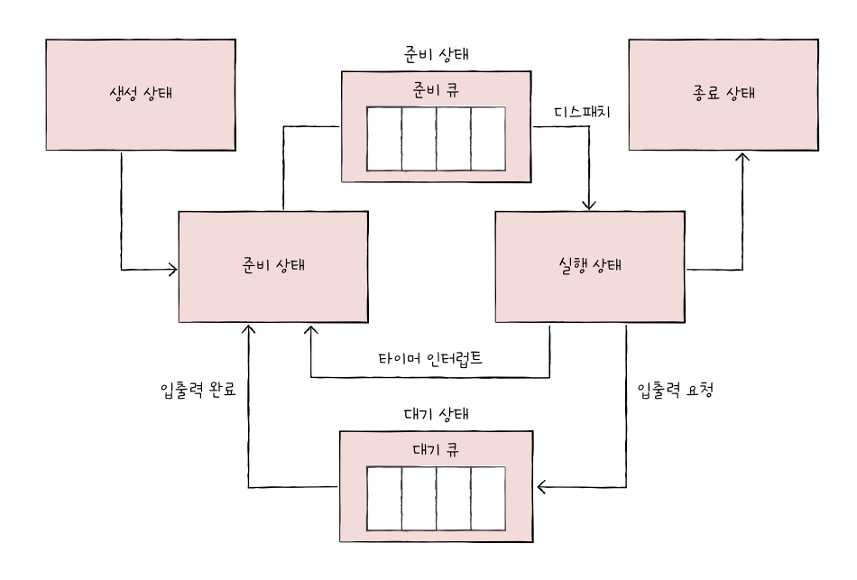

## 11.1 CPU 스케줄링 개요

&nbsp;&nbsp;모든 프로세스는 CPU를 필요로 하며 각 프로세스들에 대해 공정하고 합리적으로 CPU를 자원을 배분하는 것을 `CPU 스케줄링`이라고 합니다. CPU 스케줄링을 통해 컴퓨터는 각 프로세스들이 실행되는 순서를 정해 무질서한 상태가 발생하지 않도록 합니다.

 

### 프로세스 우선순위

&nbsp;&nbsp;CPU 스케줄링을 하기 위해서는 각 프로세스에 우선순위를 정해 우선순위가 높은 프로세스가 먼저 CPU 자원을 사용할 수 있도록 합니다. 운영체제는 각 프로세스의 PCB에 우선순위를 명시하고, PCB에 적힌 우선순위를 기준으로 먼저 처리할 프로세스를 결정합니다. 우선순위가 높은 프로세스는 더 많이, 더 자주 실행되게 됩니다.

 

> 💡 `입출력 집중 프로세스`, `CPU 집중 프로세스`
>
> &nbsp;&nbsp;비디오 재생이나 디스크 작업을 하는 프로세스의 경우 입출력 작업이 많은 프로세스이며, 수학 연산이나 그래픽 처리 등의 프로세스는 CPU 작업이 많은 프로세스입니다. 전자를 `입출력 집중 프로세스(I/O bound process)`라고 하며 후자를 `CPU 집중 프로세스(CPU bound process)`라고 합니다.
>
> &nbsp;&nbsp;입출력 집중 프로세스는 입출력을 위한 대기 상태에 더 많이 머물게 되며, CPU 집중 프로세스는 대기 상태보다 실행 상태에 더 많이 머무르게 됩니다. 여기서 입출력을 위한 대기 작업을 `입출력 버스트(I/O burst)`, CPU를 사용하는 작업을 `CPU 버스트(CPU burst)`라고 합니다.

 

### 스케줄링 큐

&nbsp;&nbsp;`스케줄링 큐`는 운영체제가 모든 준비 중인 프로세스들 중에서 실행할 다음 프로세스가 무엇인지 찾는 번거로운 일을 줄이기 위해 프로세스들에 줄을 세우는 것을 말합니다. 운영체제가 관리하는 스케줄링 큐는 크게 2가지로 나뉘는데 CPU를 이용하기 위해 프로세스가 준비하는 줄인 `준비 큐(ready queue)`와 입출력장치를 사용하기 위해 프로세스가 대기하는 줄인 `대기 큐(waiting queue)`가 있습니다.

 

**준비 큐**

- PCB에 삽입된 프로세스는 기본적으로 줄을 먼저 선 프로세스가 먼저 실행되게 됩니다.
- 우선순위가 높은 프로세스는 먼저 큐에 삽입되었지만 자신 보다 우선순위가 낮은 큐보다 앞에 줄을 서게 됩니다.

 

**대기 큐**

- 대기 큐에서도 마찬가지로 우선순위가 높은 프로세스가 먼저 실행되게 됩니다.
- 입출력 작업이 완료되면 완료 인터럽트를 발생시켜 운영체제가 대기 큐에서 작업이 완료된 PCB를 찾아 해당 PCB를 준비 상태로 변경한 뒤 대기 큐에서 제거하고, 준비 큐에 추가합니다.

 

<figure align="center">
  
</figure>

 

### 선점형과 비선점형 스케줄링

**1. 선점형 스케줄링**

- 프로세스가 CPU를 비롯한 자원을 사용하고 있더라도 운영체제가 해당 프로세스로부터 자원을 빼앗아 다른 프로세스에 할당할 수 있는 스케줄링 방식입니다.

- 하나의 프로세스가 자원 사원을 독점할 수 없습니다.

- 급한 프로세스가 언제든 끼어들 수 있어 자원 독점을 막을 수 있다는 장점이 있습니다.

- 문맥 교환이 자주 발생할 수 있는 만큼 문맥 교환 과정에서 오버헤드가 발생할 수 있습니다.

 

**2. 비선점형 스케줄링**

- 하나의 프로세스가 자원을 사용하고 있다면 그 프로세스가 종료되거나 스스로 대기 상태에 접어들기 전까진 다른 프로세스가 끼어들 수 없는 스케줄링 방식입니다.

- 하나의 프로세스가 자원 사용을 독점할 수 있습니다.

- 문맥 교환의 빈도가 적어 오버헤드가 적게 발생합니다.

- 급한 프로세스가 있더라도 자원을 사용 중인 프로세스가 끝날 때까지 대기해야합니다.

 
