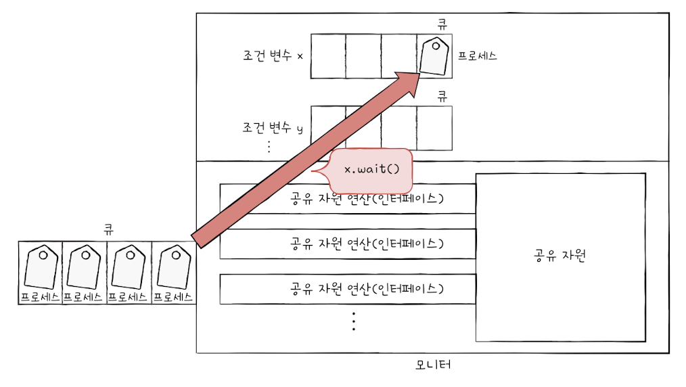

## 12.2 동기화 기법

&nbsp;&nbsp;앞 절에서는 동기화 방식과 상호배제 동기화를 위해 사용하는 프로그램적 해결방식 몇 가지에 대해 간략하게 다루었습니다. 특히 앞에서 다룬 상호배제 동기화를 위한 프로그램 방식은 `임계영역`에 접근하는 프로세스를 1개로 제한하기 위해 임계영역에 접근하는 프로세스가 누구인지 판별하는 방법을 사용했지만 이번 절에서 다룰 동기화 방식은 조금 더 고수준의 방식으로 `임계영역` 자체에 락(Lock)을 걸어 상호배제 동기화를 구현하는 방법에 대해 다뤄보겠습니다.

<br>

### 뮤텍스 락(Mutex Lock)

&nbsp;&nbsp;뮤텍스 락은 동시에 접근해서는 안되는 `공유자원`에 여러 프로세스가 접근하는 것을 방지하기 위해 사용 중인 임계영역에 대해 락을 거는 동기화 도구입니다. 뮤텍스락은 자물쇠 역할을 하는 부분, 임계구역을 잠그는 acquire, 임계구역 사용 종료 후 잠금을 해제하는 release 세 가지로 구성되어 있습니다.

<br>

```java
// Mutex Lock 의사코드
acquire:
  while (lock) {}
  lock = true;

release:
  lock = false;

acquire();
// 임계 구역
release();
```

<br>

**뮤텍스 락 특징**

- acquire 함수에서 임계구역이 잠겨있는지 while문을 통해 지속적으로 확인하며 대기하는 `busy wait` 방식입니다.

- true/false 이진 방식으로 하나의 공유자원에 대한 임계구역에 제한을 두는 방식입니다.

<br>

### 세마포(Semaphore)

- 락을 위한 자물쇠로 이진 데이터가 아닌 정수형을 사용하는 방식입니다.

- 하나 이상의 공유자원에 대한 상호배제 동기화를 위한 도구입니다.

- 뮤텍스 락과 같이 락을 위한 전역변수로 이진 값을 사용하는 `이진 세마포(binary semaphore)`와 정수 값을 사용하는 일반적인 세마포 방식인 `카운팅 세마포(counting semaphore)` 두 가지로 분류할 수 있습니다.

<br>

```java
// 세마포 의사코드
wait:
  while (S <= 0) {}
  S--;

signal:
  S++;

wait();
// 임계영역
signal();
```

<br>

**세마포 특징**

- 세마포 방식은 임계영역에 접근 가능한 프로세스의 개수로 전역 변수 S를 초기화합니다.

- 만약 최대 접근 가능한 프로세스가 모두 임계구역에 접근해 공유자원을 사용하고 있다면 S는 0이 되어 이후 다른 프로세스가 임계영역에 접근하려 할 때 wait에 걸려 자리가 날 때까지 대기하게 됩니다.

<br>

**준비 큐를 사용하는 방법**

&nbsp;&nbsp;세마포 또한 앞서 살펴본 뮤텍스 락과 같이 임계영역에 접근할 수 없다면 가능할 때까지 문을 두드리며 대기하는 `busy wait` 방식을 사용하고 있습니다. 이는 사실 준비 큐를 사용하면 조금 더 나은 방식으로 구현할 수 있습니다.

<br>

```java
// 준비 큐를 사용한 세마포 의사코드
wait:
  S--;
  if (S < 0) {
    add this process to Queue;
    sleep();
  }

signal:
  S++;
  if (S <= 0) {
    remove process p from Queue;
    awake(p);
  }

wait();
// 임계구역
signal();
```

<br>

&nbsp;&nbsp;준비 큐를 활용하면 앞서 임계구역에 진입했던 프로세스의 작업이 끝날 때 signal 내부에서 준비 큐에서 프로세스를 하나 꺼내 대기 상태로 변경하기 때문에 준비 중인 프로세스가 계속해서 전역 변수 S의 값을 확인할 필요가 없어 `busy wait`을 방지할 수 있다는 장점이 있습니다.

<br>

### 모니터(Monitor)

&nbsp;&nbsp;세마포는 wait과 signal을 사용자가 직접 코드를 작성하여 호출해야 한다는 불편함이 있으며 Human-error를 유발할 여지가 있습니다. `모니터(Monitor)`는 이를 개선하기 위한 도구로 공유자원과 이에 접근하기 위한 통로를 인터페이스로 묶어 사용하는 방법으로 `조건 변수(conditional variable)`를 사용해 공유 자원에 대한 락(lock)과 언락(unlock)을 자동으로 처리할 수 있어 코드 작성이 간단해지고 실수를 줄일 수 있다는 장점이 있습니다. 인터페이스를 사용하는 만큼 객체지향언어에서 제공되는 동기화 기법입니다.

<br>

**프로세스 흐름**

<figure align="center">
  
</figure>

<br>

1. 모니터는 인터페이스에 한번에 하나의 프로세스만 접근하도록 상호배제 동기화를 위한 큐(A)를 제공합니다.

2. 큐(A)에서 제거된 뒤 인터페이스에 삽입된 큐는 `조건 변수(conditional variable)`에 따라 wait과 signal을 호출합니다.
   - **wait**: wait를 호출한 프로세스는 대기상태가 되어 조건 변수를 위한 큐(B)에 삽입됩니다.
   - **signal**: 만약 앞서 실행 중이었던 프로세스가 x.signal을 호출했다면 조건 변수 x.wait에 의해 대기 중이던 프로세스는 큐(B)에서 빠져나와 모니터 안으로 진입할 수 있게 됩니다.

<br>

