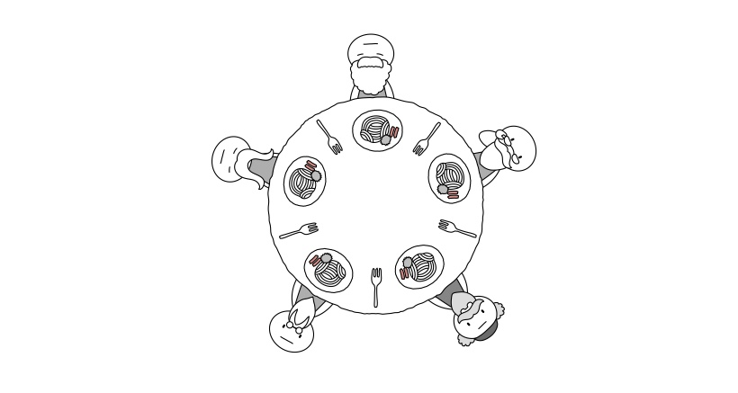
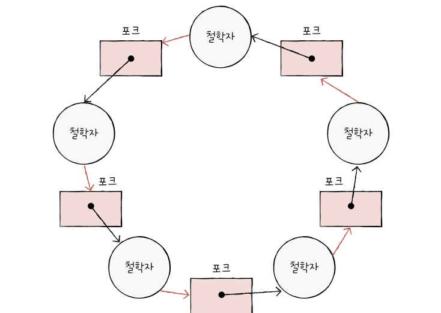

### 식사하는 철학자 문제

&nbsp;&nbsp;교착 상태를 설명하기 위한 대표적인 문제 상황은 `식사하는 철학자 문제(dining philosophers problem)`입니다. 문제 상황은 다음과 같습니다.

 

<figure align="center">
  
</figure>

&nbsp;&nbsp;맛있는 식사가 준비된 동그란 원탁에 다섯 명의 철학자가 앉아 있고 철학자들 사이에는 포크가 하나씩 놓여있습니다. 식사는 두 개의 포크를 사용해 먹을 수 있습니다. 철학자들은 다음과 같은 순서로 식사를 합니다.

 

1. 계속 생각을 하다가 왼쪽 포크가 사용 가능하면 집어듭니다.

2. 계속 생각을 하다가 오른쪽 포크가 사용 가능하면 집어듭니다.

3. 왼쪽과 오른쪽 포크를 모두 집어들면 정해진 시간동안 식사를 합니다.

4. 식사 시간이 끝나면 오른쪽 포크를 내려놓습니다.

5. 오른쪽 포크를 내려놓은 뒤 왼쪽 포크를 내려놓습니다.

6. 위의 과정을 반복합니다.

 

&nbsp;&nbsp;이 문제에서 철학자들은 식사를 마칠 수 없는 교착 상태에 이르게 됩니다. 만약 모든 철학자가 왼쪽 포크를 들었다면 오른쪽 포크는 사용할 수 없는 상태가 되어 계속 생각만 하는 상태가 됩니다. 이와 같이 <mark>일어나지 않을 사건을 기다리며 진행이 멈춰버리는 현상</mark>을 `교착 상태(deadlock)`이라고 부릅니다.

&nbsp;&nbsp;식사하는 철학자 문제에서 철학자는 프로세스 혹은 스레드, 포크는 한번에 하나의 프로세스 혹은 스레드가 접근(임계구역)할 수 있는 자원, 생각하는 행위는 자원을 기다리는 것에 비유할 수 있습니다.

 

### 자원 할당 그래프

&nbsp;&nbsp;`자원 할당 그래프(resource-allocation graph)`는 어떤 프로세스가 어떤 자원을 사용하고, 기다리고 있는지 표현하는지를 간단한 그래프로 표현한 것입니다.

 

**자원 할당 그래프 규칙**

1. 프로세스는 원으로, 자원의 종류는 사각형으로 표현합니다.

2. 사용할 수 있는 자원의 개수는 자원 사각형 내에 점으로 표현합니다.

3. 프로세스가 어떤 자원을 할당받아 사용 중이라면 자원에서 프로세스를 향해 화살표를 표시합니다.

4. 프로세스가 어떤 자원을 기다리고 있다면 프로세스에서 자원으로 화살표를 표시합니다.

 

&nbsp;&nbsp;식사하는 철학자 문제를 자원 할당 그래프로 그려보면 다음과 같이 그릴 수 있습니다. 교착 상태는 아래의 그림과 같이 자원 할당 그래프로 그렸을 때 원형으로 자원을 기다리는 형태로 그려지는 데 이것이 교착 상태 발생 조건 중 하나인 `원형 대기`입니다.

<figure align="center">
  
</figure>

 

### 교착 상태 발생 조건

&nbsp;&nbsp;교착 상태가 발생하기 위해서는 다음 4가지의 조건이 모두 만족해야합니다.

 

**1. 상호 배제(mutual exclusion)**

- 교착 상태가 발생하는 근본적인 원인 중 하나는 특정 자원을 한 번에 하나의 프로세스만 이용 가능한 `상호 배제`가 있었기 때문입니다.

- 식사하는 철학자 문제에서 철학자들 사이에 놓인 포크를 만일 여러 명이 동시에 사용할 수 있었다고 한다면 교착 상태는 발생하지 않았을 것입니다.

**2. 점유와 대기(hold and wait)**

- 교착 상태는 어느 한 자원을 가지고 다른 자원을 대기할 때 발생할 수 있습니다.

- 어느 한 자원을 할당받은 상태에서 다른 자원을 할당받기 위해 기다리는 상태를 `점유와 대기`라고 부릅니다.

- 식사하는 철학자 문제에서 철학자들이 왼쪽 포크를 들고 오른쪽 포크를 기다렸기 때문에 교착 상태가 발생할 수 있었던 것입니다.

**3. 비선점(nonpreemptive)**

- 프로세스의 작업이 끝나야만 다른 프로세스가 해당 자원을 이용할 수 있다는 점에서 `비선점`이 이루어지면 교착 상태가 발생합니다.

- 철학자들 사이에서 다른 사람이 들고 있는 포크를 뺏을 수 있었다면 교착 상태는 발생하지 않았을 것입니다.

**4. 원형 대기(circular wait)**

- 프로세스와 프로세스가 요청 및 할당받은 자원이 원의 형태를 이룬다면 교착 상태가 발생할 수 있습니다.

 
