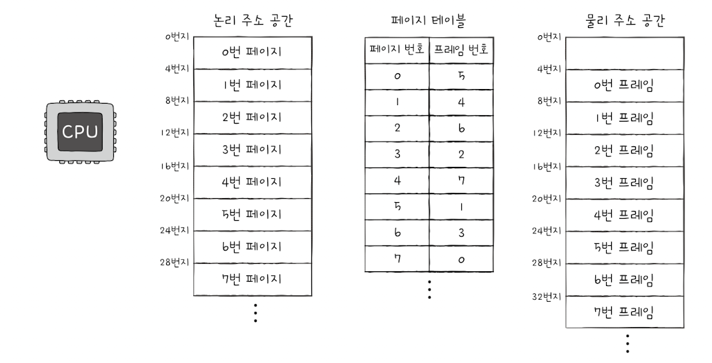

&nbsp;&nbsp;메모리 연속 할당 방식은 크게 두 가지 문제를 가지고 있습니다.

1. **외부 단편화** : 프로세스를 메모리에 연속적으로 할당하게 된다면 실제 메모리 용량보다 작은 파편화된 메모리 공간 때문에 외부 단편화가 발생할 수 있습니다.

2. **물리적 메모리 크기 제약** : 물리 메모리보다 큰 프로세스는 메모리에 적재될 수 없기 때문에 실행할 수 없다는 제약이 있습니다.

 

&nbsp;&nbsp;`가상 메모리(vitual memory)`는 실행하고자 하는 프로그램의 일부만 메모리에 적재하여 실제 물리 메모리 크기보다 더 큰 프로세스를 실행할 수 있게하는 기술입니다. 가상 메모리 기술에는 `페이징`과 `세그멘테이션` 두 가지 방법이 있지만 본문서는 현대 대부분의 운영체제에서 사용되는 페이징 기법을 다룹니다.

 

### 패이징이란

&nbsp;&nbsp;연속 메모리 할당 방식의 근본적인 문제점은 각기 다른 크기의 프로세스가 메모리에 연속적으로 할당되었기 때문에 발생했습니다. `페이징(paging)` 기법은 프로세스와 메모리를 일정한 단위로 자르고, 이를 메모리에 불연속적으로 할당하는 기법입니다.

 

**페이징 관련 용어**

**1. 페이지(page)** : 페이지는 프로세스의 논리 주소 공간을 일정한 단위로 자른 것을 의미합니다.

**2. 프레임(frame)** : 프레임은 메모리 물리 주소 공간을 페이지와 동일한 크기로 일정하게 자른 후 페이지를 할당하기 위한 공간입니다.

**3. 페이지 아웃(page out)** : 페이징을 통한 가상 메모리 관리 기법에서 페이지 단위로 발생하는 스왑 아웃을 페이지 아웃이라고 부릅니다.

**4. 페이지 인(page in)** : 반대로 페이지 단위로 발생하는 스왑 인은 페이지 인이라 부릅니다.

 

&nbsp;&nbsp;페이징 기법을 활용하면 프로세스에서 필요한 일부 페이지만 메모리(프레임)에 적재하여 실행하면 되기 때문에 물리 메모리의 크기보다 큰 프로세스를 실행하는 것이 가능해집니다.

 

### 페이지 테이블

&nbsp;&nbsp;페이징 기법을 통해 프로세스를 메모리에 불연속적으로 배치하는 것은 가능해졌지만 실제로 CPU가 프로세스를 실행할 때에는 각 페이지들에 대해 연속적으로 접근할 필요가 있습니다. `페이지 테이블(page table)`은 불연속적인 물리 주소를 연속적인 논리 주소로 표현한 테이블로 CPU는 페이지 테이블의 논리 주소 값을 참조하며 순차적으로 필요한 페이지에 접근할 수 있습니다.

 

**페이지 접근 과정**

1. CPU는 `PTBR(Page Table Base Register)`에 저장된 주소값을 찾아 메모리에서 페이지 테이블을 찾습니다.

2. 페이지 테이블에서 다음에 실행할 페이지의 주소를 찾은 뒤 해당 페이지가 적재되어 있는 프레임(메모리)에 접근합니다.

 

> 💡 TLB(Translation Lookaside Buffer)
>
> &nbsp;&nbsp;페이지 테이블이 메모리 내에 있다면 위와 같이 프로세스에 접근하기 위해 메모리에 2번 접근해야 한다는 문제점이 발생합니다. 이를 해결하기 위해 CPU내(그 중 MMU)에는 `TLB`라는 페이지 테이블의 참조 지역성에 근거해 최근에 사용된 페이지 테이블의 데이터를 저장하는 캐시 메모리를 두는 방법을 사용합니다.
>
> &nbsp;&nbsp;CPU에서 접근하려고 하는 페이지의 논리 주소가 TLB에 있다면 이를 `TLB Hit`, 없다면 `TLB Miss`라고 부릅니다.

 

> 💡 내부 단편화(internal fragmentation)
>
> &nbsp;&nbsp;프로세스를 페이지로 쪼개 불연속적으로 배치하는 페이징을 사용하더라도 페이지 자체의 크기에 의해 단편화가 발생할 수 있습니다. 모든 프로세스들이 일정한 페이지의 배수의 형태로 잘리지는 않기 때문에 남은 페이지 영역으로 발생하는 메모리 낭비를 `내부 단편화`라고 부릅니다.
>
> &nbsp;&nbsp;만약 페이지를 아주 잘게 쪼갠다면 내부 단편화로 인한 메모리 낭비를 줄일 수 있겠지만 이는 페이지 테이블의 크기가 커지는 trade-off가 존재합니다.

 

### 페이징에서의 주소 변환

&nbsp;&nbsp;페이징 시스템에서 특정 물리 주소에 접근하기 위해서 논리 주소는 `페이지 번호(page number)`와 `변위(offset)`로 이루어져 있습니다. 아래 그림과 같이 페이지 번호는 페이지 테이블에서 프레임 번호를 가리키는 해시 값을, 변위는 해당 프레임(물리 주소)의 시작 지점에서 얼마나 떨어져 있는지를 나타냅니다.

 

<figure align="center">
  
</figure>

 

### 페이지 테이블 엔트리

&nbsp;&nbsp;페이지 테이블의 각 행은 `페이지 테이블 엔트리(page table entry)`라고 불립니다. 페이지 테이블 엔트리는 페이지 번호와 프레임 번호 이외에도 `유효 비트`, `보호 비트`, `참조 비트`, `수정 비트` 등의 다양한 정보를 담고 있습니다.

 

**1. 유효 비트(valid bit)**

&nbsp;&nbsp;해당 페이지에 접근이 가능한지 여부를 나타내는 비트입니다. 실행이 완료된 페이지나 스와핑으로 인해 메모리에서 제거된 페이지의 경우 0의 값을 가집니다.

> 💡 CPU가 메모리에 적재되어 있지 않은 페이지에 접근하려 한다면 `페이지 볼트(page valut)`라는 예외(Exception)가 발생합니다. 페이지 볼트에 대한 자세한 내용은 다음 절에서 다룹니다.

 

**2. 보호 비트(protection bit)**

&nbsp;&nbsp;보호비트는 페이지 보호 기능을 위한 비트로 구현 방식에 따라 읽고 쓰기가 가능하면 1, 아니면 0의 하나의 비트, 혹은 r(read), w(write), x(execute) 각각에 대해 0 또는 1의 값을 가지는 3비트로 표현할 수 있습니다.

 

**3. 참조 비트(reference bit)**

&nbsp;&nbsp;CPU가 해당 페이지에 접근한 적이 있는 여부를 나타내는 비트입니다. 메모리에 적재된 이후 CPU가 한번도 읽거나 쓴 적이 없는 페이지는 0의 비트값을 가집니다.

 

**4. 수정 비트(modified bit)**

&nbsp;&nbsp;수정 비트는 해당 페이지가 CPU에 의해 수정된 적이 있는지를 나타내는 비트로 `더티 비트(dirty bit)`라고도 부릅니다. 수정 비트의 값에 따라 접근한 적이 없거나 수정된 적이 없던 비트값을 가지는 페이지가 메모리에 제거될 때 보조기억장치에 쓰기 작업을 해야하는 지 여부를 알기 위해 사용됩니다. 만약에 페이지의 데이터에 변경이 일어났다면 보조기억장치에 스왑 아웃될 때 변경된 값을 저장하는 별도의 과정이 필요합니다.

 

> 💡 쓰기 시 복사
>
> &nbsp;&nbsp;쓰기 시 복사에 페이징을 활용할 수 있습니다. 일반적으로 운영체제에서 fork 시스템 호출로 인해 부모 프로세스의 복사본이 자식 프로세스로서 만들어지는 과정은 프로세스의 생성 시간과 메모리의 낭비를 야기할 수 있습니다. 쓰기 시 복사를 활용하면 <mark>쓰기 작업이 이루어지기 전까지는 자식 프로세스가 부모 프로세스와 같은 프레임을 가리키지만 쓰기가 발생한 페이지만 새로 복제하여 별도의 공간을 가리키는 방법</mark>으로 프로세스 생성 시간을 줄이고 메모리 공간 절약을 할 수 있다는 장점이 있습니다.

 

> 💡 계층적 페이징
>
> &nbsp;&nbsp;페이지 테이블의 크기는 프로세스의 크기에 비례해서 커집니다. 거대해지는 페이지 테이블 크기를 줄이기 위한 방법으로 사용하는 것이 `계층적 페이징(hiearched paging)`으로 페이지 테이블을 다시 여러 페이지로 쪼개 이 쪼개진 페이지를 가리키는 상위 페이지 테이블을 두는 방식입니다.
>
> &nbsp;&nbsp;계층적 페이징을 활용하면 특정 프로세스에 대한 페이지 테이블 전체를 메모리에 적재할 필요없이 필요한 일부분의 페이지 테이블만 메모리에 적재하고 나머지는 보조기억장치에 저장하는 방식으로 메모리를 절약할 수 있습니다.
>
> &nbsp;&nbsp;계층적 페이지는 메모리를 효율적으로 활용할 수 있다는 장점이 있지만, 페이지 폴트 발생 시에 상위에서 하위 페이지 테이블을 거치는 과정에서 메모리 참조 횟수가 많아질 수 있습니다.

 
