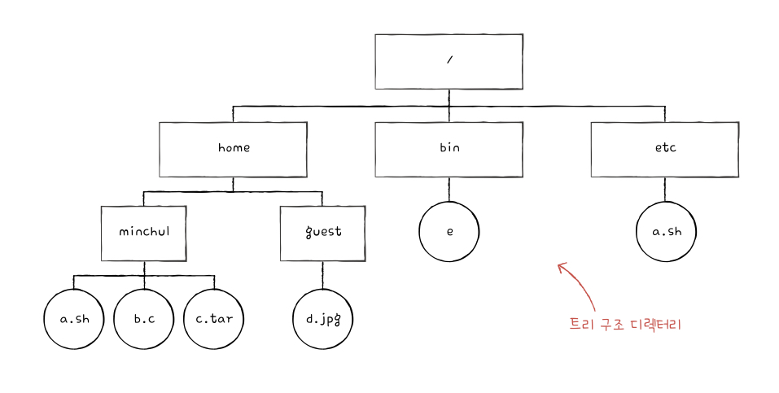

## 15.1 파일과 디렉터리

&nbsp;&nbsp;`파일`과 `디렉터리`는 운영체제 내부 `파일 시스템`에 의해 관리되는 데이터입니다. 이번 장에서는 파일 시스템과 함께 파일과 디렉터리에 대해 다룹니다.

 

### 파일

&nbsp;&nbsp;`파일(file)`은 보조기억장치에 저장된 관련 정보의 집합 혹은 의미 있고 관련 있는 정보를 모은 논리적 단위로 표현할 수 있습니다.

 

**파일을 이루는 정보**

1. 이름(파일명)
2. 파일을 실행하기 위한 정보
3. 파일과 관련된 부가 정보 : 속성(attribute) or 메타데이터(metadata)

 

**파일 속성의 종류**

| 속성 이름        | 의미                                                   |
| ---------------- | ------------------------------------------------------ |
| 유형             | 운영체제가 인지하는 파일의 종류                        |
| 크기             | 파일의 현재 크기와 허용 가능한 최대 크기               |
| 보호             | 어떤 사용자가 해당 파일을 읽고, 쓰고, 실행할 수 있는지 |
| 생성날짜         | 파일이 생성된 날짜                                     |
| 마지막 접근 날짜 | 파일에 마지막으로 접근한 날짜                          |
| 마지막 수정 날짜 | 파일이 마지막으로 수정된 날짜                          |
| 생성자           | 파일을 생성한 사용자                                   |
| 소유자           | 파일을 소유한 사용자                                   |
| 위치             | 파일의 보조기억장치상의 현재 위치                      |

 

> 💡 파일 확장자(extention)
>
> &nbsp;&nbsp;파일 유형을 운영체제에 알리기 위한 가장 흔히 사용되는 방식은 파일 이름 뒤에 .을 붙여 `확장자(extension)`을 표시하는 것입니다. 운영체제는 확장자에 따라 파일의 실행 방식을 달리합니다.

| 파일 유형          | 대표 확장자                   |
| ------------------ | ----------------------------- |
| 실행 파일          | 없음, exe, com, bin           |
| 목적 파일          | obj, o                        |
| 소스 코드 파일     | c, cpp, cc, java, asm, py, js |
| 워드 프로세서 파일 | xml, rtf, doc, docx           |
| 라이브러리 파일    | lib, a, so, dll               |
| 멀티미디어 파일    | mpeg, mov, mp3, mp4, avi      |
| 백업/보관 파일     | rar, zip, tar                 |

 

&nbsp;&nbsp;파일을 다루는 모든 작업인 `파일 연산`은 운영체제에 의해 이루어지며 응용 프로그램 스스로가 임의로 파일을 조작할 수는 없습니다. 운영체제는 파일 연산을 위해 파일 생성, 삭제, 열기, 닫기, 읽기, 쓰기 등의 `시스템 호출`을 제공합니다.

 

### 디렉터리

&nbsp;&nbsp;운영체제는 파일을 관리하기 위해 `디렉터리(directory)`를 이용하며, 윈도우 운영체제에서는 디렉터리를 `폴더(folder)`라고 표현합니다. 파일 연산과 마찬가지로 운영체제는 디렉터리 연산을 위해 디렉터리 생성, 삭제, 열기, 닫기, 읽기 등의 시스템 호출을 제공합니다.

 

**디렉터리 구조**

1. **1단계 디렉터리** : 하나의 디렉터리 아래에 모든 파일이 위치하는 구조

2. **트리 구조 디렉터리(tree-structured directory)** : 최상위 디렉터리(루트 디렉터리)에서 시작하여 여러 계층 구조로 이루어진 디렉터리

<figure align="center">
  
</figure>

 

**경로(path)**

&nbsp;&nbsp;트리 구조 디렉터리의 경우 수많은 자식 디렉터리(서브 디렉터리)를 가지게 되며 파일을 찾기 위한 개념이 필요했습니다. `경로(path)`는 디렉터리에서 파일 위치, 파일 이름을 특정 짓기 위한 방법입니다. 최상위 경로인 루트 경로는 `슬래시(/)`로 표현하며, 슬래시는 디렉터리와 디렉터리 사이의 구분자로도 사용됩니다.

1. **절대 경로(absolute path)** : 루트 디렉터리에서 자기 자신까지 이르는 고유한 경로

2. **상대 경로(relative path)** : 현재 디렉터리에서 시작하여 자기 자신까지 이르는 상대적인 경로

 

> 💡 디렉터리 엔트리(directory entry)
>
> &nbsp;&nbsp;디렉터리 역시 하나의 파일로 일반적인 파일과는 약간 다르게 해당 디렉터리에 담겨 있는 대상과 관련된 정보를 테이블(표)의 형태로 담아 보조기억장치에 저장되어 있습니다. 디렉터리 정보를 담고 있는 `디렉터리 테이블`의 각각의 `행(엔트리)`에는 디렉터리가 담고 있는 파일의 정보를 식별하기 위한 정보들이 담기는데 이는 파일 시스템의 종류마다 상이할 수 있습니다. 하지만 일반적으로 디렉터리 엔트리에 담기는 정보는 해당 파일의 위치 정보를 유추할 수 있는 정보와 함께, 해당 파일의 생성 시간, 수정 시간, 크기 등의 정보가 담길 수 있습니다.

 

> ❗️ 상대 경로를 나타내는 방법
>
> &nbsp;&nbsp;상대 경로에서 `마침표(.)`는 현재 경로를 `두 개의 마침표(..)`는 현재 작업 디렉터리의 `상위 디렉터리(부모 디렉터리)`를 나타냅니다. 만약 현재 디렉터리 아래에 dev 디렉터리로 갔다가 다시 자기 자신으로 돌아와 a.txt 파일을 가리키고 싶다면 `./dev/../a.txt`로 표현할 수 있습니다.

 
