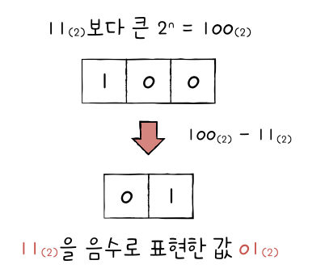

## 02.1 0과 1로 숫자를 표현하는 방법

### 정보 단위

- **비트(bit)** : `비트`는 컴퓨터가 이해하는 <mark>가장 작은 정보단위</mark>로 0과 1로 이루어져 있습니다.
- n비트로는 $2^n$가지 정보를 표현할 수 있습니다.
- **바이트(byte)** : `바이트`는 <mark>8개의 비트</mark>를 묶은 단위로 비트보다 한 단계 큰 단위입니다. 바이트부터는 이전 단위를 1000개씩 묶어서 '킬로바이트', '메가바이트', '기가바이트' 등으로 표현합니다.

 

### 이진법

&nbsp;&nbsp;우리가 숫자를 일반적으로 사용하는 방법은 9가 넘어갈 때마다 자리 수를 올리는 '십진법'입니다. 마찬가지로 '이진법'은 0과 1로 모든 숫자를 표현하기 위한 방법으로 숫자가 1을 넘어가는 시점에 자리 수를 올리는 규칙을 가집니다. 이진법과 십진법을 구분하기 위해 수학적으로는 숫자 뒤에 괄호를 붙여 $100_{(2)}$와 같이 표현하고, 코드 상에서는 `0b100`로 표현합니다.

 

  0 -> 0
   
  1 -> 1
   
  2 -> 10
   
  3 -> 11
   
  4 -> 100
   
  ...

 

**❗️ 음수 표현**

- 이진법에서 음수를 표현하는 방법 중 하나는 `2의 보수`를 사용하는 것입니다.
- 2의 보수의 사전적 의미는 <mark>어떤 수를 그보다 큰 $2^n$에서 뺀 값</mark>을 의미합니다.
- 쉽게 계산하는 방법으로는 <mark>원래의 숫자에서 0과 1을 뒤집은 다음 1을 더해</mark> 구할 수 있습니다.
- 이진수를 봤을 때 양수인지 음수인지 구분하기는 어렵습니다. 컴퓨터는 내부적으로 부가정보인 `플래그(flag)`를 사용하여 양수와 음수를 구분합니다.

 

<figure align="center">
  
</figure>

 

> &nbsp;&nbsp;2의 보수를 사용하여 음수를 표현하는 데에는 한계가 있습니다. $0000_{(2)}$을 2의 보수를 사용해 음수로 표현하면 $10000_{(2)}$로 전혀 다른 값이 되어버리거나, $1000_{(2)}$의 경우에는 $1000_{(2)}$로 자기 자신이 되어버리는 문제가 발생합니다.

 

### 십육진법

- 십육진법은 수가 15를 넘어가는 시점에 자리 올림을 하는 숫자 표현 방식입니다.
- 0~9까지는 10진법과 동일하게 숫자로 표현되지만 10부터 15까지는 `A, B, C, D, E, F`로 표현됩니다.
- 이진법은 0과 1로 모든 수를 표현하기 때문에 자리 수가 너무 길어진다는 단점이 있습니다. 이러한 단점을 보완하기 때문에 십육진법을 사용합니다.
- 특히 십육진법이 사용되는 이유는 이진법과 십육진법간 <mark>변환이 쉽기 때문</mark>입니다.
- 십육진수는 수학적으로는 $1B6A_{(16)}$과 같이 표현하고, 코드로는 `0x1B6A`와 같이 표현합니다.
   

**십육진수에서 이진수 변환**
&nbsp;&nbsp;십육진수 한 자리는 0부터 A~F까지 16개의 숫자를 표현할 수 있습니다. 이진수에서 16개의 숫자를 표현하기 위해서는 0000부터 1111까지 4자리의 0과 1의 조합으로 표현되기 때문에 십육진수 한자리는 4자리의 이진수로 치환됩니다.

  6 -> 0110
   
  A -> 1010
   
  6A -> 01101010

 

**이진수에서 십육진수 변환**

&nbsp;&nbsp;마찬가지로 이진수에서 십육진수로 변환하려면 이진수를 4자리씩 끊어 변환하면 됩니다.

 

  110 -> 6
   
  10110010 -> B2
   
  11111110 -> FE

 
