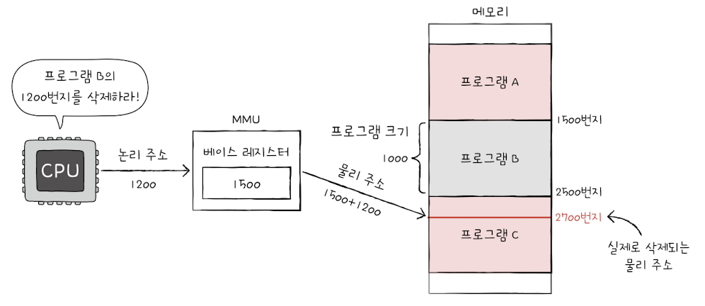

## 06.2 메모리의 주소공간

### 물리 주소와 논리 주소

&nbsp;&nbsp;주소에는 정보가 저장된 하드웨어(메모리) 상의 주소를 가리키는 `물리 주소`와 실행되는 프로그램 각각에 대해 0번부터 부여된 `논리 주소`가 있습니다.

&nbsp;&nbsp;CPU가 이해하는 주소는 논리 주소인데 CPU가 메모리와 상호작용하기 위해서는 물리 주소와 논리 주소간에 변환이 이루어져야 하는데, 이는 CPU와 주소버스 사이에 위치한 `메모리 관리 장치(MMU, Memory Management Unit)`에 의해 수행됩니다.

 

<figure align="center">
  
</figure>

 

&nbsp;&nbsp;메모리 관리 장치는 베이스 레지스터에 저장된 주소값을 기반으로 논리 주소를 물리 주소로 변환합니다. `베이스 레지스터`는 프로그램의 첫 물리 주소를 저장하고 만약 베이스 레지스터에 저장된 주소가 45000, CPU가 가리키는 논리 주소가 100번이라면 실제 메모리의 물리 주소는 45100번입니다.

 

### 메모리 보호 기법

&nbsp;&nbsp;만약 프로그램 B에 할당된 물리 주소가 1501\~2500번, C에 할당된 물리 주소가 2501\~3500번일 때, 프로그램 B에 대해 가리키는 베이스 레지스터의 값은 1501번입니다. 하지만 CPU가 프로그램 B에 대한 명령어의 논리 주소를 가리킬 때 1200번이 할당된다면 이는 2701번 물리 주소를 가리켜 프로그램 C에 대한 메모리 영역을 침범하게 됩니다.

 

<figure align="center">
  
</figure>

 

&nbsp;&nbsp;이와 같이 다른 프로그램의 메모리 영역을 보호하기 위해 `한계 레지스터`는 현재 프로그램에 대한 논리 주소의 최대 값을 저장합니다. 이렇게 되면 프로그램 B에 대해 베이스 레지스터는 1501을, 한계 레지스터는 1000번을 저장하게 되겠지요. 프로그램 A에 대한 메모리에 접근할 때, 한계 레지스터에 저장된 1000번을 넘어가는 논리 주소에 접근하려고 하면 인터럽트(트랩)을 발생하여 실행을 중단시킵니다.

 
