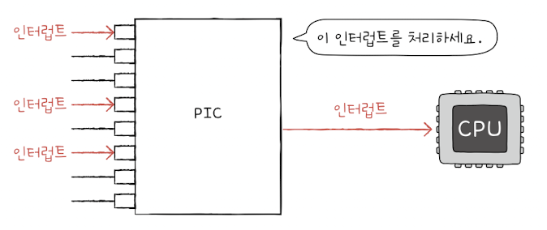

&nbsp;&nbsp;CPU와 장치 컨트롤러가 정보를 주고 받기 위한 방법에는 다음과 같이 세 가지가 있습니다.

 

### 1. 프로그램 입출력(Programmed I/O)

- 프로그램의 명령어로 입출력장치를 제어하는 방법입니다.

- 프로그램을 실행하는 도중 입출력 관련 명령어를 만나면 CPU가 입출력장치에 연결된 장치 컨트롤러와 상호작용하여 입출력 작업을 수행합니다.

- CPU는 장치 컨트롤러의 제어 레지스터에 명령을 보내고, 상태 레지스터를 확인해 명령을 수행할 수 있는 상태인지 확인합니다. 만약 데이터를 읽거나, 쓰는 명령이라면 장치 레지스터의 데이터 레지스터에 값을 저장합니다.

- CPU가 장치 컨트롤러의 레지스터에 접근하는 방법은 크게 `메모리 맵 입출력`과 `고립형 입출력` 두 가지가 있습니다.

 

> 💡 `메모리 맵 입출력`
>
> &nbsp;&nbsp;메모리에 접근하기 위한 주소 공간과 입출력장치에 접근하기 위한 주소 공간을 하나의 주소 공간으로 간주하는 방법입니다. 입출력장치에 접근하기 위한 주소 공간을 같이 사용한다는 점에서 메모리 주소 공간이 축소됩니다. 하나의 주소 공간을 사용하는 만큼 메모리에 접근하는 명령어와 입출력장치에 접근하는 명령어가 같습니다.

 

> 💡 `고립형 입출력`
>
> &nbsp;&nbsp;메모리를 위한 주소 공간과 입출력장치를 위한 주소 공간을 분리하는 방법입니다. 별도의 주소 공간을 사용하기 때문에 메모리 주소 공간이 축소되지 않으며, 입출력장치를 사용하기 위해서는 별도의 명령어를 사용해야 합니다.

 

### 2. 인터럽트 기반 입출력

&nbsp;&nbsp;`인터럽트 기반 입출력(Interrupt-Driven I/O)`은 장치 컨트롤러에 의해 발생하는 하드웨어 인터럽트 요청 신호를 CPU가 받으면 CPU는 하던 일을 중단 및 백업하고 인터럽트 서비스 루틴을 실행하는 방식입니다.

 

> 💡 `폴링(polling)`은 인터럽트와 자주 비교되는 개념입니다. 폴링이란 CPU가 입출력장치의 상태와, 처리할 데이터가 있는지 주기적으로 확인하는 방식으로 인터럽트 방식에 비해 CPU의 부담이 큰 방식입니다.

 

**PIC(Programmable Interrupt Controller)**

&nbsp;&nbsp;컴퓨터 장치는 매우 다양한 입출력장치들을 사용할 수 있으며, 각각의 입출력장치의 장치 컨트롤러에서 발생하는 하드웨어 인터럽트를 처리하는 데에는 우선 순위가 있기 마련입니다. `프로그래머블 인터럽트 컨트롤러(PIC)`라는 하드웨어는 여러 장치 컨트롤러와 연결되어 장치 컨트롤러에서 보낸 하드웨어 인터럽트들에 대한 요청의 우선 순위를 판별해 CPU가 먼저 처리해야할 인터럽트가 무엇인지 알려주는 장치입니다.

 

<figure align="center">
  
</figure>

 

&nbsp;&nbsp;PIC의 각 핀에는 CPU에 하드웨어 인터럽트 요청을 보낼 수 있는 약속된 하드웨어가 연결되어 있습니다. PIC는 연결된 하드웨어들로부터 받은 인터럽트들의 우선 순위를 판단하여 CPU에 먼저 처리할 인터럽트가 무엇인지 알려줍니다.

&nbsp;&nbsp;복잡한 장치들의 인터럽트를 관리하기 위해 PIC를 두 개 이상 계층적으로 구성하기도 합니다. PIC를 계층 구조로 구성하면 더 많은 하드웨어를 관리할 수 있습니다.

 

**PIC 다중 인터럽트 처리 과정**

1. PIC가 장치 컨트롤레에서 인터럽트 요청 신호(들)을 받아들입니다.
2. PIC는 인터럽트 우선순위를 판단하여 CPU에 처리해야할 인터럽트 요청신호를 보냅니다.
3. CPU는 PIC에 인터럽트 확인 신호를 보냅니다.
4. PIC는 데이터 버스를 통해 CPU에 인터럽트 벡터를 보냅니다.
5. CPU는 인터럽트 벡터를 통해 인터럽트 요청의 주체를 알게 되고, 해당 장치의 인터럽트 서비스 루틴을 실행합니다.

 

> ❗️ &nbsp;&nbsp;NMI(Non-maskable Interrupt)는 우선순위가 가장 높아 우선순위 판별이 불필요한 인터럽트입니다. 때문에 PIC에서 별도로 NMI의 우선순위를 판별하지 않습니다.

 

### 3. DMA 입출력

&nbsp;&nbsp;앞에서 다룬 프로그램 입출력과 인터럽트 기반 입출력의 공통점은 입출력장치와 메모리 간의 데이터 이동을 CPU가 주도하고, 이동하는 데이터 역시 CPU를 거친다는 점입니다.

&nbsp;&nbsp;입출력장치와 메모리 사이에 전송되는 모든 데이터가 CPU를 거친다면 CPU의 부담이 커지기 때문에 입출력장치와 메모리가 CPU를 거치지 않고 상호작용할 수 있는 입출력 방식인 `DMA(Direct Memory Access)`가 등장하게 되었습니다. DMA는 직접 메모리에 접근할 수 있는 입출려 기능으로 DMA 입출력을 위해서는 시스템 버스에 연결된 `DMA 컨트롤러`라는 하드웨어가 필요합니다.

 

**DMA 입출력 과정**

1. CPU는 DMA 컨트롤러에 입출력장치의 주소, 수행할 연산, 읽거나 쓸 메모리의 주소 등과 같은 정보를 포함한 입출력 작업을 명령합니다.

2. DMA 컨트롤러는 CPU 대신 장치 컨트롤러와 상호작용하며 입출력 작업을 수행합니다. DMA 컨트롤러는 필요한 경우 메모리에 직접 접근하여 정보를 읽거나 씁니다.

3. 입출력 작업이 끝나면 DMA 컨트롤러는 CPU에 인터럽트를 걸어 작업이 끝났음을 알립니다.

 

**DMA 입출력의 특징**

- 입출력 장치와 메모리 사이에 주고받을 데이터는 CPU를 거치지 않고, CPU는 DMA 컨트롤러에 입출력 작업 명령을 내리고, 인터럽트만 받으면 되기 때문에 작업 부담이 줄어듭니다.

- CPU는 오로지 입출력의 시작과 끝에만 관여하면 됩니다.

 

> ❗️ `사이클 스틸링(cycle stealing)`
>
> &nbsp;&nbsp;DMA 컨트롤러가 메모리에 직접 접근하기 위해서는 시스템 버스를 이용해야만 합니다. 시스템 버스는 공용 자원이기 때문에 CPU가 시스템 버스를 사용하는 동안 DMA 컨트롤러는 시스템 버스를 사용할 수 없으며, DMA 컨트롤러가 시스템 버스를 사용하는 동안에는 CPU가 시스템 버스를 사용할 수 없습니다.
>
> &nbsp;&nbsp;CPU 입장에서는 시스템 버스에 접근하는 주기를 DMA 컨트롤러에 도둑맞은 느낌이 들 수 있기 때문에 DMA에 의한 시스텀 버스 이용을 `사이클 스틸링(cycle stealing)`이라고 부릅니다.

 

**입출력 버스(I/O bus)**

- DMA 컨트롤러와 장치 컨트롤러가 서로 데이터를 전송하기 위해 시스템 버스를 사용하게 될 경우 DMA 컨트롤러는 메모리에서 DMA 컨트롤러로 데이터를 가져올 때 한 번, 데이터를 DMA 컨트롤러에서 장치 컨트롤러로 옮기기 위해 한 번 시스템 버스에 접근하게 됩니다.

- `입출력 버스(I/O bus)`라는 별도의 버스를 사용하면 DMA 컨트롤러와 장치 컨트롤러간 데이터를 주고 받을 때에는 시스템 버스를 이용하지 않아도 되기 때문에 시스템 버스 사용 빈도를 줄일 수 있습니다.

- 입출력 버스에는 `PCI 버스(Peripheral Component Interconnect Bus)`,`PCI Express 버스(PCIe Bus)` 등 여러 종류가 있으며 입출력 장치들은 PCIe 슬롯을 통해 PCIe 버스와 연결됩니다.

 

> 💡 DMA 컨트롤러를 통해 메모리가 CPU를 거치지 않고 직접 데이터를 주고 받을 수 있게 되었지만 입출력 명령어를 인출, 해석, 실행하는 역할의 상당 부분은 CPU가 담당한다는 문제점이 남아 있습니다. 이를 위해 메모리에 직접 접근하는 것 뿐만 아니라 명령어를 직접 인출, 해석, 실행하는 입출력 전용 CPU가 만들어지기도 했는데 이를 `입출력 프로세서(IOP, I/O Processor)` 또는 `입출력 채널(I/O Channel)`이라고 부릅니다.

 
