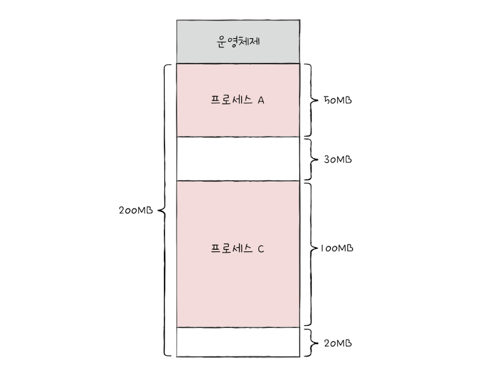

&nbsp;&nbsp;지금까지 살펴본 프로세스들은 연속적인 메모리 공간에 `연속 메모리 할당` 방식으로 적재되어 왔습니다. 이번 장에서는 프로세스들이 메모리에 연속적으로 할당되었을 때 고려해야할 요소들에 대해 다룹니다.

 

### 스와핑(swapping)

&nbsp;&nbsp;메모리에 적재된 프로세스 중 입출력 작업 등으로 인해 현재 실행 중이지 않은 프로세스나 오랜 시간 사용되지 않은 프로세스들이 있을 수 있는데 메모리 공간을 효율적으로 활용하기 위해 이러한 프로세스들을 임시로 보조기억장치의 일부 영역으로 내보내고 그렇게 빈 메모리 영역에 새로운 프로세스를 적재하여 실행하는 것을 `스와핑(Swapping)`이라고 부릅니다.

 

**스와핑 관련 용어**

- **스왑 영역** : 스와핑을 위해 임시로 프로세스들을 저장하는 보조기억장치 영역

- **스왑 아웃** : 현재 실행되지 않는 프로세스가 메모리에서 보조기억장치로 옮겨지는 것

- **스왑 인** : 스왑 아웃되었던 프로세스가 다시 실행되기 위해 메모리에 적재되는 것

 

&nbsp;&nbsp;스와핑을 활용하면 메모리보다 큰 용량을 요구하는 프로세스들을 동시에 실행할 수 있습니다. 가령 200MB인 메모리에 각각 100MB, 60MB, 30MB, 20MB인 프로세스들이 있다면 앞의 세 프로세스를 실행하다 어느 하나의 프로세스를 스왑 아웃한 뒤 20MB의 프로세스를 스왑 인하면 되기 때문입니다. 이때 스왑 아웃되었다가 다시 스왑인 되는 프로세스는 처음 메모리의 물리 주소와는 다른 주소에 적재될 수 있습니다.

 

### 메모리 할당

&nbsp;&nbsp;프로세스가 메모리의 빈 공간에 연속적으로 적재되는 방식에는 크게 `최초 적합`, `최적 적합`, `최악 적합` 3가지 방식이 있습니다.

 

**1. 최초 적합(first fit)** : 최초 적합은 운영체제가 새로운 프로세스를 적재하기 위해 순차적으로 메모리의 빈 영역을 탐색하다 프로세스를 적재할 수 있는 충분한 공간을 발견했을 때 프로세스를 해당 공간에 프로세스를 적재하는 방식입니다.

**2. 최적 적합(best fit)** : 최적 적합은 운영체제가 메모리의 빈 공간을 모두 검색한 뒤 프로세스가 적재될 수 있는 공간 중 가장 작은 공간에 프로세스를 적재하는 방식입니다.

**3. 최악 적합(worst fit)** : 최악 적합은 운영체제가 메모리의 빈 공간을 모두 검색한 뒤 프로세스를 적재될 수 있는 공간 중 가장 큰 공간에 프로세스를 적재하는 방식입니다.

 

### 외부 단편화

&nbsp;&nbsp;메모리에 프로세스를 연속적으로 할당하는 방식은 메모리의 낭비를 초래할 수 있습니다. <mark>프로세스를 할당하기 어려울 만큼 작은 메모리 공간들로 인해 메모리가 낭비되는 현상</mark>을 `외부 단편화(external gragmentation)`이라고 부르는데 외부 단편화는 아래 예시와 같은 상황에서 발생할 수 있습니다.

 

<figure align="center">
  
</figure>

 

&nbsp;&nbsp;만약 위 그림과 같은 메모리의 영역에 A~D의 프로세스가 적재되어 실행된 후 B,D 프로세스가 처리가 완료되어 메모리에서 제거되었다고 가정해보겠습니다. 남은 공간은 50MB이지만 프로세스를 메모리에 연속적으로 할당하기 위해서는 실제로 50MB의 크기를 가지는 프로세스는 메모리에 적재될 수 없습니다.

 

> ❗️ 외부 단편화는 스와핑 과정에서 빈번하게 발생할 수 있습니다. 스왑 아웃되어 생긴 빈 공간의 영역의 메모리 크기가 실제로 스왑 인될 프로세스보다 크더라도 각 빈 메모리 영역의 크기가 프로세스 크기보다 작다면 적재될 수 없기 때문이죠.

 

**압축(compaction)**

&nbsp;&nbsp;외부 단편화를 해결할 수 있는 가장 대표적인 방법에는 `압축` 또는 `메모리 조각 모음`이라 불리는 방법이 있습니다. 압축은 메모리에 적재된 프로세스들을 재배치 시켜 메모리에 흩어져 있는 빈 공간들을 하나로 모으는 과정을 거치는데 이 과정에서 하던 작업이 중지되고, 메모리의 작업들을 옮기는 동안 수 많은 오버헤드가 발생할 수 있다는 단점이 있습니다.

 

