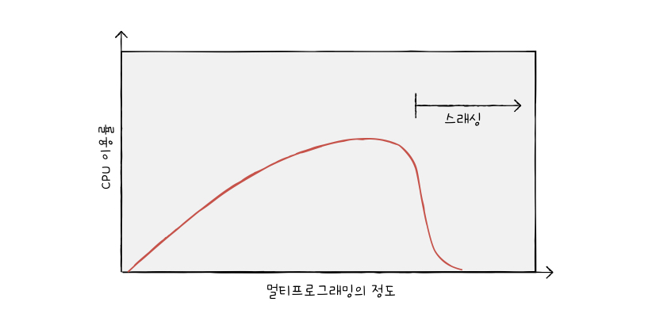
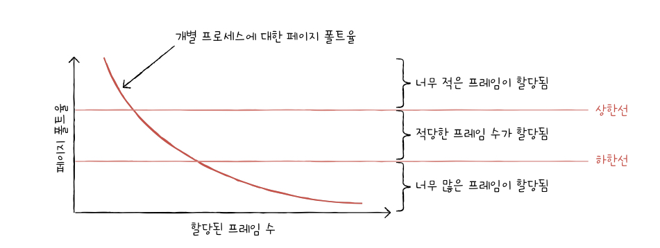

### 요구 페이징(demand paging)

&nbsp;&nbsp;프로세스를 메모리에 적재할 때 모든 페이지를 적재하지 않고 필요한 페이지만을 메모리에 적재하는 기법으로 아래와 과정을 거쳐 프로세스가 실행됩니다.

1. CPU가 특정 페이지에 접근하는 명령어를 실행합니다.
2. 해당 페이지가 현재 메모리에 있을 경우(유효 비트가 1일 경우) CPU는 페이지가 적재된 프레임에 접근합니다.
3. 해당 페이지가 현재 메모리에 없을 경우(유효 비트가 0일 경우) 페이지 폴트가 발생합니다.
4. 페이지 폴트 처리 루틴을 통해 해당 페이지를 메모리에 적재하고 유효 비트를 1로 설정합니다.
5. 다시 CPU가 해당 페이지에 접근하는 명령어를 실행합니다.

 

> 💡 순수 요구 페이징(pure demand paging)
>
> &nbsp;&nbsp;요구 페이징 중에서 프로세스가 실행되는 순간부터 페이지 메모리 적재없이 무작정 실행부터 시작해 페이지 폴트를 발생시키며 필요한 페이지를 메모리에 적재하는 방식입니다.

 

&nbsp;&nbsp;요구 페이징을 위해서는 페이지로 꽉찬 메모리를 새로 적재할 페이지로 교체하는 `페이지 교체`와 각 프로세스 별로 한정된 메모리에서 얼마만큼의 프레임을 할당받을 것인지에 대한 `프레임 할당` 문제를 해결해야 합니다.

 

### 페이지 교체 알고리즘

&nbsp;&nbsp;페이지 교체 알고리즘은 다음 필요한 페이지가 메모리에 적재될 때 어떤 페이지를 스왑 아웃할지 기준이 되는 알고리즘입니다. 좋은 페이지 교체 알고리즘일 수록 페이지 폴트가 발생되는 빈도가 적어지기 때문에 페이지 교체 알고리즘의 핵심이 되는 것은 `페이지 폴트 횟수`와 이를 계산할 수 있는 `페이지 참조열(page reference string)`입니다.

 

> ❗️ 페이지 참조열은 CPU가 참조하는 페이지들 중 연속된 페이지를 생략한 페이지열을 의미합니다. 연속된 페이지는 페이지 폴트 횟수에 무관하기 때문에 페이지 교체 알고리즘은 페이지 참조열을 통해 알고리즘의 성능을 평가합니다.

 

**1. FIFO 페이지 교체 알고리즘**

- 메모리에 가장 먼저 올라온 페이지부터 내쫒는 알고리즘입니다.

- 아이디어와 구현이 간단하지만 먼저 올라온 페이지가 자주 사용되는 페이지일 경우 페이지 폴트가 빈번하게 발생할 수 있다는 단점이 있습니다.

- 먼저 올라온 페이지이지만 이전에 참조된 적이 있다면(참조비트가 1이라면) 바로 메모리에서 내쫒지 않고 한번의 기회를 더 부여하는 `2차 기회 페이지 교체 알고리즘`도 있습니다. 이 경우 참조 비트를 0으로 변경하고 해당 시간에 적재된 페이지로 간주하고 1번의 기회를 더 부여합니다.

 

**2. 최적 페이지 교체 알고리즘**

- 앞으로의 사용 빈도가 가장 낮은 페이지를 교체하는 알고리즘 입니다.

- 이론상으로 최소의 페이지 폴트율을 보장하는 알고리즘이지만 페이지들의 앞으로의 사용 빈도에 대한 예측이 어려운 만큼 실제로 구현하기는 어렵습니다.

- 다른 페이지 교체 알고리즘의 이론상 성능을 평가하기 위한 기준이 됩니다.

 

**3. LRU(Least Recently Used) 페이지 교체 알고리즘**

- 최적 페이지 교체 알고리즘이 앞으로 사용 빈도가 가장 적을 페이지를 교체하는 방식이었다면 LRU 페이지 교체 알고리즘은 최근에 사용되지 않은 페이지는 앞으로도 사용되지 않을 것이라는 아이디어에 기반한 알고리즘입니다.

 

### 스래싱과 프레임 할당

&nbsp;&nbsp;페이지 폴트 발생 빈도는 페이지 교체 알고리즘 이외에도 메모리의 물리적 한계로 인해 증가할 수 있습니다. 만약 메모리의 용량이 무한하다면 모든 프로세스의 페이지에 대해 프레임 할당을 할 수 있는 만큼 페이지 폴트가 발생하지 않겠지요. 이렇듯 메모리의 물리적 한계로 인해 프레임이 새 페이지로 교체되는 빈도가 빈번하게 발생하여 CPU 이용률이 저하되는 문제를 `스레싱(thrashing)`이라고 부릅니다.

 

**멀티프로그래밍의 정도**

&nbsp;&nbsp;메모리에서 동시에 실행되는 프로세스의 수를 `멀티프로그래밍의 정도(degree of multiprogramming)`이라고 합니다. 많은 프로세스가 동시에 실행될 수록 CPU의 이용률은 증가하지만 메모리에서 많은 프로세스가 실행되고 메모리의 크기가 무한하지 않다면 멀티프로그래밍의 정도가 계속해서 증가하면 각 프로세스에 할당되는 프레임 수가 적어지기 때문에 페이지 폴트 발생 빈도가 증가해 CPU 이용률이 감소하게 됩니다. 프레임 할당 방식은 각각의 프로세스에 대해 어떻게 프레임을 할당할지 정하는 기준으로 페이지 폴트율에 영향을 줄 수 있는 요소입니다.

 

**1. 정적 할당 방식**

- 프로세스의 실행 과정을 고려하지 않고 프로세스의 크기와 물리 메모리의 크기만 고려한 프레임 할당 방식입니다.

- `균등 할당(equal allocation)`은 모든 프로세스에 균등하게 프레임을 할당하는 방식입니다.

- `비례 할당(proportional allocation)`은 프로세스의 크기에 비례하여 프레임을 할당하는 방식입니다. 프로세스의 크기가 크더라도 많은 프레임을 필요로 하지 않을 수도 있기 때문에 완벽한 방식은 아닙니다.

**2. 동적 할당 방식**

- 프로세스의 실행 과정을 보고 할당할 프레임 수를 결정하는 방식입니다.

- `작업 집합 모델(working set model)` 기반 할당 방식은 작업 집합 크기에 기반하여 프레임을 할당하는 방식입니다.

> 💡 작업 집합 모델
>
> &nbsp;&nbsp;실행 중인 프로세스가 일정 시간 동안 참조한 페이지의 집합입니다. 작업 집합 모델 기반 프레임 할당 방식은 작업 집합에 포함된 페이지의 개수가 많을 수록 해당 프로세스에 많은 프레임을 할당합니다.

 

- `페이지 폴트 빈도(page-fault frequency)` 기반 할당 방식은 페이지 폴트율에 대해 상한선과 하한선을 두고 범위 안에서만 프레임을 할당하는 방식입니다. 페이지 폴트율이 높으면 너무 적은 프레임이, 페이지 폴트율이 낮으면 너무 많은 프레임이 할당되었다는 아이디어에 기반하였습니다.

 
