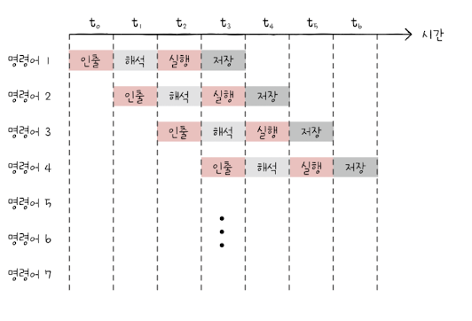

&nbsp;&nbsp;앞 장에서 알아보았던 것처럼 CPU의 성능을 증가시키기 위해서는 높은 클럭 속도와 함께 멀티코어, 멀티스레드를 CPU를 설계하는 것 뿐만 아니라, CPU가 효율적으로 동작하게 하는 것도 중요합니다. 이번 장에서는 CPU가 효율적으로 일처리를 할 수 있게 하는 방법인 `명령어 명렬 처리 기법(ILP, Instruction-Level Parallelism)에 대해 다룹니다.

 

### 명령어 파이프라인

&nbsp;&nbsp;명령어 처리 과정을 클럭 단위로 나누면 일반적으로 아래와 같이 구분할 수 있습니다.

 

1. 명령어 인출(Instruction Fetch)
2. 명령어 해석(Instruction Decode), 일부 서적에서는 생략
3. 명령어 실행(Execute Instruction)
4. 결과 저장(Write Back)

 

&nbsp;&nbsp;명령어 파이프라인에서 중요한 점은 위의 과정은 단계가 겹치지 않는다면 CPU는 각 단계가 동시에 실행될 수 있다는 것입니다. 아래와 같이 파이프라인을 배치한다면 CPU는 명령어를 저장하는 동시에, 실행하고, 해석하며, 인출하는 것이 가능합니다. 이와 같이 명령어를 `명령어 파이프라인(instuction pipeline)`에 넣고 동시에 처리하는 기법을 `명령어 파이프라이닝(instruction pipelining)`이라고 합니다.

 

<figure align="center">
  
</figure>

 

**파이프라인 위험**

&nbsp;&nbsp;명령어 파이프라이닝은 CPU로 높은 성능을 낼 수 있는 기법이긴하지만 때때로 성능 향상에 실패하는 경우가 발생할 수 있습니다. 이를 `파이프라인 위험(pipeline hazard)`이라고 부르며 파이프라인 위험은 아래와 같이 3가지로 나누어집니다.

 

1. **데이터 위험(data hazard)**

- 명령어 간 `데이터 의존성`에 의해 발생합니다.
- 한 명령어가 다른 명령어에 의존하는데 앞의 명령어의 결과가 출력되지 않은 채 뒤의 명령어를 실행하려는 경우 파이프라인이 정상적으로 동작하지 않을 수 있습니다. 이러한 상황을 `데이터 위험`이라고 부릅니다.

 

> ❗️ 가령 아래와 같은 명령어가 순차적으로 실행된다면...
>
> R1 <- R2 + R3 (레지스터 R2와 R3에 저장된 값의 합을 레지스터 R1에 저장)
> R4 <- R1 + R (레지스터 R1과 R5에 저장된 값의 합을 레지스터 R4에 저장)

 

2. **제어 위험(control hazard)**

- 분기 등으로 인한 프로그램 카운터의 갑작스러운 변화에 의해 발생합니다.
- 프로그램 카운터는 <mark>현재 실행 중인 명령어의 다음 주소로 갱신</mark>되는데 프로그램 실행 흐름이 바뀌어 명령어가 실행되면서 프로그램 카운터 값이 갑자기 바뀌게 되면 미리 명령어 파이프라인에 가지고 와 처리 중이던 명령어들은 쓸모가 없어지게 되는데 이를 `제어 위험`이라고 부릅니다.
- 자세히 다루지는 않지만 이를 위해 사용하는 기술 중 하나가 <mark>프로그램이 어디로 분기할 지 미리 예측한 후 해당 주소를 인출</mark>하는 `분기 예측(branch prediction)`입니다.

 

3. **구조적 위험(structural hazard)**

- 명령어들을 겹쳐 실행하는 과정에서 서로 다른 명령어가 동시에 ALU, 레지스터 등과 같은 CPU 자원을 사용하려고 할 때 발생하는 문제를 `구조적 위험`이라고 합니다.
- 구조적 위험은 `자원 위험(resource hazard)`이라고도 합니다.

 

### 슈퍼 스칼라

&nbsp;&nbsp;사실 대부분의 CPU는 파이프라인을 여러 개의 파이프라인을 두고 이용합니다.
이와 같이 CPU 내부에 두 개 이상의 명령어 파이프라인을 포함한 구조를 `슈퍼 스칼라`라고 하며, 슈퍼 스칼라 구조로 명령어 처리가 가능한 CPU를 `슈퍼 스칼라 프로세서` 또는 `슈퍼 스칼라 CPU`라고 합니다.

 

> 💡 슈퍼 스칼라 프로세서는 파이프라인 수에 비례하여 프로그램 처리 속도가 빨라지지만 파이프라인 위험 등의 요인에 의해 발생할 수 있는 문제 때문에 반드시 파이프라인 개수에 비례하는 것은 아닙니다. 여러 개의 파이프라인을 사용하는 만큼 파이프라인 위험에 노출될 수 있는 가능성이 커질 수 밖에 없습니다.

 

### 비순차적 명령어 처리

&nbsp;&nbsp;오늘 날의 CPU 성능 향상에 크게 기여한 기법이면서, 대부분의 CPU에서 사용하는 기법이니다. 파이프라이닝, 슈퍼 스칼라는 모두 명령어를 순차적으로 처리하는 기법입니다. 이러한 방법들은 파이프라인 위험과 같은 예상치 못한 문제에 의해 명령어가 바로 처리될 수 없는 일이 발생할 수 있기 때문입니다.

&nbsp;&nbsp;위의 `데이터 위험`에서 든 예시를 다시 사용하자면, R4 <- R1+ R5 명령어는 R1 <- R2 + R3 명령어가 처리되기 전까지 실행할 수 없으며 파이프라인의 중단이 발생하게 됩니다. 그렇다면 R1의 결과가 나올 때까지 데이터 의존성이 없는 명령어를 실행하면 어떨까요?

 

> 💡 비순차적 명령어 처리
>
> R1 <- R2 + R3
>
> R10 <- R11 + R12 (의존성 없음. 새치기!!)
>
> R4 <- R1 + R4

 

&nbsp;&nbsp;위와 같이 의존성이 없는 명령어를 파이프라인 중간에 넣는다면 파이프라인의 중단을 방지할 수 있습니다. 비순차적 명령어 처리를 위해서는 CPU가 데이터 의존성이 없는 명령어를 찾아 순서를 바꿀 수 있는지 여부를 판단할 수 있어야 합니다.

 
