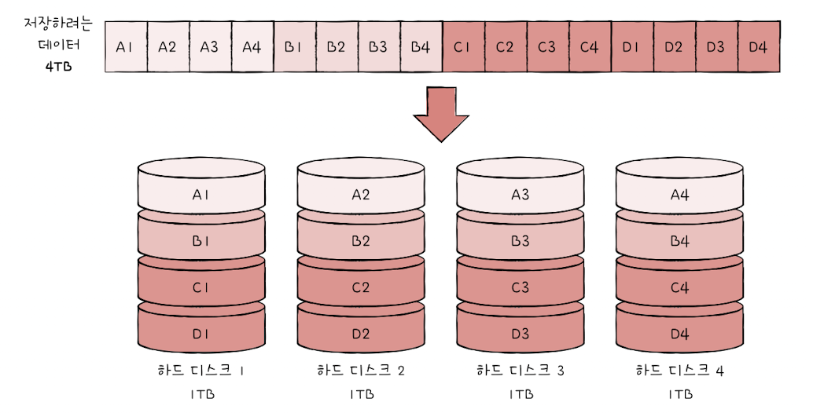
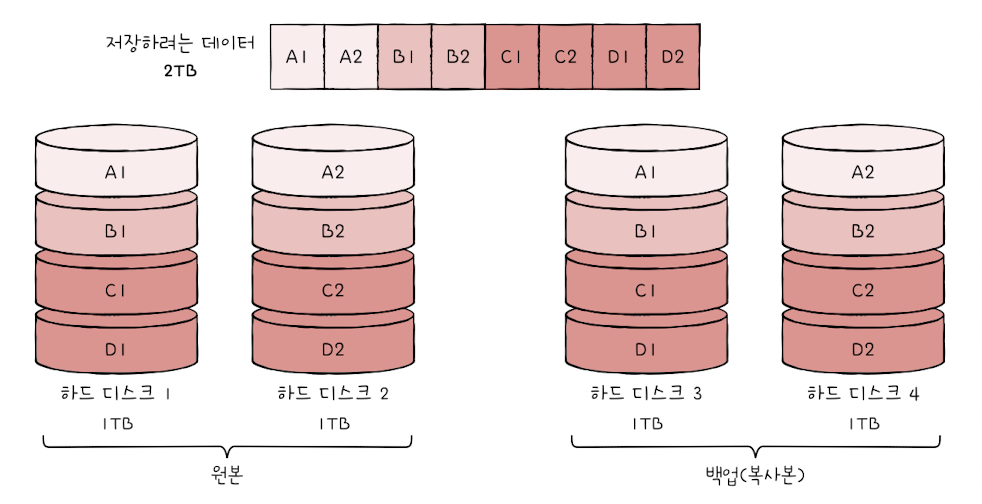
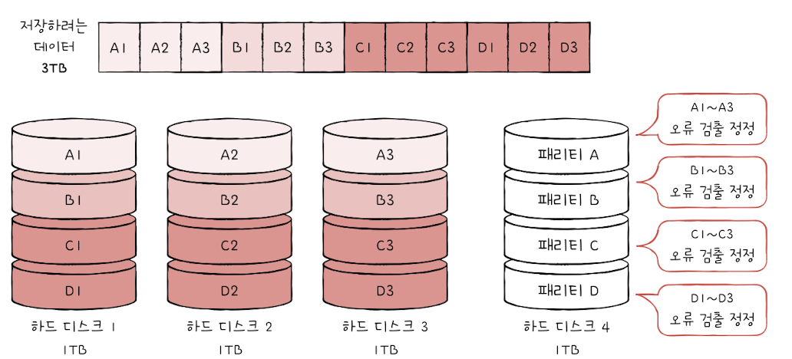
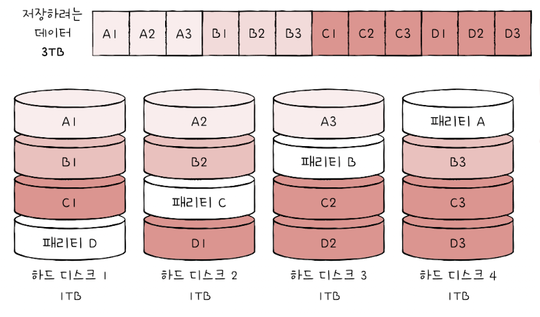
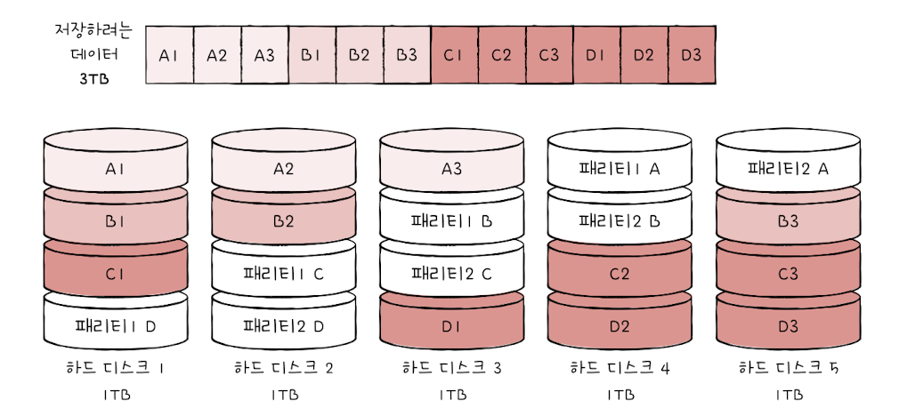

### RAID의 정의

&nbsp;&nbsp;앞에서 다룬 절에서 보조기억장치는 수명을 가지고 있다고 다루었습니다. `RAID(Redundant Array of Independent Disks)`는 기억장치의 수명을 포함한 다양한 이유에 의해 발생할 수 있는 데이터의 유실 등 데이터의 안정성이나 높은 성능을 위해 여러 개의 물리적 보조기억장치를 하나의 논리적 보조기억장치처럼 사용하는 기술입니다.

 

### RAID의 종류

&nbsp;&nbsp;여러 개의 SSD나 하드 디스크를 하나의 장치처럼 사용하는 RAID에는 RAID 0 ~ RAID 6과 이에서 파생된 RAID 10, RAID 50 등이 있습니다. 이번 절에서는 이 중에서 가장 대중적인 RAID0, RAID 1, RAID 4, RAID 5, RAID 6에 대해 다룹니다.

 

**RAID 0**

<figure align="center">
  
</figure>

 

- 여러 개의 보조기억장치에 데이터를 단순히 나누어 저장하는 방법입니다.
- **스트라입(strip)** : 줄무늬처럼 분산 저장된 데이터입니다.
- **스트라이핑(striping)** : 데이터를 분산하여 저장하는 과정을 말합니다. 여러 개의 저장장치에 동시에 읽기/쓰기가 이루어지므로 하나의 저장장치를 사용하는 것보다 빠릅니다.
- 데이터를 분산 저장하기 때문에 만약 하나 이상의 물리적 하드디스크에 문제가 생긴다면 모든 하드디스크의 정보를 읽는데 문제가 생길 수 있습니다.

 

**RAID 1**

<figure align="center">
  
</figure>

 

- RAID 0에서 발생하는 문제를 해결하기 위해 등장한 방법으로 RAID 0과 동일하지만 <mark>하나의 복사본을 만드는 과정이 있습니다.</mark>
- **미러링(mirroring)** : 완전히 동일한 복사본을 만들기 때문에 복사본을 만드는 과정을 미러링이라 부릅니다.
- 미러링 과정에 의해 같은 데이터를 두번 써야하니 쓰기 속도가 RAID 0에 비해 느립니다.
- 복사본을 참조하기만 하면 되므로 복구가 간단합니다.
- 복사본을 만들기 위한 디스크가 필요한 만큼 저장용량이 적어지며, 동일한 용량을 저장하기 위해 비용이 증가한다는 단점이 있습니다.

 

**RAID 4**

<figure align="center">
  
</figure>

 

- RAID 1처럼 완전한 복사본을 만드는 것이 아니라 오류를 검출하기 위한 `패리티 비트(parity bit)`를 저장하기 위한 디스크를 사용하는 방식입니다.
- 패리티 비트는 다른 장치의 오류를 검출하고, 복구하는데 사용됩니다.
- RAID 1에 비해 적은 하드디스크로 데이터를 안전하게 보관할 수 있습니다.

 

> ❗️ 패리티 비트는 원래 오류 검출용 비트입니만, RAID에서는 오류 검출 외에도 오류 복구도 가능합니다. 오류 복구를 위한 패리티 계산법은 본 서적에서는 다루지 않았습니다.

 

**RAID 5**

<figure align="center">
  
</figure>

 

- RAID 4에서는 패리티 정보를 저장하기 위해 한 개의 디스크만을 사용하기 때문에 병목현상이 발생할 수 있습니다.
- RAID 5는 병목현상을 제거하기 위해 패리티 정보를 여러 디스크에 분산하여 저장합니다.

 

**RAID 6**

<figure align="center">
  
</figure>

 

- RAID 6는 서로 다른 패리티를 2개 두어 오류를 검출하고, 복구할 수 있는 방식입니다.
- 기본적으로 RAID 5의 방법을 따르나 오류를 검출하고 복구하는 수단이 2개가 있어 RAID 5에 비해 안정적으로 데이터를 관리할 수 있습니다.
- 데이터 쓰기 시 2개의 패리티 정보를 저장해야 하므로 쓰기 속도는 RAID 5에 비해 느립니다.

 
