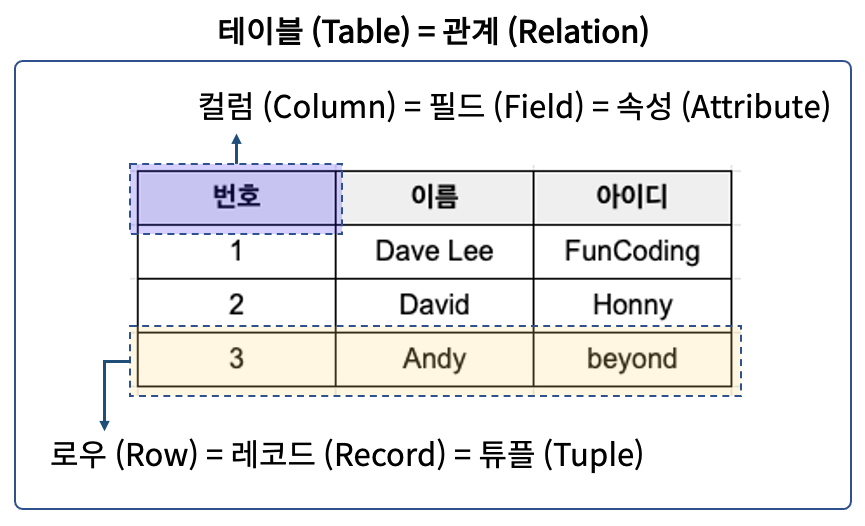

# 📄 **DB (Database)**

    

 

## **Database란?**

&nbsp;&nbsp;여러 사람이 공유하고 사용할 목적으로 통합 관리되는 정보의 집합. 논리적으로 연관된 하나 이상의 자료의 모음으로 그 내용을 고도로 구조화 함으로 <u>**검색과 갱신의 효율화**</u>를 꾀한 것. 몇 개의 자료 파일을 조직적으로 통합하여 자료 항목의 <u>**중복을 없애고 자료를 구조화**</u>하여 기억시켜 놓은 자료의 집합체.
  

### **DBMS (Database Management System)**

- 데이터베이스 조작 인터페이스 제공
- 효율적인 데이터 관리 기능제공
- 데이터베이스 구축 기능 제공
- 데이터 복구, 사용자 권한 부여, 유지보수 기능제공
    

## **RDBMS (Relational Database)**

    

 

- <u>**테이블 기반**</u>의 데이터베이스
- 데이터를 테이블 단위로 관리. 하나의 데이터(record)는 여러 속성(attribute)을 가진다.
- 데이터 중복을 최소화하며, 테이블 간의 관계를 이용하여 필요한 데이터를 검색 가능.
- 테이블은 실제 데이터가 저장되는 곳으로 행, 열의 2차원 구조.
- ORACLE, PostgreSQL, MySQL, MariaDB, SQLite 등
    

