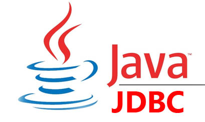
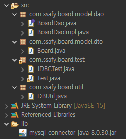
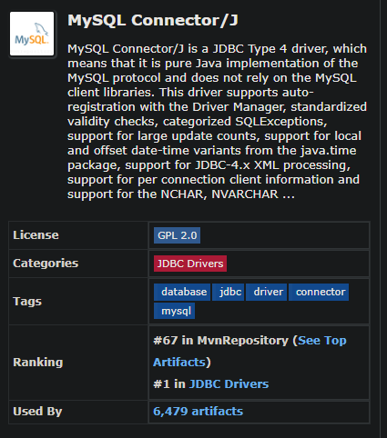

# 📄 **JDBC**

<p align="center">
    
</p></br>

## **JDBC (Java DataBase Connectivity)**

&nbsp;&nbsp;Java에서 DB에 접근할 수 있도록 하는 Java API
<br/><br/>

## **JDBC 연동 테스트**

<p align="left">
    
</p></br>

### **1. JDBC 드라이버 설치 및 프로젝트에 라이브러리 등록**

- mvnRepository에서 드라이버 다운로드
- 프로젝트 lib에 저장 및 라이브러리 추가
<p align="left">
    
</p></br>

### **2. DTO 클래스 생성**

<details>
<summary>코드보기</summary>
<div markdown="1">

```java
package com.ssafy.board.model.dto;

public class Board {
	private int id;
	private String title;
	private String writer;
	private String content;
	private int viewCnt;
	private String regDate;

	public Board() {}

	public Board(String title, String writer, String content) {
		super();
		this.title = title;
		this.writer = writer;
		this.content = content;
	}

	public int getId() {
		return id;
	}

	public void setId(int id) {
		this.id = id;
	}

	public String getTitle() {
		return title;
	}

	public void setTitle(String title) {
		this.title = title;
	}

	public String getWriter() {
		return writer;
	}

	public void setWriter(String writer) {
		this.writer = writer;
	}

	public String getContent() {
		return content;
	}

	public void setContent(String content) {
		this.content = content;
	}

	public int getViewCnt() {
		return viewCnt;
	}

	public void setViewCnt(int viewCnt) {
		this.viewCnt = viewCnt;
	}

	public String getRegDate() {
		return regDate;
	}

	public void setRegDate(String regDate) {
		this.regDate = regDate;
	}

	@Override
	public String toString() {
		return "Board [id=" + id + ", title=" + title + ", writer=" + writer + ", content=" + content + ", viewCnt="
				+ viewCnt + ", regDate=" + regDate + "]";
	}

}

```

</div>
</details>
</br>

### **3. JDBC 연결 테스트 Class**

<details>
<summary>코드보기</summary>
<div markdown="1">

```java
package com.ssafy.board.test;

import java.sql.Connection;
import java.sql.DriverManager;
import java.sql.ResultSet;
import java.sql.SQLException;
import java.sql.Statement;
import java.util.ArrayList;
import java.util.List;

import com.ssafy.board.model.dto.Board;

/*
 * JDBC 연동 테스트
 * 1. JDBC 드라이버 로드
 * 2. 데이터베이스 연결
 * 3. SQL 준비 및 실행
 * 4. 데이터베이스 연결 해제
 */
public class JDBCTest { q
	private String DB_NAME = "ssafy_board";
	private String user = "root";
	private String password = "ssafy01";


	private List<Board> selectAll() {
		List<Board> list = new ArrayList<>();

		Connection conn = null;
		Statement stmt = null;
		ResultSet rs = null;

		try {
			// 2. 데이터베이스 연결
			conn = DriverManager.getConnection("jdbc:mysql://localhost:3306/" + DB_NAME + "?serverTimezone=UTC", user, password);
			// 3. SQL 준비 및 실행
			String sql = "SELECT * FROM board";

			stmt = conn.createStatement();

			rs = stmt.executeQuery(sql);

			while (rs.next()) {
				Board board = new Board();
				board.setId(rs.getInt("id"));
				board.setTitle(rs.getString("title"));
				board.setWriter(rs.getString("writer"));
				board.setContent(rs.getString("content"));
				board.setViewCnt(rs.getInt("view_cnt"));
				board.setRegDate(rs.getString("reg_date"));
				list.add(board);
			}

		} catch (SQLException e) {
			e.printStackTrace();
		} finally {
			// 4. 데이터베이스 연결해제
			try {
				if (rs != null) rs.close();
				if (stmt != null) stmt.close();
				if (conn != null) conn.close();
			} catch (SQLException e) {
				e.printStackTrace();
			}
		}

		return list;
	}

	// 1. JDBC 드라이버 로드
	public JDBCTest() {
		try {
			Class.forName("com.mysql.cj.jdbc.Driver");
			System.out.println("드라이버 로딩 성공");
		} catch (ClassNotFoundException e) {
			e.printStackTrace();
		}
	}

	public static void main(String[] args) {
		JDBCTest jdbcTest = new JDBCTest();

		for (Board b : jdbcTest.selectAll()) {
			System.out.println(b);
		}
	}
}


```

</div>
</details>
</br>

### **4. DAO 인터페이스 및 클래스 생성**

<details>
<summary>인터페이스 코드보기</summary>
<div markdown="1">

```java
package com.ssafy.board.model.dao;

import java.sql.SQLException;
import java.util.List;

import com.ssafy.board.model.dto.Board;

public interface BoardDao {
	// 전체 게시글 조회
	public List<Board> selectAll();

	// 게시글 상세정보 조회 (id로 조회)
	public Board selectBoardById(int id) throws SQLException;

	// 게시글 등록
	public void insertBoard(Board board) throws SQLException;

	// 게시글 삭제
	public void deleteBoard(int id) throws SQLException;

	// 게시글 수정
	public void updateBoard(Board board) throws SQLException;

	// 조회수 증가
	public void updateViewCnt(int id) throws SQLException;

}

```

</div>
</details>
<details>
<summary>구현 클래스 코드보기</summary>
<div markdown="1">

```java
package com.ssafy.board.model.dao;

import java.sql.Connection;
import java.sql.PreparedStatement;
import java.sql.ResultSet;
import java.sql.SQLException;
import java.sql.Statement;
import java.util.ArrayList;
import java.util.List;

import com.ssafy.board.model.dto.Board;
import com.ssafy.board.util.DBUtil;

public class BoardDaoImpl implements BoardDao {
	// DBUtil 가져오기
	private final DBUtil util = DBUtil.getInstance();

	private static BoardDaoImpl instance = new BoardDaoImpl();
	// SingleTon Pattern
	private BoardDaoImpl() {}

	public static BoardDaoImpl getInstance() {
		return instance;
	}

	@Override
	public List<Board> selectAll() {
		List<Board> list = new ArrayList<>();
		String sql = "SELECT * FROM board";

		Connection conn = null;
		Statement stmt = null;
		ResultSet rs = null;

		try {
			conn = util.getConnection();
			stmt = conn.createStatement();
			rs = stmt.executeQuery(sql);

			while (rs.next()) {
				Board board = new Board();
				board.setId(rs.getInt("id"));
				board.setTitle(rs.getString("title"));
				board.setWriter(rs.getString("writer"));
				board.setContent(rs.getString("content"));
				board.setViewCnt(rs.getInt("view_cnt"));
				board.setRegDate(rs.getString("reg_date"));
				list.add(board);
			}

		} catch (SQLException e) {
			e.printStackTrace();
		} finally {
			// 4. 데이터베이스 연결해제
			util.close(conn, stmt, conn);
		}

		return list;
	}

	@Override
	public Board selectBoardById(int id) throws SQLException {
		String sql = "SELECT * FROM board WHERE id = ?";

		Connection conn = null;
		PreparedStatement pstmt = null;
		ResultSet rs = null;

		Board board = new Board();

		try {
			conn = util.getConnection();
			pstmt = conn.prepareStatement(sql);
			pstmt.setInt(1, id);
			rs = pstmt.executeQuery();

			while (rs.next()) {
				board.setId(rs.getInt(1));
				board.setWriter(rs.getString(2));
				board.setTitle(rs.getString(3));
				board.setContent(rs.getString(4));
				board.setViewCnt(rs.getInt(5));
				board.setRegDate(rs.getString(6));
			}

		} finally {
			util.close(conn, pstmt, rs);
		}
		return board;
	}

	@Override
	public void insertBoard(Board board) throws SQLException {
//		String sql = "INSERT INTO board (title, writer, content)\n";
//		sql += "VALUES ('" + board.getTitle() + "', '" + board.getWriter() + "', '" + board.getContent() + "')";
		String sql = "INSERT INTO board (title, writer, content) VALUES (?, ?, ?)";

		Connection conn = null;
		PreparedStatement pstmt = null;

		try {
			conn = util.getConnection();
			// 자동 오토커밋 방지
			// conn.setAutoCommit(false);

			pstmt = conn.prepareStatement(sql);
			pstmt.setString(1, board.getTitle());
			pstmt.setString(2, board.getWriter());
			pstmt.setString(3, board.getContent());

			int result = pstmt.executeUpdate();
			System.out.println(result);

		} finally {
			util.close(conn, pstmt);
		}
	}

	@Override
	public void deleteBoard(int id) throws SQLException {
		String sql = "DELETE FROM board WHERE id = ?";
		Connection conn = null;
		PreparedStatement pstmt = null;

		try {
			conn = util.getConnection();
			pstmt = conn.prepareStatement(sql);
			pstmt.setInt(1, id);
			pstmt.executeUpdate();
		} finally {
			util.close(conn, pstmt);
		}
	}

	@Override
	public void updateBoard(Board board) throws SQLException {
		String sql = "UPDATE board SET title = ?, content = ? WHERE id = ?";

		Connection conn = null;
		PreparedStatement pstmt = null;

		try {
			conn = util.getConnection();

			pstmt = conn.prepareStatement(sql);
			pstmt.setString(1, board.getTitle());
			pstmt.setString(2, board.getContent());
			pstmt.setInt(3, board.getId());

			pstmt.executeUpdate();

		} finally {
			util.close(conn, pstmt);
		}
	}

	@Override
	public void updateViewCnt(int id) throws SQLException {
		String sql = "UPDATE board SET view_cnt = view_cnt + 1 WHERE id = ?";

		Connection conn = null;
		PreparedStatement pstmt = null;

		try {
			conn = util.getConnection();
			pstmt = conn.prepareStatement(sql);
			pstmt.setInt(1, id);
			pstmt.executeUpdate();
		} finally {
			util.close(conn, pstmt);
		}
	}

}


```

</div>
</details>
<br/>

### **5. DBUtil 클래스를 별도로 두어 사용하는 방법**

<details>
<summary>코드보기</summary>
<div markdown="1">

```java
package com.ssafy.board.util;

import java.sql.Connection;
import java.sql.DriverManager;
import java.sql.PreparedStatement;
import java.sql.ResultSet;
import java.sql.SQLException;

public class DBUtil {
	// MySql 드라이버 클래스 이름
	private final String driverName = "com.mysql.cj.jdbc.Driver";
	private final String DB_NAME = "ssafy_board";
	private final String user = "root";
	private final String password = "ssafy01";
	private final String url = "jdbc:mysql://localhost:3306/" + DB_NAME + "?serverTimezone=UTC";

	private static DBUtil instance = new DBUtil();

	private DBUtil() {
		// JDBC 드라이버 로딩
		try {
			Class.forName(driverName);
		} catch (ClassNotFoundException e) {
			// TODO Auto-generated catch block
			e.printStackTrace();
		}
	}

	public static DBUtil getInstance() {
		return instance;
	}

	/**
	 * DriverManager.getConnection(url, user, password)
	 * @return Connection
	 * @throws SQLException
	 */
	public Connection getConnection() throws SQLException {
		return DriverManager.getConnection(url, user, password);
	}

	/**
	 * AutoCloseable
	 * @param autoClosables
	 */
	public void close(AutoCloseable... autoClosables) {
		for (AutoCloseable ac : autoClosables) {
			if (ac != null) {
				try {
					ac.close();
				} catch (Exception e) {
					e.printStackTrace();
				}
			}
		}
	}

//	public static void close(Connection conn, PreparedStatement pstmt) {
//		try {
//			if (pstmt != null) pstmt.close();
//			if (conn != null) conn.close();
//
//		} catch (Exception e) {
//			e.printStackTrace();
//		}
//	}
//
//	public static void close(Connection conn, PreparedStatement pstmt, ResultSet rs) {
//		try {
//			if (rs != null) rs.close();
//			if (pstmt != null) pstmt.close();
//			if (conn != null) conn.close();
//
//		} catch (Exception e) {
//			e.printStackTrace();
//		}
//	}
}
```

</div>
</details>
</br>

### **6. JDBC CRUD Test Class**

<details>
<summary>코드보기</summary>
<div markdown="1">

```java
package com.ssafy.board.test;

import java.sql.SQLException;

import com.ssafy.board.model.dao.BoardDao;
import com.ssafy.board.model.dao.BoardDaoImpl;
import com.ssafy.board.model.dto.Board;

public class Test {

	public static void main(String[] args) {
		BoardDao dao = BoardDaoImpl.getInstance();


		try {
//			Board board = new Board("점심시간이다!", "이순신", "점심시간 10분 전...");
//
//			try {
//				dao.insertBoard(board);
//			} catch (SQLException e) {
//				// TODO Auto-generated catch block
//				e.printStackTrace();
//			}

//			dao.deleteBoard(3);
//			dao.updateViewCnt(2);

//			Board board = dao.selectBoardById(2);
//			board.setContent("졸리다..");
//			dao.updateBoard(board);

			for (Board b : dao.selectAll()) {
				System.out.println(b);
			}

		} catch (Exception e) {
			// TODO Auto-generated catch block
			e.printStackTrace();
		}

	}

}


```

</div>
</details>
</br></br>

