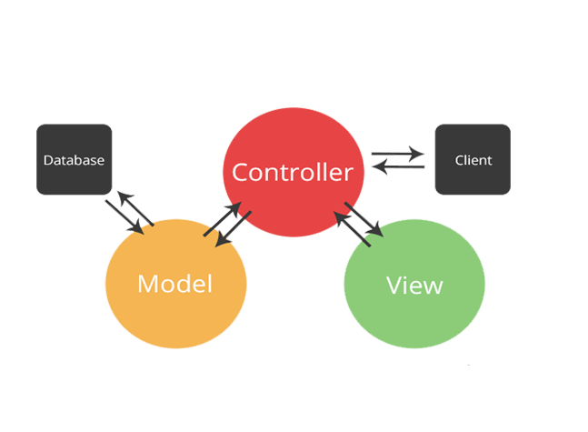
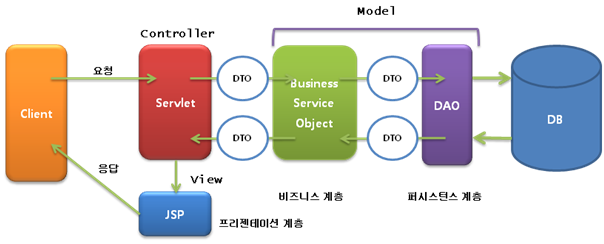

# 📄 **MVC Pattern**

    

 

## **MVC Pattern**

&nbsp;&nbsp;개발 영역을 모델(Model), 뷰(View), 컨트롤러(Controller) 세 영역으로 나누고 각가의 의존을 최소한으로 하는 패턴
  

    

 

### **모델(Model)**

&nbsp;&nbsp;data를 저장하거나, 필요한 형태로 가공하는 역할을 수행. <u>DTO, DAO</u> 등이 해당.
 

### **뷰(View)**

&nbsp;&nbsp;사용자에게 응답하기 위해서 화면을 작성하는 역할을 수행. <u>JSP</u> 등을 사용해 페이지를 그리는 것에 해당.
 

### **컨트롤러(Controller)**

&nbsp;&nbsp;뷰와 모델 사이의 실행 흐름을 제어하는 역할을 수행. 클라이언트로부터 요청을 받아 이를 분석하고 어떤 비즈니스 로직을 수행할지 결정. 이후 로직의 결과를 보여주기 위한 뷰를 선택. <u>Servlet</u> 등을 사용한 제어에 해당.
  
