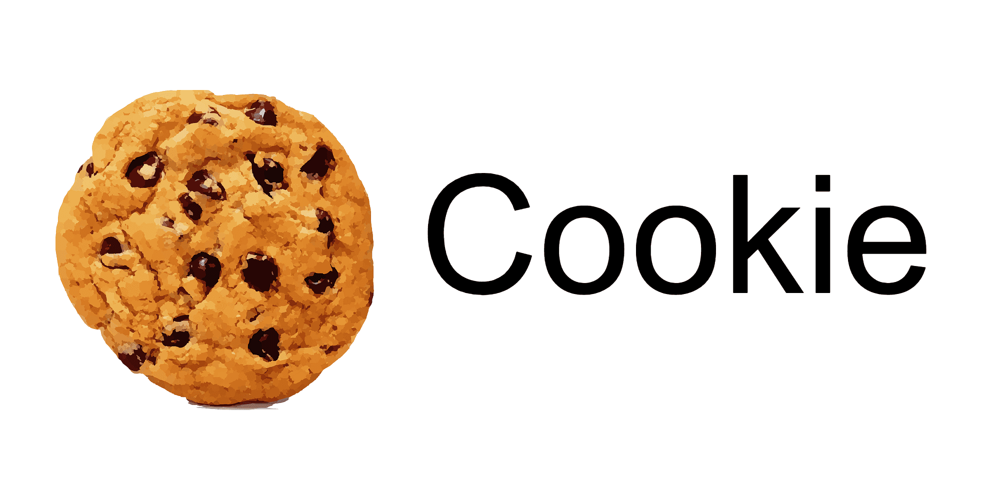
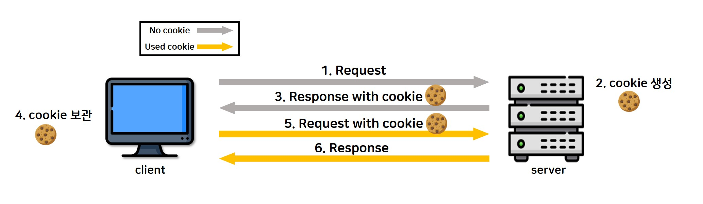

# 📄 **Cookie**

<p align="center">
    
</p></br>

## **HTTP Protocol**

&nbsp;&nbsp;쿠키에 대해 알아보기 전에 HTTP 프로토콜의 특징에 대해 먼저 짚고 넘어가보자. HTTP 통신은 <u>**비연결(connectionless) 지향**</u>의 통신 프로토콜로 요청에 대한 응답이 이루어지면 자원 낭비를 방지하기 위해 연결을 종료(<u>**stateless**</u>)한다는 특징이 있다.
<br/>

&nbsp;&nbsp;연결이 종료되면 서버는 클라이언트의 종료를 알 수가 없게 되는데 쇼핑몰을 예시로 클라이언트에서 다른 페이지로 넘어가게 되면 이전 연결은 끊어지기 때문에 서버 입장에서는 클라이언트의 장바구니 내용과 클라이언트의 로그인 정보 등을 알 수 없게 되어버린다. 이와 같이 HTTP 프로토콜은 기본적으로 connectionless 속성을 가지지만 Cookie와 HttpSession을 사용함으로써 사용자로 하여금 연속적인 느낌을 받게 하는 것이 가능하다.
<br/><br/>

## **Cookie란**

&nbsp;&nbsp;서버가 생성하는 클라이언트 정보를 가지고 있는 파일로 클라이언트의 컴퓨터에 저장되며 필요에 따라 서버에 요청 시 요청과 함께 서버로 전송된다. 쿠키는 **key-value 쌍 형태의 문자열 데이터**로 <u>세션 관리(사용자 정보, 접속시간, 장바구니 등)를 위해 사용</u>되며 브라우저마다 별도의 쿠키가 생성된다.
<br/><br/>

### **Cookie 특징**

- key-value 데이터와, 만료일(Expire date), 경로정보로 구성
- 클라이언트 하나 당 최대 300개의 쿠키가 저장
- 하나의 도메인당 최대 20개의 쿠키를 저장
- 쿠키 하나는 최대 4KB(4096byte)까지 저장
  <br/><br/>

### **Cookie 동작순서**

<p align="center">
    
</p></br>

1. 클라이언트의 요청 생성
2. WAS는 Cookie를 생성하여 HTTP Header에 Cookie를 넣어 응답
3. Cookie는 브라우저에 저장되며, 해당 서버에 요청을 보낼 때 요청과 함께 Cookie를 전달
4. Cookie는 브라우저가 종료되어도 만료기한 내까지는 저장되어 다음 번 동일한 사이트에 다시 방문해 Cookie를 포함한 요청을 보내 서버가 클라이언트의 이전 상태를 알 수 있게 한다
   <br/><br/>

### **Java Cookie (javax.servlet.http.Cookie)**

```java
/* Servlet에서 Cookie 생성 */
String key = request.getParameter("key");
String value = request.getParameter("value");

// 쿠키들 가져오기
Cookie[] cookies = request.getCookies();

Cookie cookie = new Cookie(key, value);
cookie.setMaxAge(60); // 유효기간 (초 단위)
cookie.setValue("myValue"); // 쿠키 값 설정

// cookie.setMaxAge(0); 해당 쿠키의 유효기간을 0으로 만들어 쿠키를 제거할 수 있음

response.addCookie(cookie);
response.sendRedirect("cookie01.jsp");
```
