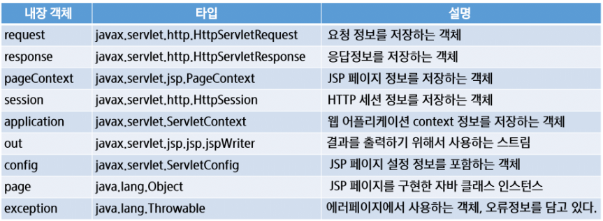

# 📄 **JSP**

<p align="center">
    
</p></br>

## **JSP란**

&nbsp;&nbsp;JSP는 **Java Server Pages**의 약자로 <u>Servlet 표준을 기반</u>으로 작성된 웹 어플리케이션 언어로 요청을 처리하고 응답을 구성하는 방법을 작성하는 파일이다. <u>**정적요소(HTML, XML 등)와 동적 요소(JSP 객체)를 모두 포함**</u>하는 텍스트 기반 문서인 JSP 페이지를 개발하기 위한 언어이며, <u>서버측 객체에 접근</u>하기 위한 표현 언어이다. Servlet이 Java 코드 안에 정적요소(HTML)를 담고 있는 반면 JSP는 HTML안에 Java가 포함된 구조이다.
<br/><br/>

### **JSP 동작 순서**

1. Client 요청
2. JSP 파일이 Java Servlet으로 변환
3. 컴파일러에 의해 Servlet 컴파일
4. Servlet에 정의된 HTML 페이지를 Client에 전달
   <br/><br/>

## **JSP 구성요소**

### **지시자(Directive)**

&nbsp;&nbsp;JSP 페이지에 대한 설정 정보를 지정하기 위해서 사용
<br/>

- 웹 컨테이너(톰캣)가 JSP를 번역하고 실행하는 방법을 서술
- 대표적으로 page, include taglib와 같은 Directive가 있음
  <br/><br/>

#### **1. page 지시자**

&nbsp;&nbsp;page 지시자는 JSP 페이지 실행 매개변수를 제어하며 출력 처리, 오류 처리 등의 내용을 포함한다. 주요 속성으로 <u>language, contentType, import, session, pageEncoding, errorPage, autoFlush</u> 등이 있음

```jsp
<%@ page language="java" contentType="text/html; charset=UTF-8"
    pageEncoding="UTF-8"%>
```

<br/>

#### **2. include 지시자**

&nbsp;&nbsp;<u>**JSP 내에 다른 JSP 페이지를 포함**</u>하기 위해서 사용한다. 반복적으로 사용되는 header, footer 등을 별도로 작성하여 페이지 내에 삽입하여 반복되는 코드를 줄일 수 있다.

```jsp
<%@ include file="/template/header.jsp"%>
```

<br/>

#### **3. taglib 지시자**

&nbsp;&nbsp;<u>**JSTL 또는 사용자가 작성한 커스텀 태그를 사용할 때**</u>작성하며 불필요한 자바 코드를 줄일 수 있다.

```jsp
<%@ taglib uri="http://java.sun.com/jsp/jstl/core" prefix="c"%>
```

<br/><br/>

### **스크립트 요소**

&nbsp;&nbsp;Scriptlet, 표현식(Expression), 선언부(Declaration) 등 JSP에서 문서의 내용을 동적으로 생성하기 위해서 사용하며 JSP 내에서 프로그래밍 로직을 수행하기 위해 사용된다.
<br/><br/>

#### 1. **Scriptlet** : 스크립팅 언어(java)로 작성된 코드 조각을 포함하는데 사용 (내부에 선언된 변수는 service 메서드 내에서 사용되는 지역변수로 <u>service 메서드가 새로 호출될 때마다 초기화</u>)

```jsp
<%
    int localVar_cnt = 0;
    out.write("count : " + ++localVal_cnt);
%>
```

<br/>

#### 2. **선언부** : 멤버변수나 메서드를 선언하는 영역 (멤버변수는 JSP init 메서드의 변수로 컴파일되며 <u>서비스가 시작될 때 한번 초기화</u> 되기 때문에 JSP 객체가 소멸되기 전까지 계속해서 유지된다.)

```jsp
<%!
    String name = "MyName";

    public int add(int a, int b) {
        return a + b;
    }
%>
```

<br/>

#### 3. **표현식** : 문자열로 변환된 값을 출력결과에 포함시킬 때 사용

```jsp
<div id="timer"><%= counter %></div>
```

<br/><br/>

### **JSP 기본 객체**

&nbsp;&nbsp;요청 및 응답 관련 정보를 얻거나 응답 결과를 만들기 위해서 사용

<p align="center">
    
</p>
<br/>

#### **JSP 기본 객체 Scope**

Page(pageContext) < Request(request) < session(session) < application(application)

<p align="center">
    
</p><br/>
<br/>

## **표현언어(Expression Language, EL)**

&nbsp;&nbsp;<u>**JSP를 좀 더 간결하게 작성하기 위해**</u>서 사용. JSP 스크립트의 표현식(\<%= expr %>)을 대신하여 속성값을 쉽게 출력할 수 있도록 해준다. EL 표현식에서는 Map 객체, Java Bean 객체의 경우에는 도트(.) 연산자를 사용하여 속성을 출력할 수 있다. 이 경우에 도트 연산자 오른쪽 값은 Map 객체의 경우에는 key, Java Bean의 경우에는 Bean property를 가리킨다. <u>EL 내부에는 연산자를 포함할 수 있으며</u> 산술, 조건, 논리, 관계 연산을 수행할 수 있다. 알아 두어야 할 점은 EL 내부에서 null은 공백문자로 출력된다.
<br/><br/>

### **EL 문법**

```jsp
<%= "Hello World" %> // JSP 표현식
${"Hello World"} // EL Expression
```

<br/><br/>

### **Action Tag & JSTL (JSP Standard Tag Libarary)**

&nbsp;&nbsp;자주 사용하는 기능을 모아 미리 정의하여 Tag형태로 작성. JSP에서 자바코드를 쉽게 작성할 수 있도록 사용. Java EE 기반의 웹 어플리케이션 개발을 위한 컴포넌트들의 묶음으로 기존의 JSP가 HTML과 JSP 스크립트가 섞여 복잡한 구조가 되었던 것을 해소하기 위한 라이브러리이다.
<br/><br/>

### **JSTL 기능 (core 라이브러리)**

- 간단한 프로그램 로직 구현
- 데이터 출력 포맷 설정
- DB 입력, 수정, 삭제, 조회
- 문자열 처리 함수
- XML 문서 처리

### **JSTL 사용**

1. JSTL 라이브러리를 찾아 프로젝트에 추가
2. taglib 지시자를 사용한 태그 사용 선언 (사용하고자 하는 기능에 따라 적절한 라이브러리 기입)

```jsp
<%@ taglib uri="http://java.sun.com/jsp/jstl/core" prefix="c" %>
```

3. 사용할 태그를 구분하기 위해 prefix 작성

```jsp
<c:out value="Hello JSTL"></c:out>
<c:out value="Hello JSP" />

<c:set val="header">MY HEADER</c:set>
<c:set var="title" value="JSTL Tutorial" />
```

<br/>

#### **라이브러리 종류**

1. c : 기본기능, 변수 선언, 로직 구현 (http://java.sun.com/jsp/jstl/core)
2. fmt : 데이터 출력 포맷 (http://java.sun.com/jsp/jstl/fmt)
3. sql : 데이터베이스 작업 (http://java.sun.com/jsp/jstl/sql)
4. x : XML 관련 기능 (http://java.sun.com/jsp/jstl/xml)
5. fn : 문자열 처리 함수 (http://java.sun.com/jsp/jstl/fn)
   <br/><br/>

## **JSP 페이지 이동**

&nbsp;&nbsp;URL을 작성할 때 확인해야할 점은 Path 앞에 '/' 유무이다. 만약 앞에 '/'가 붙어있다면 해당 서버의 Root부터 탐색을 시작하게 되고 '/'가 없다면 현재 위치 기준 상대경로로 파일을 찾는다. <u>반면 JSTL의 include로 다른 jsp파일을 불러오는 경우에는 '/'를 사용해도 context path 기준</u>으로 파일을 찾는다.
<br/><br/>

### **1. 포워드 방식**

&nbsp;&nbsp;요청이 들어오면 요청을 받은 JSP 또는 Servlet이 직접 응답하지 않고, <u>**요청을 서버 내부로 전달하여 해당 요청을 처리**</u>하게 하는 방식. request, response 객체가 전달되어 사용되기 때문에 객체가 사라지지 않음. 브라우저에는 최초 요청한 주소가 표시.

```jsp
RequestDispatcher dispatcher = request.getRequestDispatcher("URL");
dispatcher.forward(request, response);
```

<br/>

### **2. 리다이렉트 방식**

&nbsp;&nbsp;요청이 들어오면 내부 로직 실행 후 브라우저의 URL을 변경하도록 하여 <u>**새로운 요청을 생성**</u>함으로 페이지를 이동. 브라우저가 새로운 요청을 만들어 내기 때문에 최초 요청 주소와 다른 요청 주소가 화면에 보여짐.

```jsp
response.sendRedirect("location");
// 파라미터를 같이 넘기는 방법
response.sendRedirect("location?key=mykey&value=myVal");
```

<br/><br/>

