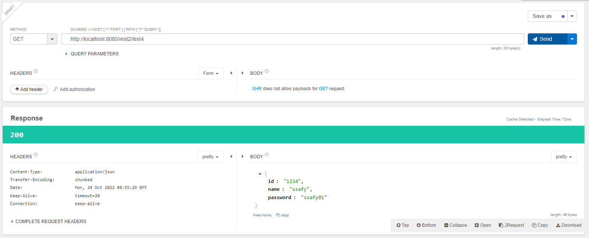
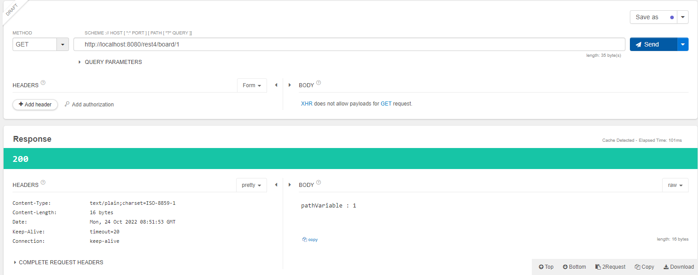
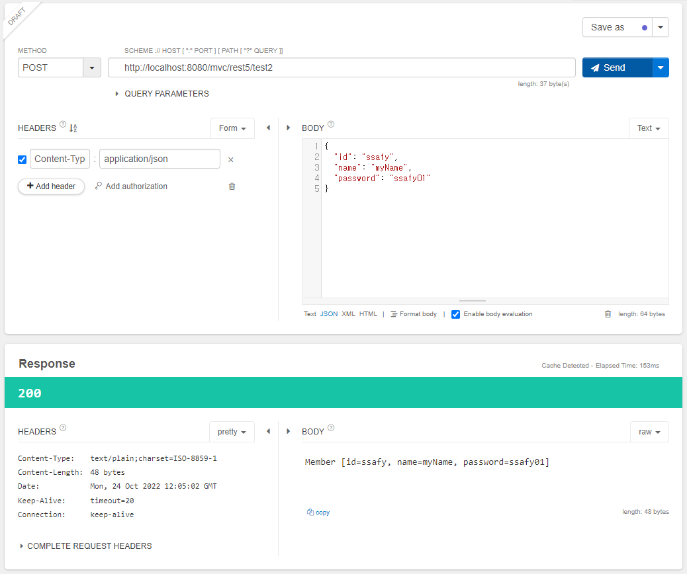
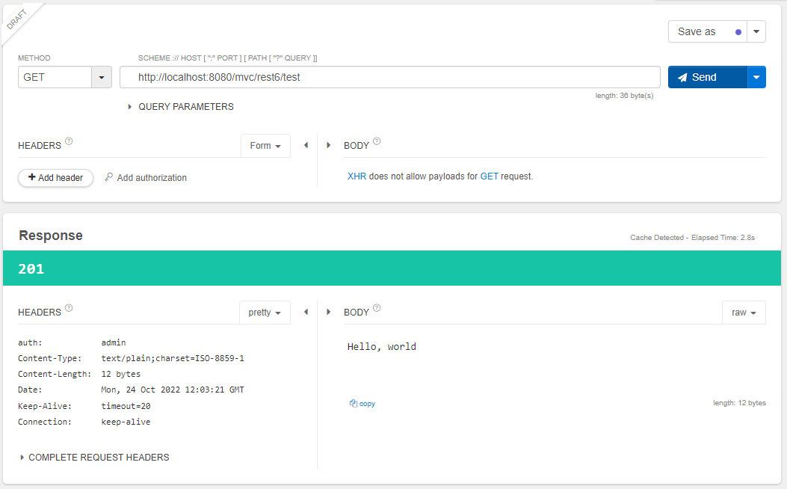

## **REST API**

## **REST**

- <u>Representational State Transfer</u>의 약어
- 하나의 URI는 하나의 고유한 리소스(Resource)를 대표하도록 설계된다는 개념에 전송 방식이 결합된 방식
- **HTTP URI**를 통해 제어할 자원(Resource)을 명시하고, HTTP Method(GET, POST, PUT, DELETE)를 통해 해당 자원을 제어하는 명령을 내리는 방식의 아키텍쳐.
  <br/>

### **REST 구성요소**

&nbsp;&nbsp;잘 표현된 HTTP URI로 리소스를 정의하고 HTTP Method로 리소스에 대한 행위를 정의. 리소스는 JSON, XML과 같은 여러가지 언어로 표현할 수 있음.

- 자원(Resource) : URI
- 행위(Verb) : HTTP Method
- 표현(Representations)
  <br/><br/>

### **기존의 방식과의 차이점**

- 기존의 접근 방식은 GET, POST만으로 자원에 대한 CRUD를 처리, URI는 액션을 나타냈었음
- REST에서는 4가지 Method를 모두 사용하여 CRUD를 처리, URI는 제어하려는 자원을 나타냄
  <br/><br/>

## **REST API**

- 기존의 전송방식과 다르게 요청으로 받은 리소스에 대해 순수한 데이터를 전송
- GET, POST 외에도 PUT, DELETE 방식을 사용하여 리소스에 대한 CRUD 처리
- <u>HTTP URI를 통해 제어할 자원을 명시</u>하고, <u>HTTP Method를 통해 해당 자원을 제어</u>
- RESTful이란 REST API로 구축된 웹 서비스를 의미
  <br/><br/>

### **REST API 디자인 가이드**

&nbsp;&nbsp;정해진 표준이 없기 때문에 암묵적인 표준으로 존재

- URI는 명사형으로 사용

```cmd
GET /boards/show/3 (X)
GET /boards/3 (O)
```

- URI는 자원에 대한 정보만을 나타냄

```cmd
POST /boards/delete/2 (X)
DELETE /boards/2 (O)
```

- 하이픈('-')은 사용 가능하나 언더 바('\_')는 사용하지 않음 (가독성 문제)

- 특별한 경우 외에는 대문자는 사용하지 않음 (URI는 대소문자를 구분하기 때문)

- URI 마지막에 '/'는 사용하지 않음

```cmd
GET /boards/ (X)
```

- '/'는 계층관계를 표현

```cmd
GET /boards/sports/football
```

- 확장자가 포함된 파일이름을 직접 표현하지 않음 (대신 **Accept Header** 사용)

```cmd
GET /boards/sports/football/239/picture.png (X)
```

<br/><br/>

### **기존 Service VS REST API Service**

- **기존 Service** : 요청에 대한 처리를 한 뒤 가공된 data를 이용해 특정 플랫폼에 적합한 형태의 View를 만들어 반환

- **REST Service** : data에 대한 처리만 하거나, 반환될 data가 있다면 <u>JSON이나 XML의 형식</u>으로 전달. View에 대해서는 처리하지 않음. Open API에서 많이 사용됨
  <br/><br/>

## **Spring RestAPI Annotation**

### **@ResponseBody**

&nbsp;&nbsp;일반적으로 handler의 반환 값은 ViewResolver에 의해 지정된 prefix, subfix가 붙은 View를 찾게 되는데 @ResponseBody Annotation을 사용하면 해당 handler의 반환 값을 View가 아닌 데이터로 받게 된다.

```java
@Controller
@RequestMapping("/rest1")
public class TestController {

	@GetMapping("/test1")
	public String test1() {
		return "hi rest"; // ViewResolver에 의해 views/hi rest.jsp 파일을 찾게 됨
	}

	/* @ResponseBody Annotation을 사용해 View가 아닌 "hi rest"라는 문자열 데이터를 반환값으로 넘김 */
	@GetMapping("/test2")
	@ResponseBody
	public String test2() {
		return "hi rest";
	}

	/* JSON 형태의 데이터를 넘기려고 했으나 406 에러(JSON 형태로 바인딩이 되지 않아 에러 발생), pom.xml에 Jackson Databind 라이브러리 추가해서 해결 */
	@GetMapping("/test3")
	@ResponseBody
	public Map<String, String> test3() {
		Map<String, String> data = new HashMap<>();
		data.put("id", "ssafy");
		data.put("name", "ssafyssafy");
		return data;
	}

	/* DTO에 담아서 리턴해도 JSON 형태로 잘 받아와짐 */
	@GetMapping("/test4")
	@ResponseBody
	public Member test4() {
		Member m = new Member();
		m.setId("1234");
		m.setName("ssafy");
		m.setPassword("ssafy01");

		return m;
	}

	/* List 형태로 데이터를 받는 것도 가능 */
	@GetMapping("/test5")
	@ResponseBody
	public List<Member> test5() {
		List<Member> list = new ArrayList<>();
		for (int i = 0; i < 5; i++) {
			Member m = new Member();
			m.setId("a" + i);
			m.setName("ssafy" + i);
			m.setPassword("ssafy0" + i);
			list.add(m);
		}

		return list;
	}
}
```

<br/>
<p align="center">
    
</p></br>

### **@RestController**

&nbsp;&nbsp;위에서는 @ResponseBody로 handler에 지정을 해주어야 데이터를 반환값으로 사용할 수 있었지만 Controller의 Annotation을 **@RestController**로 사용하면 해당 Controller가 REST 방식을 처리하기 위한 것임을 명시해주기 때문에 따로 handler에 @ResponseBody Annotation을 지정하지 않아도 데이터를 반환값으로 사용할 수 있다.
<br/><br/>

### **@~Mapping**

&nbsp;&nbsp;handler에 다음과 같은 Annotation을 사용하면 각각의 Method에 대한 요청처리가 가능하다.
<br/>

- @GetMapping
- @PostMapping
- @PutMapping
- @DeleteMapping
  <br/><br/>

### **@PathVariable**

&nbsp;&nbsp;**@PathVariable** Annotation은 URL 경로에 있는 값을 파라미터로 추출하기 위해서 사용하며 실제 변수ㄱㄷ와 이름이 다를 때에는 괄호 안에 값을 받을 파라미터 명을 지정해주면 된다.

```java
@RestController
@RequestMapping("/rest4")
public class TestController4 {

//	@PathVariable
//	http://www.localhost:8080/rest4/board/1
//	http://www.localhost:8080/rest4/board/2
//	http://www.localhost:8080/rest4/board/3
//	이와 같이 어떤 board에 대한 자원을 활용할 것인지에 대해 가변 요소가 있을 때...
	@GetMapping("/board/{id}")
	public String test1(@PathVariable("id") int num) {
		return "pathVariable : " + num;
	}
}
```

<br/>
<p align="center">
    
</p></br>

### **@RequestBody**

&nbsp;&nbsp;REST API에서 JSON 데이터를 원하는 데이터 타입으로 바인딩하여 파라미터로 받아오기 위해서는 파라미터 앞에 **@RequestBody** Annotation을 사용하면 된다.

```java
@RestController
@RequestMapping("/rest5")
public class TestController5 {
	/* 그냥 받아오려고 하면 null로 받아와짐 */
	@PostMapping("/test1")
	public String test1(Member member) {
		return member.toString();
	}

	/* @RequestBody Annotation은 JSON 형태의 데이터를 받아오고 싶을 때  */
	@PostMapping("/test2")
	public String test2(@RequestBody Member member) {
		return member.toString();
	}
}
```

<br/>
<p align="center">
    
</p></br>

### **ResponseEntity**

&nbsp;&nbsp;HTTP 응답은 크게 Status, Header, Body로 구성되는데 이 셋에 대한 값을 세부적으로 지정하는 방법이 **ResponseEntity**를 사용하는 방법이다. handler의 반환 값을 ResponseEntity로 지정해준 뒤 ResponseEntity 객체에 응답으로 보낼 Status, Header, Body 값을 지정하여 리턴하면 된다.

```java
@RestController
@RequestMapping("/rest6")
public class TestController6 {

	@GetMapping("test")
	public ResponseEntity<String> test() {
		HttpHeaders headers = new HttpHeaders();
		headers.add("auth", "admin");

		return new ResponseEntity<String>("Hello, world", headers, HttpStatus.CREATED);
	}
}
```

<br/>

<p align="center">
    
</p></br>
