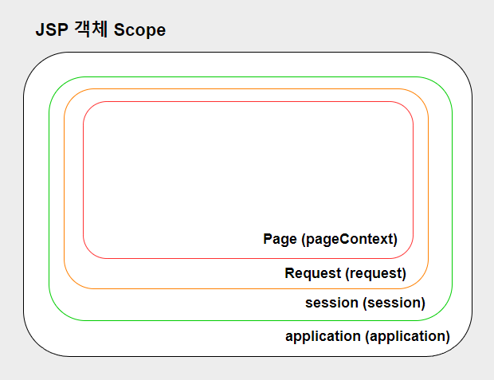

# 📄 **Session**

## **Session**

&nbsp;&nbsp;**사용자가 웹 서버에 접속해 있는 상태에 대한 하나의 단위로 세션**이라고 한다. 각 세션은 <u>sessionid</u>를 사용해 구분하며 세션은 WAS의 메모리에 객체 형태로 저장된다. 메모리에 허용된 용량만큼 제한없이 저장이 가능하며 쿠키의 경우에는 클라이언트에 저장되기 때문에 공유 PC를 사용하는 경우 보안이 취약한 반면 <u>세션은 서버에 저장</u>되기 때문에 쿠키에 비해 보안이 좋다.
<br/>

&nbsp;&nbsp;브라우저 하나당 하나의 session id(JSESSIONID)를 할당 받으며 로그인 정보(아이디, 닉네임)와 같이 자주 사용되는 정보를 session에 저장하면 DB에 접근할 필요가 없어 효율적이다.
<br/><br/>

### **Session 동작 과정**

1. 클라이언트 요청 발생
2. 서버에서 쿠키에 session id가 있는지 확인
3. session id가 존재하지 않으면 session id를 생성해 쿠키에 포함하여 클라이언트에 반환
4. 생성된 session id를 이용해 서버 메모리에 공간을 할당
5. 다음 클라이언트 요청 시에 쿠키에 session id(JSESSIONID)를 포함해 전달하면 서버 내 저장된 session id와 비교하여 데이터 조회
   <br/><br/>

## **Session Scope**

<p align="center">
    
</p><br/>

&nbsp;&nbsp;JSP 객체는 아래와 같은 Scope를 가진다. pageContext는 해당 페이지의 Scope로 그 페이지를 벗어나면 pageContext 내부에 할당된 데이터는 사라진다. 우리가 여기서 살펴볼 것은 session Scope이다. session은 <u>클라이언트와 서버 간 연결이 되어있는 상태라면 데이터를 유지</u>한다. 로그인 정보 등은 session에 담기기 때문에 사용자가 로그아웃 하기 전까지 혹은 세션이 만료되기 전까지 유지되며 session의 기본 유효기간은 30분이다.
<br/><br/>

### **Java Session (javax.servlet.http.HttpSession)**

```java
// 세션 객체 생성 및 값 할당
HttpSession session = request.getSession();
session.setAttribute("userNickname", "Hong");
// 제거
session.removeAttribute("usernickname");

// 세션 유효기간 설정
session.setMaxInactiveInteral(3600); // 초 단위(3600초)

// 세션 고유 아이디 반환
String sId = session.getId();

// 클라이언트가 마지막으로 보낸 요청 시간 반환
String lastAccess = session.getLastAccessTime();

// 현재 세션 및 고유 속성 제거
session.invalidate();
```
