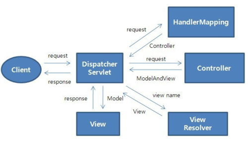

# 📄 **Spring MVC**

<p align="center">
    
</p></br>

## **MVC(Model-View-Controller)**

- Servlet API를 기반으로 구축된 웹 프레임워크
- 정식 명칭은 Spring Web MVC
- Spring Framwork가 제공하는 DI, APO 뿐만 아니라 WEB 개발을 위한 기능들을 제공
- DispatcherServlet(FrontController)를 중심으로 디자인 되었으며, View Resolver, Handler Mapping, Controller와 같은 객체와 함께 요청을 처리하도록 설계
  <br/><br/>

### **Spring MVC 구성요소**

- **DispatcherServlet** : 클라이언트 요청 처리

- **HandlerMapping** : 요청을 어떤 Controller가 처리할지 결정

- **Controller** : 요청에 따라 수행할 메서드를 선언, 요청 처리를 위한 비즈니스 로직 수행

- **ModelAndView** : 요청 처리를 하기 위해 필요한 객체 또는 요청에 대한 결과를 저장하기 위한 객체

- **ViewResolver** : Controller에 선언된 view 이름을 기반으로 반환할 View를 결정

- **View** : 응답화면 생성
  <br/><br/>

### **Spring MVC 요청 처리 흐름**

<p align="center">
    
</p></br>

1. 클라이언트 요청이 들어오면 DispatcherServlet이 받음
2. HandlerMapping이 어떤 Controller가 요청을 처리할 지 결정
3. DispatcherServlet은 Controller에 요청 전달
4. Controller는 요청을 처리
5. 결과를 보여줄 view의 이름과 요청처리를 위한 data를 ModelAndView에 담아 반환
6. ViewResolver에 의해서 실제 결과를 처리할 View를 결정 및 반환
7. 결과를 처리할 View에 ModelAndView를 전달
8. DispatcherServlet은 View가 만들어낸 결과를 응답
   </br></br>

## **Spring MVC 작성 과정**

### **프로젝트 생성**

- Dynamic Web Project 생성 및 Maven Project로 변경
- pom.xml에 필요한 라이브러리 세팅

```xml
<dependencies>
    <!-- https://mvnrepository.com/artifact/org.springframework/spring-context -->
    <dependency>
        <groupId>org.springframework</groupId>
        <artifactId>spring-context</artifactId>
        <version>5.3.20</version>
    </dependency>
    <!-- https://mvnrepository.com/artifact/org.springframework/spring-webmvc -->
    <dependency>
        <groupId>org.springframework</groupId>
        <artifactId>spring-webmvc</artifactId>
        <version>5.3.23</version>
    </dependency>
</dependencies>
```

<br/>

### **web.xml에 MVC 요소 설정 1**

- **pom.xml** 및 **web.xml** 작성
- DispatcherServlet 및 Listener, Filter 등록

```xml
<!-- DispatcherServlet 등록 -->
<servlet>
    <servlet-name>springDispatcherServlet</servlet-name>
    <servlet-class>org.springframework.web.servlet.DispatcherServlet</servlet-class>
    <init-param>
        <param-name>contextConfigLocation</param-name>
        <param-value>/WEB-INF/servlet-context.xml</param-value>
    </init-param>
    <load-on-startup>1</load-on-startup>
</servlet>
<servlet-mapping>
    <servlet-name>springDispatcherServlet</servlet-name>
    <url-pattern>/</url-pattern>
</servlet-mapping>

<!-- Listener 등록 -->
<listener>
    <listener-class>org.springframework.web.context.ContextLoaderListener</listener-class>
</listener>

<!-- Filter 등록 -->
<filter>
    <filter-name>encodingFilter</filter-name>
    <filter-class>org.springframework.web.filter.CharacterEncodingFilter</filter-class>
    <init-param>
        <param-name>encoding</param-name>
        <param-value>UTF-8</param-value>
    </init-param>
</filter>
<filter-mapping>
    <filter-name>encodingFilter</filter-name>
    <url-pattern>/*</url-pattern>
</filter-mapping>
```

<br/>

### **web.xml에 MVC 요소 설정 2**

- **servlet-context.xml** 작성
- servlet-context.xml는 <u>Web과 관련된 설정</u>을 하는 xml 파일
- MVC 구성요소(handler mapping, view resolver, controller) bean 등록

```xml
<context:component-scan base-package="com.ssafy.mvc.controller"></context:component-scan>

<!-- ViewResolver -->
<bean class="org.springframework.web.servlet.view.InternalResourceViewResolver">
    <property name="prefix" value="/WEB-INF/view/"></property>
    <property name="suffix" value=".jsp"></property>
</bean>
```

<br/>

- **applicationContext.xml** 작성
- applicationContext.xml는 Web과 관련된 설정 이외에 <u>Service, DB, Model(DTO, DAO) 등에 대한 설정을 지정</u>하는 xml 파일

```xml
<!-- Annotation을 사용하기 위해 component-scan 패키지 지정 -->
<context:component-scan base-package="com.ssafy.mvc.model.service"></context:component-scan>
```

<br/>

### **Controller 작성**

- servlet-context.xml에서 작성한 ViewResolver에 의해 앞뒤로, 접두사, 접미사가 붙은 View를 만들어 리턴
- View 이름은 <u>setViewName</u> 메서드를 사용해 지정
- 리턴값을 String으로 하면 해당 이름의 View를 리턴
- 만약 View 이름 앞에 <b>redirect:</b>를 붙이면 리다이렉트 되어짐
- **@GetMapping, @PostMapping**을 사용해 각각의 GET, POST 요청에 대해서만 View를 리턴하게 하는 것도 가능

```java
@Controller
public class MyController {
	private MyService myService;

	@Autowired
	public void setMyService(MyService myService) {
		this.myService = myService;
	}

	@RequestMapping("home")
	public ModelAndView handler01() {
		ModelAndView mav = new ModelAndView();

		/* msg라는 키에 값을 담아 넘김 */
		mav.addObject("msg", "home으로 이동!");
		mav.setViewName("home");
		return mav;
	}

	/* String으로 리턴하면 해당 리턴된 이름으로 View 호출 */
    @RequestMapping("test2")
    public String handler02() {
        return "test";
    }

    /* GET 방식으로 들어온 요청에 대해서만 뷰를 리턴 */
    @GetMapping("test3") // POST 요청에 대해서는 @PostMapping
    public String handler03() {
        return "test";
    }

    /* 값을 넘기는 방식은 model 객체를 만들어 addAttribute */
    @GetMapping("test4") // POST 요청에 대해서는 @PostMapping
    public String handler04(Model model) {
        model.addAttribute("msg", "model 객체에 담아 보내기!");
        return "test";
    }

    /* 값을 받는 방식은 파라미터로 넘겨 받음, 들어오지 않는다면 null로 받으나 기본 데이터 타입의 경우에는 에러 발생 */
    /* @RequestParam 어노테이션으로 기본 값 설정 가능 */
    @GetMapping("giveParam") // POST 요청에 대해서는 @PostMapping
    public String handler05(Model model, String msg, @RequestParam(value="number", defaultValue="0")int number) {
        model.addAttribute("msg", msg);
        model.addAttribute("number", number);
        return "test";
    }

    /* 만약 넘겨받은 파라미터에 적절한 DTO가 있다면 알아서 데이터를 DTO에 삽입 */
    /* @ModelAttribute 어노테이션을 지정하면 해당  바로 모델 객체에 setAttribute한 것과 같음 */
    @PostMapping("userInfo")
    public String handler06(Model model, @ModelAttribute User user) {
        System.out.println(user);
        return "userInfo";
    }
}
```

<br/>

