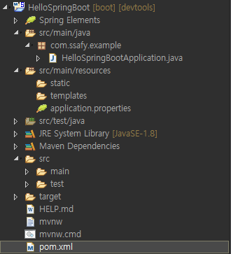

## **SpringBoot**

<p align="center">
    
</p></br>

## **SpringBoot 특징**

### **1. Dependency**

&nbsp;&nbsp;Legacy Spring에서는 dependency를 설정해주기 위해 pom.xml에 많은 dependency를 관리했었다. SpringBoot에서는 Legacy Spring에서 자주 사용하는 dependency들을 모아 여러 dependency를 추가하지 않고 몇 개만을 추가해 원래 사용하던 기능들의 상당부분을 이용할 수 있도록 해두었다.

<br/>

```xml
<!-- Spring의 Web과 관련된 라이브러리들을 통합한 SpringBoot 라이브러리 -->
<dependency>
  <groupId>org.springframework.boot</groupId>
  <artifactId>spring-boot-starter-web</artifactId>
</dependency>

<dependency>
  <groupId>org.springframework.boot</groupId>
  <artifactId>spring-boot-devtools</artifactId>
  <scope>runtime</scope>
  <optional>true</optional>
</dependency>

<!-- Spring의 Spring Test, JUnit, Hamcrest, Mockito를 통합한 라이브러리 ㄴ-->
<dependency>
  <groupId>org.springframework.boot</groupId>
  <artifactId>spring-boot-starter-test</artifactId>
  <scope>test</scope>
</dependency>
```

<br/>

### **2. @SpringBootApplication**

Legacy Spring에서는 Configuration 설정을 하기 위해 모든 관리할 Component를 등록할 필요가 있었다. SpringBoot의 @SpringBootApplication은 기존에 존재하던 상당 부분의 설정을 간소화하는 기능을 제공한다.
<br/>

```java
package com.ssafy.example;

import org.springframework.boot.SpringApplication;
import org.springframework.boot.autoconfigure.SpringBootApplication;

@SpringBootApplication
public class HelloSpringBootApplication {

	public static void main(String[] args) {
		SpringApplication.run(HelloSpringBootApplication.class, args);
	}

}
```

<br/>

- **@ComponentScan** : @Component, @Controller, @Repository, @Service Annotation이 붙어 있는 객체들을 스캔해 Bean으로 등록. 스캔되는 영역은 @SpringBootApplication가 존재하는 패키지 내부로 제한된다.

- **@EnableAutoConfiguration** : @ComponentScan 이후 사전 정의된 라이브러리들을 Bean에 등록, <i>External Libraries/spring-boot-autoconfiture/META-INF/spring.factories</i>에 정의된 라이브러리들을 Bean에 등록해주는데 모든 라이브러리를 등록해주는 것은 아니라고 한다.

<br/>

### **3. 편리한 배포**

&nbsp;&nbsp;Legacy Spring으로 개발한 어플리케이션은 war 파일을 WAS에 올리는 방식으로 배포한다. 이 방식은 매 수정이 발생할 때마다 코드를 수정한 뒤 새로만든 war 파일을 WAS에 올리는 작업이 필요한데, SpringBoot 어플리케이션은 내장 WAS를 가지고 있어 jar 파일 만으로 배포가 가능하다는 특징이 있다.
<br/>

## **SpringBoot 프로젝트 생성**

### **SpringBoot 프로젝트 구조**

<p align="center">
    
</p></br>
<br/>

- **src/main/java** : java source directory

- **HelloSpringBootApplication.java** : application을 시작할 수 있는 main method가 존재하는 SpringBoot 메인 클래스

- **static** : css, js, img 등의 정적 resource directory

- **templates** : SpringBoot에서 사용할 수 있는 View Template(Tyhmeleaf, Velocity, FreeMarker 등)들의 위치

- **application.properties** : application 및 스프링의 설정에서 사용할 여러가지 property를 정의한 파일

- **src/main** : jsp 등의 resource directory
  <br/>

&nbsp;&nbsp;SpringBoot에서는 기본적으로 JSP를 바로 읽을 수 없기 때문에 아래와 같은 의존성을 추가해주어야 한다. 이때 어떤 버전을 사용해도 큰 문제는 없으나 현재 사용하고 있는 SpringBoot에 따라 권장하는 버전이 아닐 경우 dependency의 version 태그에 노란 경고줄이 생길 수 있다.
<br/>

```xml
<!-- JSTL -->
<dependency>
  <groupId>javax.servlet</groupId>
  <artifactId>jstl</artifactId>
</dependency>

<!-- tomcat embed jasper -->
<dependency>
  <groupId>org.apache.tomcat.embed</groupId>
  <artifactId>tomcat-embed-jasper</artifactId>
</dependency>
```

<br/>

### **설정 정보 작성**

&nbsp;&nbsp;기존에 root-context.xml에 작성된 DB정보 및 mybatis 정보들을 application.properties과 관련 설정파일(@Configuration을 사용한 클래스)에 작성한다. dao scan에 대한 지정은 DBConfig.java 파일을 만들어 설정파일(@Configuration)로 지정하고 MapperScan을 통해 스캔해준다.
<br/>

```xml
<!-- 기존 root-context.xml -->
<bean id="dataSource" class="org.apache.commons.dbcp2.BasicDataSource">
  <property name="driverClassName" value="com.mysql.cj.jdbc.Driver"/>
  <property name="url" value="jdbc:mysql://localhost:3306/ssafy_board?serverTimezone=UTC"/>
  <property name="username" value="root"/>
  <property name="password" value="root"/>
</bean>

<!-- 마이바티스를 사용하기 위한 SqlSessionFactory를 등록한다. -->
<bean id="sqlSessionFactory" class="org.mybatis.spring.SqlSessionFactoryBean">
  <property name="dataSource" ref="dataSource"/>
  <property name="mapperLocations" value="classpath*:mapper/**/*.xml"/>
  <property name="typeAliasesPackage" value="com.ssafy.board.model.dto"/>
</bean>

<!-- mybatis에서 제공하는 scan 태그를 통해 dao interface들의 위치를 지정한다. -->
<mybatis-spring:scan base-package="com.ssafy.board.model.dao"/>
```

<br/>

```
# application.properties #

# View Resolver (기존 servlet-context.xml에서 작성)
spring.mvc.view.prefix=/WEB-INF/views/
spring.mvc.view.suffix=.jsp

# DB Connection (기존 root-context.xml에서 작성)
spring.datasource.driver-class-name=com.mysql.cj.jdbc.Driver
spring.datasource.url=jdbc:mysql://localhost:3306/ssafydb?serverTimezone=UTC
spring.datasource.username=root
spring.datasource.password=ssafy

# MyBatis (기존 root-context.xml에서 작성)
mybatis.mapper-locations=classpath*:mapper/**/*.xml
mybatis.type-aliases-package=com.ssafy.board.model.dto
```

<br/>

```java
/* DBConfig.java */
@Configuration
@MapperScan(basePackages = "com.ssafy.board.model.dao")
public class DBConfig {

}
```

<br/>

```java
/* WebConfig.java */
@Configuration
@EnableWebMvc
public class WebConfig implements WebMvcConfigurer {
  // application.properties에서 작성한 설정 정보 값을 읽어옴
	@Value("${ spring.mvc.view.prefix }")
	private String prefix;

	@Value("${ spring.mvc.view.suffix }")
	private String suffix;

	@Bean // Bean으로 등록되면 setter injection이 발생
	public ViewResolver internalViewResolver() {
		InternalResourceViewResolver resolver = new InternalResourceViewResolver();
		resolver.setPrefix(prefix);
		resolver.setSuffix(suffix);
		resolver.setViewClass(JstlView.class);

		return resolver;
	}

	@Override
	public void addResourceHandlers(ResourceHandlerRegistry registry) {
		registry.addResourceHandler("/**").addResourceLocations("classpath:/static/");
		// TODO Auto-generated method stub
		WebMvcConfigurer.super.addResourceHandlers(registry);
	}
}
```

<br/><br/>
