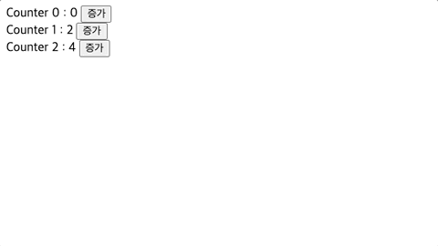

&nbsp;&nbsp;이 프로젝트는 바닐라 자바스크립트로 카카오페이지 UI를 클론코딩하다 생긴 의문으로 시작하게 되었습니다. 프레임워크로 JS로 SPA를 구현하던 도중 state 변경에 의해 트리거 되는 재렌더링의 과정을 바닐라 자바스크립트로 구현해보고 싶다고 생각하게 되었고, 이 프로젝트를 통해 웹 컴포넌트와 상태관리를 구현하며 자바스크립트에 대한 이해와 함께 리액트에 대해 깊이 있게 공부해보고자 합니다. 이번 프로젝트의 전체적인 진행은 황준일님의 [개발 블로그](https://junilhwang.github.io/TIL/Javascript/Design/Vanilla-JS-Component/#_2-state-setstate-render) 내용을 참고했습니다.

<br>

## 기본 기능 구현

&nbsp;&nbsp;먼저 리액트의 컴포넌트의 기능을 떠올려 보면, 컴포넌트는 UI를 표현하기 위한 `JSX` 구문과 상태(state)에 따라 UI가 변할 수 있으므로 `state`와 이를 설정하는 `setState`가 필요합니다. 아래 코드는 `state` 값이 변함에 따라 변경되는 UI를 표시하는 간단한 `Counter` 컴포넌트 코드입니다.

 **App.js**
```javascript
const $app = document.getElementById("app");

// state & setState
let state = {
  count: 0,
};

const setState = (newState) => {
  state = { ...state, ...newState };
};

// JSX에 대응
const template = () => {
  const { count } = state;
  return `
      <span>Count: ${count}</span>
      <button id="addTodo">추가</button>
    `;
};

// render로 DOM에 요소 추가 후 이벤트 등록
const registEvent = ($target) => {
  const { count } = state;
  document.getElementById("addTodo").addEventListener("click", () => {
    setState({ count: count + 1 });
    render($target);
  });  
}

// $target 요소 아래 UI 갱신
const render = ($target) => {
  $target.innerHTML = template();
  registEvent($target);
};

render($app);
```

<br>

&nbsp;&nbsp;`template`은 `JSX`에 대응되는 UI를 반환하는 함수로 호출 시 상태(state)값을 읽어와 이를 포함한 새로운 UI 값을 반환합니다. `render`함수는 `template`함수를 실행해 새롭게 화면에 띄울 내용을 가져와 `$target`요소에 삽입합니다. 만약 특정 요소에 이벤트를 추가해야 한다면 마지막에 해당 요소에 `addEventListener`를 통해 이벤트를 등록합니다.

<br>

## 추상화 및 모듈화

### 추상화

&nbsp;&nbsp;이제 위에서 구현한 컴포넌트의 전반적인 기능을 추상화를 통해 모든 컴포넌트에서 활용할 수 있도록 class를 통해 구현했습니다. 이렇게 구현한 컴포넌트를 활용해 가장 먼저 루트 컴포넌트인 `App`을 생성해주었습니다. 현재 `App`은 별도의 상태값을 가지 않고, 이후 `Counter` 컴포넌트를 포함할 것이기 때문에 `template` 메서드만 구현해주었습니다.

**Component.js & App.js**
```javascript
// src/core/Component.js
export default class Component {
  $target;
  state;
  
  constructor($target) {
    this.$target = $target;
    this.init();
    this.render();
  }

  // state 등 초기화 작업 진행
  init() {}

  setState(newState) {
    this.state = { ...this.state, ...newState };
    this.render();
  }

  // 반환할 UI 정의
  template() {
    return "";
  }

  // UI에 이벤트 등록
  setEvent() {}

  render() {
    this.$target.innerHTML = this.template();
    this.setEvent();
  }
}

// src/App.js
import Component from "./core/Component.js";

export default class App extends Component {
  template() {
    return `
      <div>App Component</div>
    `;
  }
}
```

<br>
&nbsp;&nbsp;각 컴포넌트는 `Component`를 상속받으며 `Component`의 구조를 따라 각 컴포넌트 역시 구현의 방향성을 가지게 되었습니다. 이제 컴포넌트는 `Component` 클래스를 확장해 구현하므로 코드의 관리가 용이해졌습니다.

<br>

### 모듈화

&nbsp;&nbsp;앞서 언급하지 않았지만 컴포넌트는 `src/component` 경로에, 리액트 기능을 구현할 모듈은 `src/core`에 위치해있습니다. 각 파일은 각자 수행할 기능을 담당하기 위해 파일 구조를 나누어 모듈화하도록 설계했습니다. 저의 경우 리액트에 익숙하기 때문에 리액트와 유사하게 `App` 컴포넌트를 루트 컴포넌트로 두고 `index.js`를 모듈의 시작점으로 설정했습니다.

**directory tree**
```bash
.
├── index.html 
├── index.js ## ES Module 시작점
└── src
    ├── App.js ## Root Component
    ├── components
    │   └── Counter.js
    └── core ## 리액트 기능 구현을 위한 core module
        └── Component.js
```

**index.js**
```javascript
import App from "./src/app.js";
new App(document.getElementById("app"));
```

**Counter.js**
```javascript
import Component from "../core/Component.js";

export default class Counter extends Component {
  init() {
    this.state = {
      count: 0,
    };
  }

  setEvent() {
    this.$target.querySelector("#addCount").addEventListener("click", () => {
      this.setState({ count: this.state.count + 1 });
      this.render(this.$target);
    });
  }

  template() {
    return `
      <div>
        <span>Counter : ${this.state.count}</span>
        <button id="addCount">증가</button>
      </div>
    `;
  }
}
```

<br>

## 수정 사항 

### 1. 자식 컴포넌트 삽입

&nbsp;&nbsp;지금까지의 과정을 통해 `#app` 요소에 `App`이라는 컴포넌트가 렌더링되도록 했습니다. 컴포넌트를 통해 성공적으로 UI를 띄우는 것엔 성공했지만 아직 몇 가지 문제가 남아있습니다. 우선 컴포넌트는 DOM과 마찬가지로 `App`이라는 루트 컴포넌트를 기준으로 트리 구조로 이루어질 수 있습니다. 현재까지 구현된 방식에서는 부모 컴포넌트에서 자식 컴포넌트를 렌더링하는 기능이 없죠. 이를 위해 `core/Component`가 아래와 같이 수정되었습니다.

**Component.js**
```javascript
export default class Component {
  //... 생략
  
  // 렌더링이 완료된 이후 작업할 내용
  mounted() {}

  render() {
    this.$target.innerHTML = this.template();
    this.setEvent();
    this.mounted();
  }
}
```

<br>

&nbsp;&nbsp;이제 컴포넌트는 `mounted` 함수를 통해 자신의 UI가 마운트된 이후, 자식 컴포넌트를 자신이 가진 요소 아래에 추가할 수 있습니다. 이를 바탕으로 `App` 컴포넌트는 마운트가 완료된 뒤 `Counter` 컴포넌트를 추가할 수 있습니다.

**App.js**
```javascript
import Component from "./core/Component.js";
import Counter from "./components/Counter.js";

export default class App extends Component {
  mounted() {
    const $container = document.getElementById("container");
    new Counter($container);
  }
 
  template() {
    return `
      <main id="container"></main>
    `;
  }
}
```

<br>

### 2. 중복 이벤트

&nbsp;&nbsp;현재 이벤트 등록은 `render` 실행이 완료된 뒤, DOM이 업데이트 되면서 발생합니다. 또 특정 요소에 이벤트를 등록하기 위해 `querySelector`와 같은 요소 선택 함수를 사용하는데, 만약 이러한 요소가 여러 개라면 아래와 같이 이벤트를 등록해야 하는 번거로움이 있습니다.


**Counter.js**
```javascript
import Component from "../core/Component.js";

export default class Counter extends Component {
  init() {
    this.state = {
      counts: [0, 2, 4],
    };
  }
  
  setEvent() {
    this.$target.querySelectorAll(".addCount").forEach((button) => {
      button.addEventListener("click", ({ target }) => {
        const newCounts = [...this.state.counts];
        newCounts[target.dataset.index]++;
        this.setState({ counts: newCounts });
        this.render(this.$target);
      });
    });
  }

  template() {
    return `
      <div>
        ${this.state.counts.map((count, key) => {
          return `
            <div>
              <span>Counter ${key} : ${count}</span>
              <button class="addCount" data-index="${key}">증가</button>
            </div>
            `;
        }).join("")}
      </div>
    `;
  }
}
```


<br>

&nbsp;&nbsp;~~카운터 예제가 좋은 예시는 아니지만~~ 반복문을 통해 여러 요소에 이벤트를 등록하는 것은 코드의 가독성이 떨어져 한눈에 코드를 이해하기 어렵다는 단점이 있습니다. 이는 `$target` 요소에 이벤트를 등록하고 이벤트 버블링을 활용하는 방식으로 다음과 같이 코드를 직관적으로 표현할 수 있습니다.

**Counter.js : setEvent 변경**
```javascript
import Component from "../core/Component.js";

export default class Counter extends Component {
  init() { /* 생략 */ }
  
  setEvent() {
    this.$target.querySelectorAll(".addCount").forEach((button) => {
      button.addEventListener("click", ({ target }) => {
        const newCounts = [...this.state.counts];
        newCounts[target.dataset.index]++;
        this.setState({ counts: newCounts });
        this.render(this.$target);
      });
    });
  }

  template() { /* 생략  */ }
}
```

<br>

>![tip] 이벤트 버블링
>
>&nbsp;&nbsp;이벤트 전파(Event Propagatoin)는 DOM 트리를 따라 크게 "캡쳐링(Capturing)"과 "버블링(Bubbling)" 단계로 구분되어 이루어집니다.. 어떠한 요소에 이벤트가 발생하면 이벤트 객체는 먼저 최상위 요소인 `window`에서 시작되어 이벤트 타깃(target)에 이동하는 캡쳐링 단계를 거쳐 다시 타킷에서 `window`  방향으로 이동하는 버블링 단계로 넘어갑니다.

<br>

### 3. 이벤트 중복 등록

&nbsp;&nbsp;하지만 문제가 생겼습니다. 버튼을 클릭했을 때 1씩 증가해야 하는데 실제 결과는 그렇지 않았죠. 이는 앞서 이벤트를 등록하는 `setEvent`가 `render` 함수 내에서 호출되기 때문입니다. 이제 이벤트 등록은 `$target` 요소에서 이루어지기 때문에 자식 컴포넌트가 재렌더링 되어도 `$target` 요소는 그대로 유지되므로 렌더링이 발생할 때마다 `$target` 요소에 이벤트 등록이 중복해서 이루어집니다.



<br>

&nbsp;&nbsp;이벤트 등록 함수의 호출을 처음 컴포넌트가 생성되었을 때로 이동해주었습니다. 첫 컴포넌트 렌더링이 이루어질 때만 이벤트가 등록되므로 이제 클릭한 만큼만 count가 증가합니다.

**Component.js**
```javascript
export default class Component {
  /* 생략 */
  
  constructor($target) {
    this.$target = $target;
    this.init();
    this.render();
    this.setEvent();
  }

  render() {
    this.$target.innerHTML = this.template();
    this.mounted();
  }
}
```

<br>

### 4. 이벤트 추가 추상화

&nbsp;&nbsp;보다 유연하게 이벤트를 등록하기 위해 이벤트 등록 로직을 추상화했습니다.

```javascript
```

<br>

**References**
- [Vanilla Javascript로 웹 컴포넌트 만들기](https://junilhwang.github.io/TIL/Javascript/Design/Vanilla-JS-Component/)
- [모던 자바스크립트, JS 클래스](https://m.yes24.com/Goods/Detail/92742567)
- [모던 자바스크립트, 이벤트 전파](https://m.yes24.com/Goods/Detail/92742567)
- [메이커준, DOM](https://www.youtube.com/watch?v=y4U0EtxAtHI&ab_channel=%EB%A9%94%EC%9D%B4%EC%BB%A4%EC%A4%80)
- [메이커준, Event](https://www.youtube.com/watch?v=exziAmVQ7iA&ab_channel=%EB%A9%94%EC%9D%B4%EC%BB%A4%EC%A4%80)