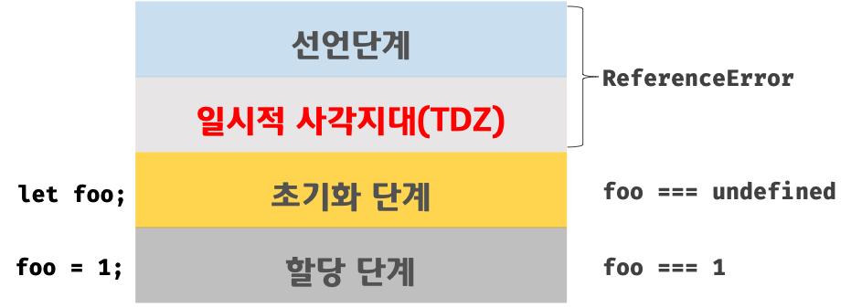

## 호이스팅(Hoisting)

&nbsp;&nbsp;호이스팅을 알아보기 전에 변수의 라이프 사이클에 대해 간단히 살펴보겠습니다.

<br>

### JS 변수 라이프 사이클

&nbsp;&nbsp;Javascript에서는 변수처리를 위해 다음과 같은 3가지 라이프 사이클이 존재합니다.

**1. 선언 단계(Declaration phase)**

- 변수 객체를 생성하고 변수를 등록합니다.

- 스코프에서는 해당 변수 객체를 참조합니다.

**2. 초기화 단계(Initialization phase)**

- 변수 객체에 등록된 변수를 메모리에 할당합니다.

- 변수는 `undefined`로 초기화 됩니다.

**3. 할당 단계(Assignment phase)**

- `undefined`로 초기화된 변수에 실제 값을 할당합니다.

<br>

&nbsp;&nbsp;이제 본격적으로 각 변수 선언 방식에 따른 라이프 사이클과 호이스팅의 연관관계에 대해 알아보겠습니다.

### `var` Variable

```javascript
// 호이스팅에 의해 변수 선언과 초기화가 상단에서 동시에 이루어집니다.
console.log(foo); // undefined

foo = 1;
console.log(foo); // 1

var foo;
```

&nbsp;&nbsp;`var` 키워드로 변수를 선언하면 변수의 선언문이 해당 스코프의 상단으로 끌어 올려진 것처럼 동작합니다. 이것이 `호이스팅(Hoisting)`이며 변수 선언문 이전에 변수를 참조할 수 있습니다.

<br>

**var 변수 Lifecycle**

<figure align="center" style="background: white; padding: 16px;">
  
</figure>

&nbsp;&nbsp;`var` 키워드로 선언된 변수는 JS엔진에 의해 암묵적으로 런타임 이전에 `선언 단계`와 `초기화 단계`가 동시에 진행됩니다. 이러한 특성 때문에 런타임 환경에서 `var` 키워드로 선언된 변수에 선언문 이전에 접근했을 때, 에러가 발생하지 않으며 `undefined`라는 값을 확인할 수 있습니다.

<br>

### `let` Variable

```javascript
// 런타임 이전에 호이스팅에 의해 선언 단계가 실행됩니다. 변수의 초기화는 발생하지 않습니다.
// 초기화 이전 TDZ(Temporal Dead Zone)에 의해 변수를 참조할 수 없습니다.
console.log(foo); // ReferenceError: foo is not defined

let foo; // 변수 선언문에서 초기화가 발생합니다.
console.log(foo); // undefeind

foo = 1;
console.log(foo); // 1
```

&nbsp;&nbsp;`let` 키워드로 할당된 변수는 호이스팅이 발생하지만 `var` 키워드로 선언된 변수와는 다른 라이프 사이클을 가지기 때문에 마치 호이스팅이 발생하지 않는 것처럼 보입니다. 아래 `let` 변수의 라이프 사이클을 보겠습니다.

<br>

**let 변수 Lifecycle**

<figure align="center" style="background: white; padding: 16px;">
  
</figure>

&nbsp;&nbsp;`let` 키워드로 선언된 변수 라이프 사이클의 가장 큰 특징들은 `var` 키워드로 선언된 변수와 달리 `선언 단계`와 `초기화 단계`가 분리되어 있다는 것, 그리고 두 단계 사이에 존재하는 `일시적 사각지대(TDZ, Temporal Dead Zone)`입니다. 이 `TDZ`에 의해 실제로 초기화가 이루어지기 전에 변수에 접근하려 하면 `ReferenceError`가 발생하며, 호이스팅이 발생하지 않는 것처럼 보이게 됩니다.

<br>

### `const` Variable

```javascript
const foo; // SyntaxError: Missing initializer in const declaration
```

&nbsp;&nbsp;`const` 키워드는 `상수(Constant)`를 선언하기 위해 사용되는 변수 선언 방식입니다. `const` 키워드로 선언한 변수는 반드시 선언과 동시에 초기화 해야하며 이를 지키지 않으면 `SyntaxError`가 발생하게 됩니다.

&nbsp;&nbsp;`const` 키워드로 선언된 변수 역시 `let` 키워드로 선언된 변수와 마찬가지로 겉으로 보기에 호이스팅이 발생하지 않는 것처럼 보입니다.

<br>

### `var` vs. `let` vs. `const`

- ES6 이후의 버전을 사용한다면 `let`과 `const` 키워드를 사용하여 변수를 선언하는 방식이 변수의 재할당으로 인한 오류 발생을 줄일 수 있다는 관점에서 `var` 키워드를 사용하는 것보다 좋습니다.

- 재할당이 필요한 경우에는 `let` 키워드를, 변경이 발생하지 않는 읽기 전용 원시 값과 레퍼런스 값이 바뀌지 않는 객체 타입에는 `const` 키워드를 사용합니다. `const` 키워드를 사용하면 의도치 않은 재할당을 방지할 수 있기 때문에 안정성 측면에서 유리합니다.

<br>

> ❗️ **변수 재선언**
>
> &nbsp;&nbsp;호이스팅의 발생 외에 `var` 키워드와 `let`, `const` 키워드의 또 다른 차이점은 **변수의 재선언** 가능 여부입니다. `var` 키워드로 선언된 변수는 이후 다시 `var` 키워드를 사용하여 선언해도 오류가 발생하지 않지만 `let`과 `const` 키워드를 사용해 선언된 변수는 재선언을 허용하지 않기 때문에 재선언을 하려고 하면 오류가 발생합니다.

<br>

**Reference**

- 모던 자바스크립트 Deep Dive

- [let, const와 블록 레벨 스코프](https://poiemaweb.com/es6-block-scope)

<br>

