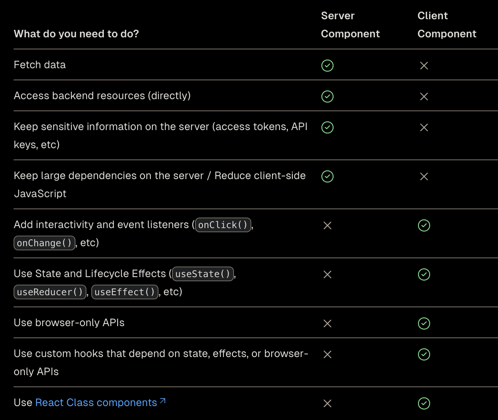

&nbsp;&nbsp;본 포스팅은 `Next.js`를 공부하기 위해 Vercel의 [Next.js 가이드 문서](https://nextjs.org/docs/app/building-your-application/rendering/composition-patterns)를 번역한 내용을 담고 있습니다. `Next.js` 프로젝트는 `Server`와 `Client` 컴포넌트의 복합적인 구조로 이루어져 있는데, 본 포스팅은 다양한 상황에서 어떤 컴포넌트를 사용해야 하는지, 가이드라인을 제시해주고 있습니다.

<br>

### When to use Server and Client Components?

&nbsp;&nbsp;`Server Component`와 `Client Component`가 언제 필요할지 간단하게 표로 정리하면 아래와 같습니다. 주로 `Server component`는 데이터 요청과 같이 백엔드 서비스와 관련이 있는 액션이나 `API KEY`처럼 클라이언트에 노출하지 않도록 하는 자원에 접근할 때 사용하며, `Client Component`는 사용자 액션 혹은, `document`, `localstorage`처럼 브라우저 API를 사용해야할 때 사용됩니다.

<br>



<br>

### Server Component Patterns

&nbsp;&nbsp;`Server Component`는 앞서 이야기한 것처럼 주로 백엔드 서비스나 `API KEY`처럼 클라이언트에 노출시키지 않는 자원에 접근할 때 사용됩니다. 지금부터 각 상황들에 대해 조금 더 자세히 살펴보도록 하겠습니다.

<br>

**1. Sharing data between components**

&nbsp;&nbsp;만약 여러 `Server Component`에서 동일한 서버 데이터에 접근해야 하는 상황이라면 어떨까요? 클라이언트에서와 달리 `Server Component`는 `Context API`와 같은 전역 상태관리 라이브러리를 사용할 수 없습니다. 그러면 각 컴포넌트는 각자 필요한 데이터를 `중복`해서 서버에 요청해야 할까요?

>[!tip] **React `fetch`**
>
>&nbsp;&nbsp;React extends `fetch` to automatically memoize data requests, and the `cache` function can be used when `fetch` is not available.

&nbsp;&nbsp;`React`의 `fetch`는 내부적으로 요청 이후 데이터가 캐싱되는 로직이 포함되어 있습니다. 따라서 여러 컴포넌트에서 중복된 데이터를 요청하더라도 이전 요청에 의해 캐싱된 데이터가 있다면 중복된 요청은 발생하지 않을 수 있습니다. `React fetch`가 데이터를 캐싱하는 방식에 대해서는 [다음](https://nextjs.org/docs/app/building-your-application/caching#request-memoization) 내용을 참고할 수 있습니다.

<br>

**2. Keeping Server-only code out of the Client Environment

&nbsp;&nbsp;어떤 코드는 서버 환경에서만 실행하기를 원할 수 있습니다. 다음 코드에서 `API KEY`는 클라이언트에 노출되지 않기 위해 서버 환경에서만 해당 코드를 호출하고 싶지만 원치 않게 `Client Component`에서 호출될 수 있습니다. 또한, 클라이언트 환경에서 `NEXT_PUBLIC`은 접근할 수 없으므로 원칙적으로 `''(빈 문자열)`을 반환하므로 실제로 요청이 정상적으로 처리되지 않습니다.

```javascript
export async function getData() {
  const res = await fetch('https://external-service.com/data', {
    headers: {
      authorization: process.env.API_KEY,
    },
  })
 
  return res.json()
}
```

<br>

위의 `getData`가 클라이언트에서 호출되는 것을 방지하기 위해 `server-only`를 사용할 수 있습니다. `server-only`를 사용하면 `getData`가 원치 않게 클라이언트 코드에서 실행되는 것을 빌드 타임에 오류를 통해 확인할 수 있습니다.

```bash
npm install server-only
```

```javascript
import 'server-only'
 
export async function getData() {
  const res = await fetch('https://external-service.com/data', {
    headers: {
      authorization: process.env.API_KEY,
    },
  })
 
  return res.json()
}
```

&nbsp;&nbsp;`server-only`와 비슷하게 어떤 코드는 클라이언트 환경에서만 실행되기를 원할 수 있습니다. `client-only` 패키지를 사용하면 클라이언트 코드가 서버 코드에서 실행되는 것을 빌드 타임 시에 오류를 통해 확인할 수 있습니다.

<br>
**3. Using Third-party Packages and Providers

**Third-party Packages**

&nbsp;&nbsp;`Server Component`가 등장한 이후, 새로운 서드 파티 패키지에는 `"use client"` 지시문이 추가되어 릴리즈되어 나오고 있습니다. 이 경우, 서버 환경에서는 해당 패키지를 사용할 수 없으므로 서버 컴포넌트가 패키지를 사용하려고 하면 빌드 타임에 오류를 통해 이를 검출할 수 있습니다.

&nbsp;&nbsp;하지만 여전히 많은 패키지는 `"use client"` 지시문이 포함되어 있지 않습니다. 때문에 서버 환경에서 패키지에 접근해도 별다른 오류를 띄우지 않아 문제를 미리 파악할 수 없습니다. 하나의 패키지를 예시로 들어보겠습니다.

<br>

```javascript
// app/page.tsx
import { Carousel } from 'acme-carousel'
 
export default function Page() {
  return (
    <div>
      <p>View pictures</p>
 
      {/* Error: `useState` can not be used within Server Components */}
      <Carousel />
    </div>
  )
}
```

&nbsp;&nbsp;`acme-carousel` 패키지에는 `Carousel` 컴포넌트가 포함되어 있으며, 이 컴포넌트는 `useState` 훅을 사용합니다. 하지만 `"use client"` 지시문이 없기 때문에 서버 컴포넌트에서 `Carousel` 컴포넌트를 사용해도 별다른 오류를 사전에 확인할 수 없습니다.

&nbsp;&nbsp;이 경우, 서드파티 컴포넌트를 새로운 컴포넌트로 만든 뒤, `"use client"` 지시문을 포함시키는 방법을 사용할 수 있습니다. 클라이언트 환경에서 동작하는 패키지는 대부분 이 방법으로 해결할 수 있습니다.

```javascript
// app/carousel.tsx
'use client'
import { Carousel } from 'acme-carousel'
 
export default Carousel

// app/pages.tsx
import Carousel from './carousel'
 
export default function Page() {
  return (
    <div>
      <p>View pictures</p>
 
      {/*  Works, since Carousel is a Client Component */}
      <Carousel />
    </div>
  )
}
```

<br>

**Context Providers**

&nbsp;&nbsp;전역 상태를 위한 `Context API`의 `Provider`는 많은 경우 `root`에 인접하게 렌더링됩니다. 하지만 `Server Component`는 `Provider`를 지원하지 않으므로 오류를 발생시킬 수 있습니다. 이 경우 `Context`를 설계할 때 `Provider`를 별도의 `Client Component` 내부에 렌더링되도록 할 수 있습니다.

```javascript
// app/theme-provider/tsx
'use client'
import { createContext } from 'react'
export const ThemeContext = createContext({})
 
export default function ThemeProvider({ children }: {
  children: React.ReactNode
}) {
  return <ThemeContext.Provider value="dark">{children}</ThemeContext.Provider>
}
```

  &nbsp;&nbsp;이렇게 하면 `Server Component`는 `Provider` 컴포넌트를 `Client Component`로써 렌더링합니다. 만약 `<ThemeProvider />`가 `root`에 렌더링 되었다면 `root` 하위의 모든 `Client Component`는 `<ThemeProvider />`의 전역 상태에 접근할 수 있습니다.

<br>

### Client Components

&nbsp;&nbsp;`Next.js`에서 컴포넌트는 기본적으로 `Server Component`로 동작하는 만큼 `Client Component`는 `Server Component` 자식 컴포넌트로 사용되는 경우가 많습니다. 때문에 `Client Component`를 사용하기 위해서는 다음과 같은 사항들에 대해 고려하는 것이 좋습니다.

<br>

**1. Moving Client Components Down the Tree**

&nbsp;&nbsp;`Client Component` 내부에서 사용되는 모듈들은 `Client bundle`로써 클라이언트에게 다운로드됩니다. ㅂ

<br>

**References**
- [Composite patterns, Vercel Docs](https://nextjs.org/docs/app/building-your-application/rendering/composition-patterns)
- [React Fetchs](https://nextjs.org/docs/app/building-your-application/caching#request-memoization)
- 