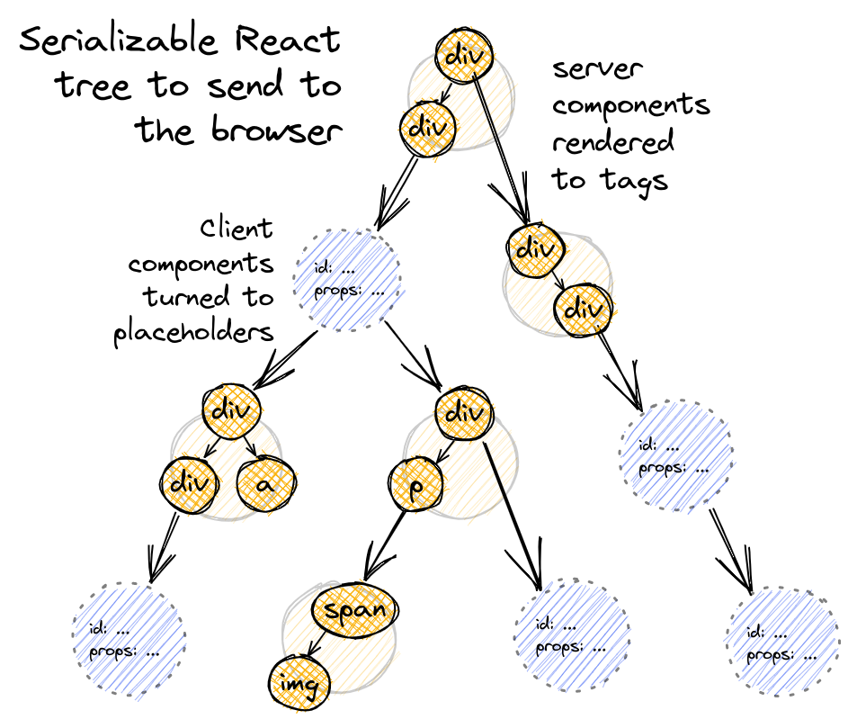

&nbsp;&nbsp;`Server Component`는 사전에 빌드된 후 그려진 UI(`pre-rendered`)를 서버에 선택적으로 `캐싱`하고 이후에 빠르게 불러올 수 있다는 장점이 있습니다. 이번 포스트에서는 `Next.js`의 `Server Component`의 특징과 장점에 대해 살펴보겠습니다.

<br>

### Server Component in Next.js

&nbsp;&nbsp;`Next.js 13`에서 `app dir` 하위에 존재하는 컴포넌트는 기본적으로 `Server Component`입니다. 별다른 설정이 없다면 서버 환경에서 동작하는 컴포넌트로 캐싱 전략을 통해 클라이언트에게 빠른 응답을 제공하는 것이 가능합니다. `Next.js`의  `캐싱` 동작방식은 다음 [섹션](../Caching/Caching) 에서 살펴볼 수 있습니다.

<br>

### Next.js Component 렌더링 과정

&nbsp;&nbsp;`Next.js`에서 렌더링은 `File system`에 의한 `Routing` 구조 혹은, `Suspense boundaries`에 의해 쪼개진 `chunk` 단위로 이루어집니다.

각각의  `chunk`는 서버에서 다음의 2단계 과정을 거쳐 렌더링됩니다.

1. `React`는 `Server Component`를 `Server Component Payload(RSC Payload)`라는 특별한 데이터 포맷으로 변환합니다.
2. `Next.js`는 `RSC Payload`와 `Client Component`의 Javascript 지시문을 통해 서버 상에서 HTML을 렌더링합니다.

이후 클라이언트에 전달된 HTML은 다음의 과정을 거칩니다.

1. Server에서 렌더링되어 전달받은 HTML를 통해 초기 페이지를 그립니다. 이 페이지는 인터렉티브한 상호작용이 불가능하지만 zero-bundle size(no javascript)로 빠른 렌더링이 가능합니다.
2. `RSC Payload`는 `Server Component Tree`와 `Client Component Tree`를 조정하며, 이를 통해 DOM을 새롭게 업데이트합니다.
3. 서버에서 렌더링된 `Client Component`의 HTML은  Javascript 코드와 결합되는 `Hydrating` 과정을 통해 어플리케이션이 인터렉티브하게 동작할 수 있게 됩니다.

<br>

### RSC Payload

&nbsp;&nbsp;[공식문서](https://nextjs.org/docs/app/building-your-application/rendering/server-components)를 읽으면서 가장 이해하기 어려웠던 개념은 `RSC Payload`였습니다. 문서에는 `RSC Payload`를 다음과 같이 설명하고 있습니다.

>[!tip] **RSC Payload**
>
>&nbsp;&nbsp;The RSC Payload is a compact binary representation of the rendered React Server Components tree. It's used by React on the client to update the browser's DOM. The RSC Payload contains:

<br>

&nbsp;&nbsp;꽤나 난해한 개념이었지만 어떤 분의 [블로그](https://velog.io/@2ast/React-%EC%84%9C%EB%B2%84-%EC%BB%B4%ED%8F%AC%EB%84%8C%ED%8A%B8React-Server-Component%EC%97%90-%EB%8C%80%ED%95%9C-%EA%B3%A0%EC%B0%B0)를 보고 어느정도 이해할 수 있게 되었는데 제가 이해한 내용을 바탕으로 정리해보았습니다.

&nbsp;&nbsp;우선 공식문서에 이야기한 것처럼 `RSC`는 바이너리 데이터의 일종으로 `RSC` 컴포넌트 트리 정보를 담고 있는 데이터의 형태입니다. 그렇다면 이렇게 독특한 데이터의 형태를 왜 사용하는 것일까요? 이에 대한 해답은 우선 `Next.js`가 단순히 `SSR(Server Side Rendering)`을 위한 도구가 아님을 먼저 알아야 합니다.

<br>

**Next.js에서의 SSR**

&nbsp;&nbsp;전통적인 `SSR`은 사실 사전에 서버에서 렌더링된 HTML과 JS 번들을 클라이언트에 전달하고, 클라이언트는 브라우저 환경에서 이 둘을 결합하는 `Hydrating`의 과정을 거치는 단순한 구조입니다. 하지만 실제 `Next.js`로 만들어진 페이지는 `RSC(React Server Component)` 뿐만 아니라 `RCC(React Client Component)`가 섞인 복합적인 구조로 이루어져 있죠. 컴포넌트 트리 상에서 렌더링된 `RSC` 결과와 함께 `RCC`의 위치, `RSC`와 `RCC`간 주고 받는 `props`의 정보를 담고 있으며 이를 통해 클라이언트가 DOM Tree를 작성할 수 있도록 하는 데이터가 `RSC Payload`입니다.

<br>



&nbsp;&nbsp;아래는 `RSC Payload`를 설명하기 위한 예시로, 만약 `RSC`와 `RCC`가 뒤섞여 있는 페이지를 사용자가 요청했다고 가정하고 `RSC Payload`가 어떻게 이용되는지 설명하고 있습니다.

1. 사용자의 요청에 따라 서버는 `Root`부터 컴포넌트 트리를 작성하기 시작합니다.
2. 컴포넌트 트리는 브라우저에게 전달하기 위해 `직렬화(serialization)` 과정을 거쳐 `json`의 형태로 변환됩니다. `RCC`는 함수로 `직렬화`가 불가능하기 때문에 `placeholder`의 형태로 해당 위치에 `RCC`가 렌더링되는 위치임을 나타내는 `Reference`로서 담깁니다. 이렇게 `직렬화` 과정을 거쳐 만들어진 `json` 데이터가 `RSC Payload` 입니다.
4. 클라이언트는 `RSC Payload`와 JS 번들을 내려받아 렌더링하고,`RCC Reference`가 등장할 때마다 `RCC`를 렌더링해 빈 공간을 채웁니다.

<br>

>[!tip] **직렬화(Serialization)**
>
>&nbsp;&nbsp;`직렬화(Serialization)`는 컴퓨터 과학의 데이터 스토리지 문맥에서 데이터 구조나 오브젝트 상태를 동일하거나 다른 컴퓨터 환경에 저장하고 나중에 재구성할 수 있는 포맷으로 변환하는 과정입니다.(Wikipedia)

<br>

### Server Rendering 전략

&nbsp;&nbsp;`Next.js`의 컴포넌트 렌더링 방법은 크게 `Static Rendering`, `Dynamic Rendering`, `Streaming`로 3가지 입니다. 각각의 렌더링 방식의 특징과 언제 해당 렌더링 방식을 채택해야 하는지 살펴보겠습니다.

<br>

**1. Static Rendering(Default)**

&nbsp;&nbsp;`Next.js`에서 컴포넌트에 별다른 설정을 하지 않았다면 기본적으로 렌더링되는 방식입니다. 컴포넌트는 `빌드 타임`, 혹은 데이터가 재평가되는 시점에 렌더링되며 렌더링된 결과는 캐싱되거나 `CDN(Content Delivery Network)`에 보내져 이후 사용자의 요청에 대해 빠르게 결과를 제공할 수 있습니다.

&nbsp;&nbsp;`Static Rendering`은 `Next 13`의 `SSG(Server Site Generation)`과 매우 흡사합니다. 블로그 게시물처럼 자주 변경이 발생하지 않거나, 모든 사용자에게 동일한 결과를 제공해야하는, not personalized한 페이지를 보여주기 위해 주로 사용됩니다.

<br>

**2. Dynamic Rendering**

&nbsp;&nbsp;`Dynamic Rendering`은 사용자가 요청을 보낼 때마다 새롭게 서버에서 렌더링되는 방식입니다. 만약 같은 페이지지만 사용자마다 다른 UI를 보아야 한다면 `Dynamic Rendering`을 할 수 있습니다. 매 요청마다 새롭게 페이지를 렌더링하기 때문에 요청 시에 넘겨받는 데이터(cookies, url params)들을 활용할 수 있습니다.

&nbsp;&nbsp;`noStore`는 `Next.js`에서 제공하는 기능으로 데이터를 `fetching`하는 함수로 하여금 요청에 대한 응답이 캐싱되지 않도록 해 매 호출마다 새로운 데이터를 가져옵니다. 아래 fetching 함수는 `Next.js`의 `noStore()`를 통해 자신을 호출하는 컴포넌트가 `Dynamic Rendering`를 따르도록 하고 있습니다.

```javascript
import { unstable_noStore as noStore } from 'next/cache';

export async function fetchRevenue() {
  // Add noStore() here to prevent the response from being cached.
  // This is equivalent to in fetch(..., {cache: 'no-store'}).
  noStore();
  try {
    // Artificially delay a response for demo purposes.
    // Don't do this in production :)
    console.log('Fetching revenue data...');
    await new Promise((resolve) => setTimeout(resolve, 3000));
    const data = await sql<Revenue>`SELECT * FROM revenue`;
    console.log('Data fetch completed after 3 seconds.');
    
    return data.rows;
  } catch (error) {
    console.error('Database Error:', error);
    throw new Error('Failed to fetch revenue data.');
  }
}
```

>[!tip] **Switching to Dynamic Rendering**
>
>&nbsp;&nbsp;`Next.js`는 자동으로 컴퍼넌트 내부 `Dynamic function`의 유무와 데이터의 `캐싱`여부를  통해 해당 컴포넌트를 `Static Rendering`을 할지 `Dynamic Rendering`을 할지 결정합니다. 만약 `Dynamic function`이 존재하거나 `캐싱`되지 않은 데이터가 있다면 `Next.js`는 컴포넌트를 동적으로 렌더링합니다.
>
>&nbsp;&nbsp;추가로 `Dynamic function`은 사용자의 `Request` 시점에 의존해 실행결과가 달라지는 함수를 의미합니다. 주로 `cookie`나 `URL Params`, `Request header` 등에 의존하는 함수 등이 이에 해당합니다. 

<br>

**3. Streaming (Progressive Rendering))**

&nbsp;&nbsp;사용자가 보는 페이지의 `UI Loading time`은 사실 가장 오래 걸리는 `data fetching` 시간에 의존합니다. 다른 모든 데이터를 가져오는데 100ms가 걸리지 않았더라도 남은 하나의 `fetching time`이 3s라면 사용자가 해당 페이지를 보기까지 걸리는 시간은 최소 3s 이상일테니깐요.

&nbsp;&nbsp;`Streaming`은 `Next 13`부터 추가되어, `App router`에 기본적으로 내장된 기능입니다. `Streaming`은 렌더링까지 오래걸리는 요소의 렌더링을 지연시키고 대체 요소를 보여주는 기술로 `Streaming`을 사용하면 개발자는 `TTV(Time to view) & TTI(Time to interact)`를 크게 개선할 수 있습니다.

<br>


&nbsp;&nbsp;위 그림에서 화면 전체의 `Layout` 중 게시글이 표시될 영역은 가장 `fetching time`이 긴 요소이며 전체 렌더링을 지연시키는 컴포넌트입니다. 해당 컴포넌트의 렌더링을 미루고 대체 컴포넌트(`loading.tsx` 등)을 보여 줌으로써 사용자는 빠르게 UI를 확인할 수 있으며, 지연된 UI 이외에는 UI 확인과, 상호작용이 가능하므로 상대적으로 기다린다는 느낌을 줄일 수 있습니다.

<br>

&nbsp;&nbsp;특정한 컴포넌트에 대해서 `Streaming`은 `React`의 `Suspense`를 통해 구현할 수 있습니다. `Suspense`는 Boundary 내부에 `children prop`으로 화면에 표시할 `JSX` 혹은 `컴포넌트`를 가지며, 해당 요소가 준비되기 전에 화면에 대신 띄워줄 `fallback`을 `prop`으로 받습니다. `React Suspense`에 관한 자세한 내용은 이전에 작성된 `React` 관련 포스트에서 확인할 수 있습니다.

```javascript
// app/dashboard/(overview)/page.tsx
import { Card } from '@/app/ui/dashboard/cards';
import RevenueChart from '@/app/ui/dashboard/revenue-chart';
import LatestInvoices from '@/app/ui/dashboard/latest-invoices';
import { lusitana } from '@/app/ui/fonts';
import { fetchLatestInvoices, fetchCardData } from '@/app/lib/data';
import { Suspense } from 'react';
import { RevenueChartSkeleton } from '@/app/ui/skeletons';
 
export default async function Page() {
  const latestInvoices = await fetchLatestInvoices();
  const {
    numberOfInvoices,
    numberOfCustomers,
    totalPaidInvoices,
    totalPendingInvoices,
  } = await fetchCardData();
 
  return (
    <main>
      <h1 className={`${lusitana.className} mb-4 text-xl md:text-2xl`}>
        Dashboard
      </h1>
      <div className="grid gap-6 sm:grid-cols-2 lg:grid-cols-4">
        <Card title="Collected" value={totalPaidInvoices} type="collected" />
        <Card title="Pending" value={totalPendingInvoices} type="pending" />
        <Card title="Total Invoices" value={numberOfInvoices} type="invoices" />
        <Card
          title="Total Customers"
          value={numberOfCustomers}
          type="customers"
        />
      </div>
      <div className="mt-6 grid grid-cols-1 gap-6 md:grid-cols-4 lg:grid-cols-8">
        // fallback으로 렌더링이 되기 전에 표시할 컴포넌트를 지정합니다.
        <Suspense fallback={<RevenueChartSkeleton />}>
          <RevenueChart />
        </Suspense>
        <LatestInvoices latestInvoices={latestInvoices} />
      </div>
    </main>
  );
}

// app/ui/dashboard/revenue-chart.tsx
import { generateYAxis } from '@/app/lib/utils';
import { CalendarIcon } from '@heroicons/react/24/outline';
import { lusitana } from '@/app/ui/fonts';
import { fetchRevenue } from '@/app/lib/data';
 
// ...
 
export default async function RevenueChart() { // Make component async, remove the props
  const revenue = await fetchRevenue(); // Fetch data inside the component
 
  const chartHeight = 350;
  const { yAxisLabels, topLabel } = generateYAxis(revenue);
 
  if (!revenue || revenue.length === 0) {
    return <p className="mt-4 text-gray-400">No data available.</p>;
  }
 
  return (
    // ...
  );
}
```

<br>

>[!caution] **무분별한 Suspense boundary 지정**
>
>&nbsp;&nbsp;모든 부분 컴포넌트마다 `Suspense`를 통해 `Streaming`을 하는 것은 오히려 사용자 경험을 저해하는 요소로 작용할 수 있습니다. 만약 한 페이지에 게시글 목록, 사용자 정보, 즐겨찾기 등 다양한 컴포넌트가 각자 별개의 `stream`으로 묶여있다면 각 컴포넌트가 렌더링되는 속도에 따라 제각각 화면에 나타나겠죠. 사용자의 입장에선 화면 여기저기서 정보가 popping하는 것처럼 느껴질 수 있습니다.


>[!tip] **Next.js `loading.tsx`**
>
>&nbsp;&nbsp;`Next.js`에서 `loading.tsx`는 특별한 의미를 갖는 컴포넌트입니다. `Next.js 13` 기준 `app` 하위에 위치한 페이지의 렌더링이 지연되었다면 디렉토리 상위에 위치한 `loading.tsx`가 `fallback`으로써 렌더링이 완료되기 전까지 대신 화면에 표시됩니다. `loading.tsx는 별도의 `Suspense`를 지정하지 않아도 페이지(`page.tsx`)의 렌더링이 지연되면 대체 컴포넌트로써 동작합니다.

<br>

### Server Rendering의 장점

&nbsp;&nbsp;지금까지 `Server Component`와 `Server Rendering`에 대해 살펴보았습니다. 마지막으로 `Server Rendering`을 했을 때 얻을 수 있는 장점들을 살펴보고 포스트를 마무리하겠습니다.

1. **Data fetching**: `Server Component`는 클라이언트에 비해 상대적으로 DB에 가까지 위치한 서버에서 데이터를 요청하므로 데이터를 `fetching` 해오는 시간이 빠릅니다. 또한 클라이언트가 서버에 요청하는 요청의 횟수 또한 감소합니다.
2. **Security**: `Server Component`는 `token`이나 `API key` 등 민감한 정보를 클라이언트에 노출시키지 않습니다.
3. **Caching**: 서버에서 렌더링되고 캐싱되기 때문에 여러 사용자로부터 발생하는 요청에 대해 마지막 요청에 의해 캐싱된 최신 UI를 제공할 수 있습니다. 사용자의 모든 요청마다 불필요하게 렌더링되는 것을 방지할 수 있습니다.
4. **Bundle sizes**: `Server Component`는 클라이언트의 입장에서 JS 번들을다운받지 않아도 되므로  네트워크 지연에 의존하는 렌더링 속도 저하를 방지할 수 있습니다.
5. **Initial page load and FCP(First contentful paint)**: 사용자는 서버에서 생성된 HTML을 받아 파싱하여 화면에 띄우기만 하면 되므로 JS 번들이 다운로드 되고, 파싱 후 실행되는 것을 기다릴 필요없이 즉시 화면에 표시됩니다.
6. **SEO 최적화**: 서버에서 렌더링된 HTML은 검색 엔진 봇에 의해 더욱 더 자주 인덱싱되므로 검색 사이트에 노출되기 쉽습니다.
7. **Streaming**: `Server Component`는 렌더링을 위해 `chunk`들로 나뉘고 `stream`에 의해 준비된 요소들을 우선적으로 화면에 표시하므로 모든 페이지의 렌더링이 완료되기까지 기다리지 않아도 됩니다.

<br>

**References**
- [Server Components, Vercel Docs](https://nextjs.org/docs/app/building-your-application/rendering/server-components)
- [Learn Next.js dashboard-app, streaming](https://nextjs.org/learn/dashboard-app/streaming)
- [How React server components work: an in-depth guide](https://www.plasmic.app/blog/how-react-server-components-work)
- [Serialization, Wikipedia](https://en.wikipedia.org/wiki/Serialization)