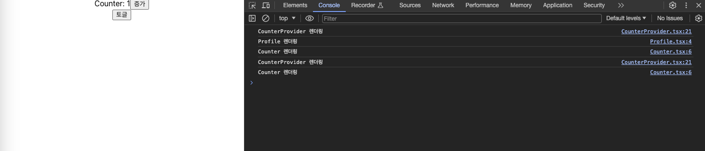

&nbsp;&nbsp;`Recoil`, `Redux`와 함께 전역상태관리를 위해 `Context API`를 사용해왔는데, 필요한 라이브러리를 골라 사용했다기 보단 유명하니 한번 사용해보자는 느낌으로 사용했던 터라 이번 기회를 통해 한번 정리하고자 합니다. 올해 새롭게 진행하는 프로젝트에서는 각 라이브러리의 특성을 이해하고 프로젝트 특성에 맞는 라이브러리를 선택하는데 있어 이번 학습이 기준이 되었으면 합니다.

<br>

### Context API

>[!tip] context는 React 컴포넌트 트리 안에서 전역적(global)이라고 볼 수 있는 데이터를 공유할 수 있도록 고안된 방법입니다. 그러한 데이터로는 현재 로그인한 유저, 테마, 선호하는 언어 등이 있습니다.

&nbsp;&nbsp;`Context API`는 리액트에서 공식으로 제공하는 전역상태관리를 위한 도구입니다. 한때 비교적 설정이 복잡한 `Redux`에 비해 가벼운 `Context API`가 유행했던적이 있었던 것 같은데 최근에는 여러가지 이슈로 `Recoil`이나 `Zustand`를 선호하는 경향이 있는 것 같습니다.

<br>

### Context API 사용법

&nbsp;&nbsp;`Conext API`를 사용하기 위해서 간단한 카운터 예제를 통해 과정을 살펴보겠습니다.


```javascript
/* CounterProvider.tsx */
import { useState, createContext, useMemo } from "react";

interface ICounterContext {
	counter: number;
	setCounter: React.Dispatch<React.SetStateAction<number>>;
}

const defaultContext: ICounterContext = {
	counter: 0,
	setCounter: () => {},
};

interface Props {
	children: React.ReactNode;
}

export const CounterContext = createContext<ICounterContext>(defaultContext);

const CounterProvider: React.FC<Props> = ({ children }) => {
	const [counter, setCounter] = useState(0);
	const memo = useMemo(() => {
		return { counter, setCounter };
	}, [counter, setCounter]);

	return <CounterContext.Provider value={memo}>{children}</CounterContext.Provider>;
};

export default CounterProvider;

/* Counter.tsx */
import { useContext } from "react";
import { CounterContext } from "../contexts/CounterProvider";

const Counter = () => {
	const { counter, setCounter } = useContext(CounterContext);
	
	return (
		<div>
			<span>Counter: {counter}</span>
			<button onClick={() => setCounter((prev) => prev + 1)}>증가</button>
		</div>
	);
};

export default Counter;
```

<br>

1. `createConext`에 `defaultContext`를 넣어 컨텍스트를 생성합니다. `defaultConext`는 전역으로 관리할 초기 객체를 의미합니다.
2. 생성한 컨텍스트를 사용할 컴포넌트 상위에 `CounterConext.Provider`로 감싸줍니다.
3. `Provider`는 `value`를 통해 전역으로 관리할 값을 넘겨받으며 전역상태가 초기화됩니다.
4. 하위 컴포넌트(children)에서는 `useContext`를 호출해 전역상태에 접근이 가능합니다.


<br>

### Context API의 렌더링 이슈

&nbsp;&nbsp;`Context API`에는 렌더링 성능과 관련한 문제점이 있습니다. 다시 예제를 살펴보겠습니다. 

```javascript
/* CounterProvider.tsx */
import { useState, createContext, useMemo } from "react";

interface ICounterContext {
	counter: number;
	setCounter: React.Dispatch<React.SetStateAction<number>>;
	nickname: string, // nickname 추가
	setNickname: React.Dispatch<ReactSetStateAction<string>>;
}

const defaultContext: ICounterContext = {
	counter: 0,
	setCounter: () => {},
	nickname: "", // nickname 추가
	setNickname: () => {},
};

interface Props {
	children: React.ReactNode;
}

export const CounterContext = createContext<ICounterContext>(defaultContext);

const CounterProvider: React.FC<Props> = ({ children }) => {
	const [counter, setCounter] = useState(0);
	const [nickname, setNickname] = useState("Paka"); // nickname 추가
	const memo = useMemo(() => {
		return { counter, setCounter, nickname, setNickname };
	}, [counter, setCounter]);

	console.log("CounterProvider 렌더링");

	return <CounterContext.Provider value={memo}>{children}</CounterContext.Provider>;
};

export default CounterProvider;

/* Profile.tsx */
import { useContext } from "react";
import { CounterContext } from "../contexts/CounterProvider";

const Profile = () => {
	const { nickname } = useContext(CounterContext);
	console.log("Profile 렌더링");
	
	return (
		<div>
		<span>닉네임: {nickname}</span>
		</div>
	);
};

export default Profile;
```


&nbsp;&nbsp;이번에는 `CounterContext`에 `nickname`과 `setNickname`이 추가되었습니다(counter와 연관성은 없지만...). `Profile` 컴포넌트는 `useContext`로 `nickname`을 사용하고 있고요. 모든 컴포넌트는 렌더링을 확인하기 위해 콘솔을 통해 렌더링 되었음을 출력하게 해두었습니다. 이 상태로 카운터를 증가시키면 어떻게 될까요?

<br>

**결과화면**



&nbsp;&nbsp;`Profile` 컴포넌트는 `counter` 상태를 사용하지 않지만 같은 `CounterContext`라는 객체를 공유하고 있기 때문에 재렌더링이 발생합니다. 지금은 관리하는 전역상태와 컴포넌트의 개수가 적지만 시스템이 커지고, 복잡해질 수록 원치않는 재렌더링은 성능저하로 연결될 수 있습니다.

&nbsp;&nbsp;불필요한 렌더링을 방지하기 위해서는 `Provider`를 최대한 쪼개 별도의 컨텍스트로 묶어 범위를 최소화하는 것이 좋습니다. 이 과정에서 수많은 `Provider`가 `Wrapper`로서 JSX에 

<br>

### children props와 자식 컴포넌트

&nbsp;&nbsp;학습을 진행하면서 렌더링과 관련해 새롭게 배운 내용이 있어 추가된 내용입니다. `children` props로 넘겨받은 컴포넌트와 부모 컴포넌트 내부에 JSX 반환문에 위치한 자식 컴포넌트는 모두 DOM 트리상에서 부모 컴포넌트 아래에 위치하지만 렌더링되는 규칙이 다릅니다.


&nbsp;&nbsp;부모 컴포넌트의 상태가 변경되어 재렌더링이 발생함에 따라 자식 컴포넌트는 함께 렌더링이 발생하지만, children props로 넘겨받은 컴포넌트는 재렌더링이 발생하지 않습니다. 그 이유는 children props는 부모 컴포넌트가 자신보다 상위 컴포넌트로부터 받은 props이기 때문인데, props는 props를 넘겨준 상위 컴포넌트에서 관리되며 상위 컴포넌트에서 props의 변경이 발생하지 않았다면 children 역시 변경 사항이 없기 때문에 부모 컴포넌트의 재렌더링과 관계없이 새롭게 렌더링이 되지 않는 것입니다. 예제를 통해 살펴보겠습니다.

<br>

```javascript
/* App.js */
const App = () => {
	return (
		<div>
			<Parent>
				<Children />
			</Parent>
		</div>
	)	
}
/* Parent.js */
const Parent = () => {
	const [_, setToggle] = useState(false);
	console.log("Parent 컴포넌트 렌더링");
	return (
		<div>
			{ children }
			<Child />
			<button onClick={() => setToggle((prev) => !prev)}>토글</button>
		</div>
	)
}

/* Children */
const Children = () => {
	console.log("Chilren 컴포넌트 렌더링");
	return (
		<div>Children</div>
	)
}

/* Child */
const Child = () => {
	console.log("Child 컴포넌트 렌더링");
	return <div>Child</div>
}
```

&nbsp;&nbsp;위 예제에서 `Parent` 컴포넌트는 `chilren props`로 `Children` 컴포넌트를, 그리고 JSX 내부에 `Child` 컴포넌트를 가지고 있으며, 두 자식 컴포넌트는 DOM 트리 상에서 Parent의 자식 컴포넌트가 됩니다. 

<br>

**결과화면**


&nbsp;&nbsp;`Parent` 컴포넌트의 토글 버튼을 클릭하면 컴포넌트가 가진 상태에 변경이 발생하고, `Parent` 컴포넌트는 `Child` 컴포넌트와 함께 재렌더링 됩니다. 하지만 `Children` 컴포넌트는 `App` 컴포넌트에서 `Parent` 컴포넌트의 children props로 넘겨졌기 때문에 렌더링이 이루어지지 않습니다.

<br>

**References**
- [React Docs, useContext](https://react.dev/reference/react/useContext)
- [React Hooks! useContext편(React 17)](https://www.zerocho.com/category/React/post/5fa63fc6301d080004c4e32b)
- [Context API의 최대 단점은 무엇일까](https://velog.io/@ckstn0777/Context-API%EC%9D%98-%EC%B5%9C%EB%8C%80-%EB%8B%A8%EC%A0%90%EC%9D%80-%EB%AC%B4%EC%97%87%EC%9D%BC%EA%B9%8C)