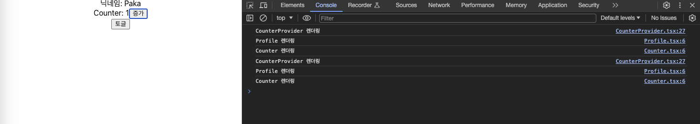

&nbsp;&nbsp;`Recoil`, `Redux`와 함께 전역상태관리를 위해 `Context API`를 사용해왔는데, 필요한 라이브러리를 골라 사용했다기 보단 유명하니 한번 사용해보자는 느낌으로 사용했던 터라 이번 기회를 통해 한번 정리하고자 합니다. 올해 새롭게 진행하는 프로젝트에서는 각 라이브러리의 특성을 이해하고 프로젝트 특성에 맞는 라이브러리를 선택하는데 있어 이번 학습이 기준이 되었으면 합니다.

<br>

### Context API

>[!tip] context는 React 컴포넌트 트리 안에서 전역적(global)이라고 볼 수 있는 데이터를 공유할 수 있도록 고안된 방법입니다. 그러한 데이터로는 현재 로그인한 유저, 테마, 선호하는 언어 등이 있습니다.

&nbsp;&nbsp;`Context API`는 리액트에서 공식으로 제공하는 전역상태관리를 위한 도구입니다. 한때 비교적 설정이 복잡한 `Redux`에 비해 가벼운 `Context API`가 유행했던적이 있었던 것 같은데 최근에는 여러가지 이슈로 `Recoil`이나 `Zustand`를 선호하는 경향이 있는 것 같습니다.

<br>

### Context API 사용법

&nbsp;&nbsp;`Conext API`를 사용하기 위해서 간단한 카운터 예제를 통해 과정을 살펴보겠습니다.


```javascript
/* CounterProvider.tsx */
import { useState, createContext, useMemo } from "react";

interface ICounterContext {
	counter: number;
	setCounter: React.Dispatch<React.SetStateAction<number>>;
}

const defaultContext: ICounterContext = {
	counter: 0,
	setCounter: () => {},
};

interface Props {
	children: React.ReactNode;
}

export const CounterContext = createContext<ICounterContext>(defaultContext);

const CounterProvider: React.FC<Props> = ({ children }) => {
	const [counter, setCounter] = useState(0);
	const memo = useMemo(() => {
		return { counter, setCounter };
	}, [counter, setCounter]);

	return <CounterContext.Provider value={memo}>{children}</CounterContext.Provider>;
};

export default CounterProvider;

/* Child.tsx */
import { useContext } from "react";
import { CounterContext } from "../contexts/CounterProvider";

const Child = () => {
	const { counter, setCounter } = useContext(CounterContext);
	
	return (
		<div>
			<span>Counter: {counter}</span>
			<button onClick={() => setCounter((prev) => prev + 1)}>증가</button>
		</div>
	);
};

export default Child;
```

<br>

1. `createConext`에 `defaultContext`를 넣어 컨텍스트를 생성합니다. `defaultConext`는 전역으로 관리할 초기 객체를 의미합니다.
2. 생성한 컨텍스트를 사용할 컴포넌트 상위에 `CounterConext.Provider`로 감싸줍니다.
3. `Provider`는 `value`를 통해 전역으로 관리할 값을 넘겨받으며 전역상태가 초기화됩니다.
4. 하위 컴포넌트(children)에서는 `useContext`를 호출해 전역상태에 접근이 가능합니다.


<br>

### Context API의 렌더링 이슈

&nbsp;&nbsp;`Context API`에는 렌더링 성능과 관련한 문제점이 있습니다. 바로 `Provider`가 위치한 상위 컴포넌트가 재렌더링되면 Provider 아래에 위치한 모든 컴포넌트 역시 다시 렌더링됩니다. 우선 상위 컴포넌트가 아닌 전역상태인 `CounterContext`의 값이 변경되었을 때를 살펴보겠습니다. 

<br>

**전역상태(CounterContext)의 변경**

&nbsp;&nbsp;`App` 컴포넌트는 `CounterProvider`를 자식 컴포넌트로 가지고 있고, `CounterProvider`는 children props로 `Profile` 컴포넌트와 `Child` 컴포넌트를 받습니다. 그리고 `Child` 컴포넌트는 `useContext`를 호출해 증가 버튼을 클릭하면 이벤트가 발생해 `counter` 전역상태를 변경합니다.

```javascript
/* App.tsx */
function App() {
	const [_, setToggle] = useState(false);
	
	return (
		<div className="App">
			<CounterProvider>
				<Profile />
				<Child />
			</CounterProvider>
			<button onClick={() => {setToggle((prev) => !prev);}}>			
				토글
			</button>
		</div>
	);
}

/* Child.tsx */
import { useContext } from "react";
import { CounterContext } from "../contexts/CounterProvider";

const Child = () => {
	const { counter, setCounter } = useContext(CounterContext);
	
	return (
		<div>
			<span>Counter: {counter}</span>
			<button onClick={() => setCounter((prev) => prev + 1)}>증가</button>
		</div>
	);
};

export default Child;
```

<br>

**결과화면**



&nbsp;&nbsp;증가버튼을 누르게 되면 위에서 살펴보았듯 `CounterContext`가 가진 `setCounter`를 통해 `counter` 전역상태에 변경이 발생합니다. 결과적으로 `Child`와 `CounterProvider`는 재렌더링이 발생하지만 `CounterProvider` 자식컴포넌트인 `Profile` 컴포넌트는 렌더링이 발생하지 않습니다.

<br>

>[!caution] `children` props와 자식 컴포넌트
>
>&nbsp;&nbsp;사실 하나 짚고 넘어가야할 점이 있습니다. `children` props로 넘겨받은 컴포넌트와 

<br>

**Provider 상위 컴포넌트의 변경**

&nbsp;&nbsp;이제 CounterProvider의 부모 컴포넌트에 재렌더링이 이루어졌을 경우를 살펴보겠습니다.