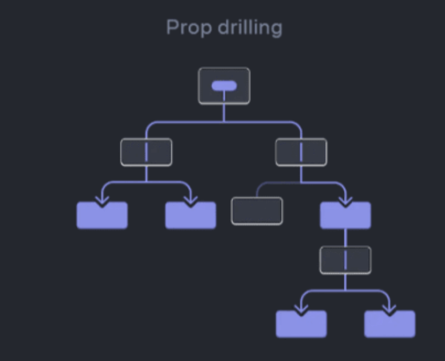

&nbsp;&nbsp;React는 Angular, Vue와 달리 `MVVM` 패턴을 명시적으로 지원하지 않는 라이브러리입니다. 그렇다면 React는 어떤 패턴을 사용해 데이터와 비즈니스 로직을 관리할까요?

> [!tip] **MVVM 패턴**
>
> &nbsp;&nbsp;MVVM 패턴은 데이터를 나타내는 `Model`, UI를 그리기 위한 `View` 그리고 데이터를 UI 바인딩하여 화면에 그리기 위한 `View Model`로 구성되어 있습니다.

 

### Container-Presenter

&nbsp;&nbsp;`Container-Presenter` 패턴을 사용하기 전의 React는 시스템의 크기와 비례해 증가하는 데이터의 종류와 이를 핸들링하는 로직이 곳곳에 위치하게 되면서 컴포넌트의 주 사용 목적인 `재사용성`이 떨어지는 문제가 발생하게 되었습니다. 이를 위해 등장한 것이 `Container-Presenter` 패턴입니다.

&nbsp;&nbsp;`Container-Presenter` 패턴은 UI를 보여주기만 하는 `ReadOnly`의 `Presenter` 컴포넌트와, Presenter 컴포넌트를 감싸며 데이터를 핸들링하는 상위 컴포넌트인 `Container` 컴포넌트로 구성되어 있습니다. 이를 통해 비즈니스 로직과 UI를 분리해 상위 컴포넌트는 비즈니스 로직에 집중하고, 하위 컴포넌트는 UI에 집중함으로써 컴포넌트의 재사용성과 함께 유지보수를 용이하게 했습니다.

 

**props drilling**

&nbsp;&nbsp;하지만 Container-Presenter 패턴은 여러 컴포넌트에서 공유하는 상태들을 몇몇의 상위 컴포넌트에서 관리하게 되면서 지나치게 많은 props의 전달을 야기하게 되었습니다. UI에 상태 데이터를 전달하기 위해 수많은 컴포넌트를 거치고, 또 그 과정에서 일부 컴포넌트는 props를 전달하기 위해 사용하지도 않는 props를 상속받게 됩니다. 이러한 `props drilling`에 의해 상위 컴포넌트와 하위 컴포넌트의 결합도가 증가하게 되었죠.

 

### FLUX 아키텍쳐

&nbsp;&nbsp;`Flux` 아키텍쳐는 비즈니스 로직이 굳이 컴포넌트의 계층 구조를 따라 흘러갈 필요가 없다는 아이디어에서 시작되었습니다. 어떤 화면 UI인 `View`에서의 사용자의 동작(`Action`)은 `dispatcher`에 의해 데이터를 담고 있는 `Store`를 변경합니다. 그리고 View는 Store의 데이터와 바인딩되어 그저 변경된 내용을 화면에 보여주기만 하면 됩니다. dispatcher가 별도로 관리된다면 컴포넌트 계층 구조를 따라 비즈니스 로직이 흘러가지 않아도 되는거죠.

 

**1. Action**

&nbsp;&nbsp;`Action`은 데이터를 변경하는 행위이면서 `Dispatcher`에 전달되는 객체입니다. Redux에서는 Redux 내장메서드인 `useDispatch`가, Recoil에서는 `useRecoilReducer`의 reducer 함수가 Action을 넘겨받아 상태를 새롭게 갱신합니다.

**2. Dispatcher**

&nbsp;&nbsp;`Flux` 아키텍처에서 데이터의 흐름을 관리하는 중앙 허브입니다. 넘겨받은 `Action`의 타입을 확인하고 적절한 `Store`의 데이터와 데이터 변경 함수를 콜백함수를 통해 호출합니다. Store의 데이터는 Dispatcher를 통해서만 조작할 수 있습니다.

**3. Store**

&nbsp;&nbsp;상태 저장소로써 상태 데이터와 상태를 변경할 수 있는 메서드를 가지고 있습니다. 상태변경 메서드는 `Dispatcher`가 넘겨받은 `Action`의 타입에 따라 적절한 콜백함수에 등록됩니다.

**4. View**

&nbsp;&nbsp;리액트 컴포넌트로 필요한 전역상태를 `Store`에서 가져와 화면에 렌더링하며, 사용자 동작에 따라 `Action`을 `Dispatcher`에 넘겨 전역상태를 변경하고 재렌더링됩니다.

 

### 상태관리도구

&nbsp;&nbsp;`Flux` 아키텍쳐는 `Redux`와 같은 `상태관리도구`의 등장에 따라 하나의 트렌드가 되었습니다. 상태관리도구에 의해 비즈니스 로직은 컴포넌트로부터 분리되었고 컴포넌트간 의존성과 결합도를 감소시킬 수 있게 되었습니다.

&nbsp;&nbsp;하지만 상태관리도구는 이를 사용한 준비과정이 필요합니다. 특히, Redux는 전역상태를 관리하기 위한 설정과정이 복잡한 편이죠. 각각의 상태관리도구의 특성을 이해하고 프로젝트에 따라 적절한 라이브러리를 활용하는 것이 중요합니다. 다양한 상태관리도구에 대해서는 다음에 다뤄보도록 하겠습니다.

 

**References**

- [Understanding React Context and Property (Prop) Drilling](https://blogs.perficient.com/2021/12/03/understanding-react-context-and-property-prop-drilling/)
- [프론트엔드 아키텍처 트렌드](https://yozm.wishket.com/magazine/detail/1663/)
