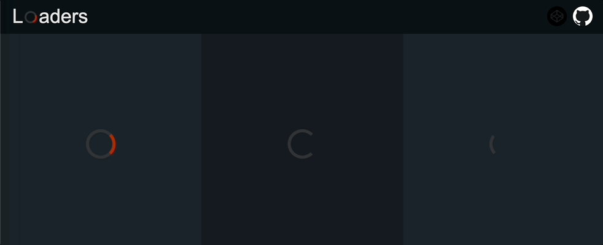
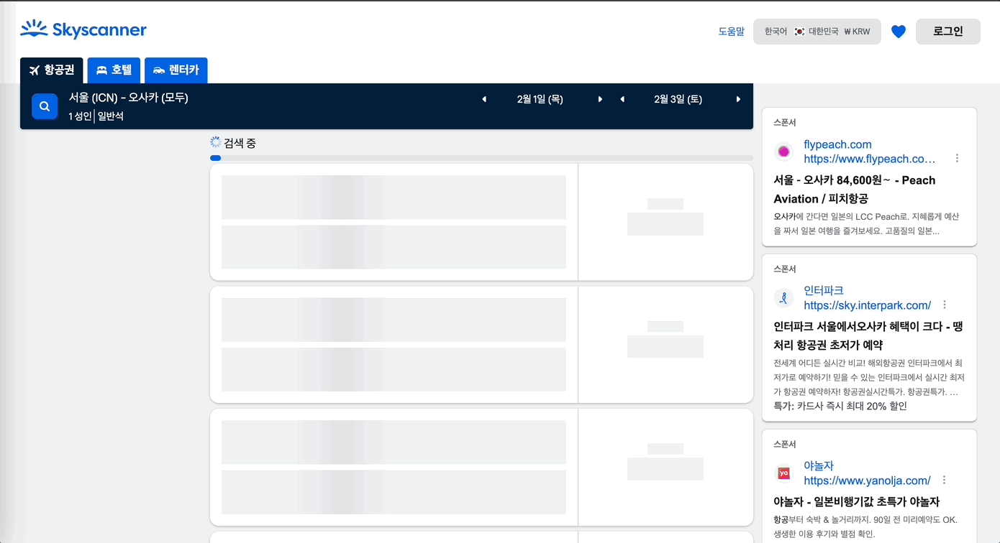

&nbsp;&nbsp;`Skeleton UI`는 프론트엔드 개발자라면 `사용자 경험(User Experience)`을 위해서 Spinner의 형태든, Bar의 형태든 데이터를 기다리는 동안 보여주기 위한 화면을 활용해본 경험이 있을 것입니다. `Skeleton UI`가 없다면 사용자는 데이터를 기다리는 동안 빈 화면만을 보고 있어야 하고, 실제로 화면이 로드되는 중인지 알 수 없습니다. 그렇기 때문에 `Skeleton UI`는 사용자로 하여금 무언가 로드되는 중임을 나타내고, 기다리는 동안 생길 수 있는 지루함을 조금이나마(?) 덜기 위해 사용됩니다.

[출처: cssloaders](https://cssloaders.github.io/)

 

### Skeleton UI 타입

&nbsp;&nbsp;`Skeleton UI`에는 앞서 이미지로 살펴본 Spinner처럼 Spinner와 Bar를 사용해 로딩 중임을 나타내는 방법과 함께 최근에는 대체 컴포넌트를 활용해 해당 영역에 내용이 어떻게 표시될 것인지 간접적으로 표현하는 방법이 자주 사용됩니다. 대표적인 항공권 예매 서비스인 Skyscanner에서 검색한 항공편 데이터를 가져오고 로드하는 부분에 대체 컴포넌트를 활용한 `Skeleton UI`가 적용되어 있습니다.

&nbsp;&nbsp;상대적으로 로드되기까지 시간이 오래걸리는 페이지에 대해 표시하고자 하는 데이터에 따라 적절한 `Skeleton UI`를 활용할 수 있습니다. `사용자 경험`이라는 취지에서 도입된 기능인 만큼 어디까지나 서비스 특성에 맞게  `Skeleton UI`를 디자인을 하는 것이 서비스를 이용하는 사용자에게 좋은 경험을 제공할 수 있을 것이라 생각합니다.

 

### Skeleton UI와 사용자 경험

&nbsp;&nbsp;그렇다면 항상 `Skeleton UI`를 사용하는 것이 좋은 `사용자 경험`을 제공하는데 도움이 될까요? 결론부터 이야기하자면 "그렇지 않다"입니다. [카카오 기술블로그](https://tech.kakaopay.com/post/skeleton-ui-idea/)에서 인용한 UX 리서치 그룹(닐슨 노먼 그룹)의 [Progress indicators](https://www.nngroup.com/articles/progress-indicators/) 지침을 아래와 같이 정리할 수 있습니다.

1. Looped animation: Use only for fast actions.
2. Percent-done animation: Use for actions that take 10 seconds or more.
3. Static progress indicators: Don’t use them.
4. Don’t-click-again warnings: Don’t use them.

 

**References**
- [더 나은 UX를 위한 React에서 스켈레톤 컴포넌트 만들기](https://ui.toast.com/weekly-pick/ko_20201110)
- [무조건 스켈레톤 화면을 보여주는게 사용자 경험에 도움이 될까요?](https://tech.kakaopay.com/post/skeleton-ui-idea/)
- [Progress indicators, Nielsen Norman Group](https://www.nngroup.com/articles/progress-indicators/)