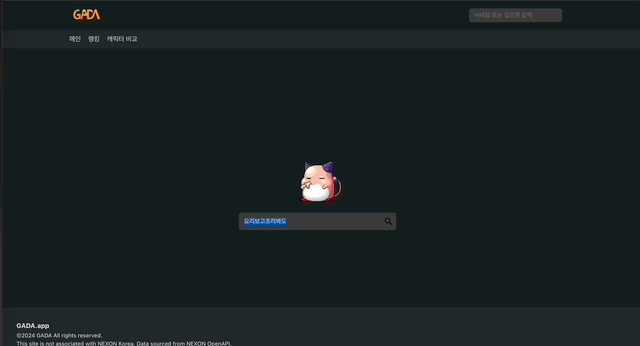

&nbsp;&nbsp;`Skeleton UI`는 프론트엔드 개발자라면 `사용자 경험(User Experience)`을 위해서 Spinner의 형태든, Bar의 형태든 데이터를 기다리는 동안 보여주기 위한 화면을 활용해본 경험이 있을 것입니다. `Skeleton UI`가 없다면 사용자는 데이터를 기다리는 동안 빈 화면만을 보고 있어야 하고, 실제로 화면이 로드되는 중인지 알 수 없습니다. 그렇기 때문에 `Skeleton UI`는 사용자로 하여금 무언가 로드되는 중임을 나타내고, 기다리는 동안 생길 수 있는 지루함을 조금이나마(?) 덜기 위해 사용됩니다.


[출처: cssloaders](https://cssloaders.github.io/)

<br>

### Skeleton UI 타입

&nbsp;&nbsp;`Skeleton UI`에는 앞서 이미지로 살펴본 Spinner처럼 Spinner와 Bar를 사용해 로딩 중임을 나타내는 방법과 함께 최근에는 대체 컴포넌트를 활용해 해당 영역에 내용이 어떻게 표시될 것인지 간접적으로 표현하는 방법이 자주 사용됩니다. 대표적인 항공권 예매 서비스인 Skyscanner에서 검색한 항공편 데이터를 가져오고 로드하는 부분에 대체 컴포넌트를 활용한 `Skeleton UI`가 적용되어 있습니다.


&nbsp;&nbsp;상대적으로 로드되기까지 시간이 오래걸리는 페이지에 대해 표시하고자 하는 데이터에 따라 적절한 `Skeleton UI`를 활용할 수 있습니다. `사용자 경험`이라는 취지에서 도입된 기능인 만큼 어디까지나 서비스 특성에 맞게  `Skeleton UI`를 디자인을 하는 것이 서비스를 이용하는 사용자에게 좋은 경험을 제공할 수 있을 것이라 생각합니다.

<br>

### Skeleton UI와 사용자 경험

&nbsp;&nbsp;그렇다면 항상 `Skeleton UI`를 사용하는 것이 좋은 `사용자 경험`을 제공하는데 도움이 될까요? 결론부터 이야기하자면 "그렇지 않다"입니다. [카카오 기술블로그](https://tech.kakaopay.com/post/skeleton-ui-idea/)에서 인용한 UX 리서치 그룹(닐슨 노먼 그룹)의 [Progress indicators](https://www.nngroup.com/articles/progress-indicators/) 지침을 아래와 같이 정리할 수 있습니다.

> [!tip] Use a progress indicator for any action that takes longer than about 1.0 second.
>1. Looped animation: Use only for fast actions.
>2. Percent-done animation: Use for actions that take 10 seconds or more.
>3. Static progress indicators: Don’t use them.
>4. Don’t-click-again warnings: Don’t use them.

<br>

&nbsp;&nbsp;지침에서 가장 중요하게 봐야할 점은 Progress indicator는 1초 이상이 걸리는 작업에 적용해야 한다는 것입니다. 아래 이미지는 현재 토이프로젝트로 개발 중인 서비스의 캐릭터 조회 페이지입니다. 캐릭터 조회 후 발생하는 대기시간에 로딩 페이지를 보여주고 있죠. 하지만 대부분의 경우엔 로딩 페이지는 1초 내외로 보입니다. 사용자 입장에서 로딩 페이지는 순식간에 깜빡거리며 지나가기 때문에 오히려 거슬리는 느낌을 줄 수 있습니다.



<br>

&nbsp;아이러니하게도 로딩 페이지는 `사용자 경험` 개선을 위해 추가되었지만 오히려 사용자에게 불편함을 주는 요소가 될 수도 있습니다. 위 예시는 그나마 1초 내외로 로딩 페이지라는 것을 식별할 수 있지만, 1초 미만으로 빠르게 로드되는 페이지에서는  깜빡임 때문에 페이지가 전환되는 과정이 삐걱거리는 것처럼 느껴질 수 있습니다.

<br>

### Suspense를 활용한 DeferredComponent

&nbsp;&nbsp;사실 로드되는 시간은 개발자가 제어할 수 없는 인자입니다. 네트워크 상황에 따라, 사용자에 따라 동일한 페이지가 로드되는 시간은 다를 수 있습니다. 그렇다면 페이지가 빠르게 로드될 때에는 `Skeleton UI`를 표시하지 않고, 느리게 로드될 때엔 표시되도록 하는 방법이 있을까요?

&nbsp;&nbsp;[카카오 기술블로그](https://tech.kakaopay.com/post/skeleton-ui-idea/)에서는 `Suspense`의 `fallback`으로 넘겨받은 `Skeleton` 컴포넌트를 `DeferredComponent`로 감싸 이를 통해 `Skeleton` 컴포넌트가 200ms 안쪽으로 로드되는 것을 방지하는 코드로 로드 속도에 따라 동적으로 `Skeleton` 컴포넌트를 표시할지 말지를 결정하는 방식으로 구현하고 있습니다. 이 방식을 현재 개발하고 있는 토이 프로젝트에 바로 적용해보도록 하겠습니다.

<br>

```javascript
// DeferredComponent.tsx
import { PropsWithChildren, useEffect, useState } from "react";

const DeferredComponent = ({ children }: PropsWithChildren) => {
  const [isDeferred, setIsDeferred] = useState<boolean>(false);

  // 200ms가 지났을 때 children이 렌더링 되도록...
  useEffect(() => {
    setTimeout(() => {
      setIsDeferred(true);
    }, 200);
  }, []);

  if (!isDeferred) return null;
  return <>{children}</>;
};

// Character.tsx
// 상단코드 생략
return (
  <CenteredBox>
    <FetchErrorBoundary errorMsg="조회된 캐릭터가 없습니다.">
      <Suspense
        fallback={
          <DeferredComponent> // 추가
            <Loading text="캐릭터 정보를 조회 중 입니다" />
          </DeferredComponent>
        }>        
        <CharacterFetchContainer />
      </Suspense>
    </FetchErrorBoundary>
  </CenteredBox>
);
```

&nbsp;&nbsp;기존의 `fallback` 컴포넌트 밖을 `DeferredComponent`로 감쌌습니다. `DeferredComponent`는 200ms가 지나야 비로소 `children`을 렌더링하기 때문에 만약 `Suspense` 내부 컴포넌트가 200ms 이내로 로드된다면 `fallback`에 등록된 로딩 컴포넌트는 보지 않을 수 있습니다.

&nbsp;&nbsp;이제 `Suspense` 내부 컴포넌트가 빠르게 준비가 완료되어 로드되면 `Skeleton UI`로 인한 불필요한 깜빡임이 발생하지 않게 되었습니다. 물론 이 방법도 완벽한 방법은 아니라고 생각합니다. ~~만약 로드되는 시간이 220ms가 걸린다면 20ms 동안은 로딩 페이지를 보게 되지 않을까...~~ 하지만 일반적으로 200ms 이내로  빠르게 로드되는 컴포넌트에 한해서는(setTimeout 값 지정에 따라 다릅니다) `Skeleton UI`를 보지 않고, 로드되는데 200ms 이상 걸리는 컴포넌트만 로딩 페이지를 본다는 관점에서 개발자가 `fallback` 컴포넌트를 어느정도 제어할 수 있게 되었습니다.

<br>

### 후기

&nbsp;&nbsp;`Skeleton UI`는 사용자 경험을 향상시키기 위한 장치로 이를 적절하게 활용하는 것이 프론트엔드 개발자의 역량이라 생각합니다. 하지만 모든 것이 그렇듯 `Skeleton UI`를 남용하는 것은 오히려 사용자 경험을 저해하는 요인이 될 수 있는 만큼 개발하는 서비스/기능에 맞게 적절한 `Skeleton UI`를 적용하고, 관리하는 것이 중요할 것 입니다.

<br>

**References**
- [더 나은 UX를 위한 React에서 스켈레톤 컴포넌트 만들기](https://ui.toast.com/weekly-pick/ko_20201110)
- [무조건 스켈레톤 화면을 보여주는게 사용자 경험에 도움이 될까요?](https://tech.kakaopay.com/post/skeleton-ui-idea/)
- [Progress indicators, Nielsen Norman Group](https://www.nngroup.com/articles/progress-indicators/)