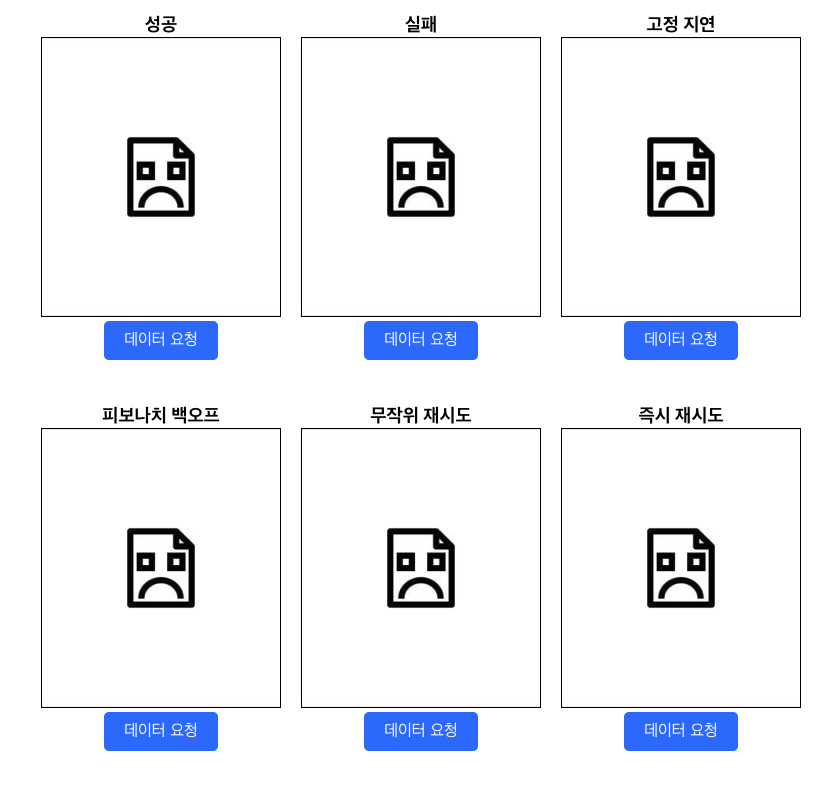
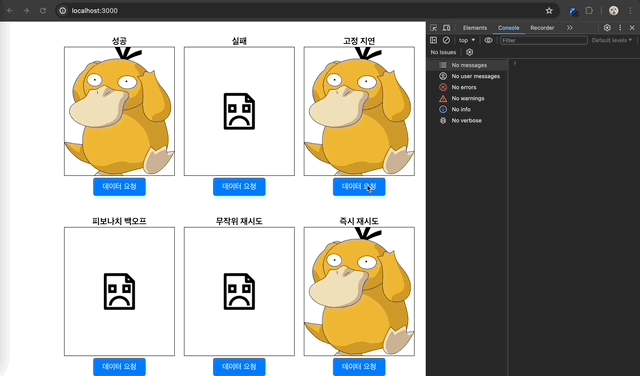

&nbsp;&nbsp;클라이언트에서 서버로 보낸 요청은 때로 예기치 못한 상황이나 일시적인 네트워크 문제로 원하는 결과를 얻지 못할 수 있습니다. 만약 요청에 문제가 없다면 사용자는 다시 이 요청이 처리되길 원할 것입니다. 지난번 참여했던 프로젝트에서는 올바른 요청에 대해서는 재요청을 보내는 로직을 추가해 이슈를 처리했습니다. 

&nbsp;&nbsp;사실 이미 재요청 관련 기능을 구현한 라이브러리가 있긴 하지만 라이브러리에 의존하기 보단 직접 필요한 기능을 구현하고 라이브러리와 비교해보며 재요청 관련 로직에서 필요한 기술 혹은 기능들에 대해 인사이트를 가지고자 이번 포스트을 진행하게 되었습니다. 포스트에서 다룬 프로젝트의 코드는 제 깃 [레포](https://github.com/PakaOxO/javascript-retry-api)에서 확인하실 수 있습니다.

<br>

### 목차
1. [프로젝트 생성](##프로젝트%20생성)
2. [가상 응답 환경설정 : MSW](##가상%20응답%20환경설정)
3. [커스텀 재요청 기능 구현](##커스텀%20재요청%20기능%20구현)
4. [후기](##후기)

<br>

## 프로젝트 생성

&nbsp;&nbsp;API 재요청 기능을 구현하기에 앞서테스트 환경 구축을 위해 리액트 프로젝트를 생성해주었습니다. 이 프로젝트에서는 각종 응답 상황과 재요청 방식 등을 구별해 테스트를 진행하기 `ApiTester` 컴포넌트를 아래와 같이 만들었고, 각각의 API 요청은 `ApiTester`가 처리할 예정입니다.

**ApiTester.tsx**

```tsx
const ApiTester: React.FC<IProps> = ({ target, type, retry = 0 }) => {
  const { loading, data, fetch } = useFetch();
  
  useEffect(() => {
    fetch(target, type, retry);
  }, [fetch, type, target, retry]);
  
  const refreshHandler = () => {
    fetch(target, type, retry);
  };
  
  return (
    <StyledContainer>
      {loading ? <ApiResultSkeleton /> : <ApiResult data={data} />}
      <ApiRefresher onRefresh={refreshHandler} />
    </StyledContainer>
  );
};

export default ApiTester;
```

<br>

&nbsp;&nbsp;`ApiTester` 컴포넌트는 아래 이미지와 같이 구성되어 있습니다. 상단의 박스에는 요청에 대한 결과로 `MSW`로부터 반환될 이미지가, 하단의 버튼은 API 요청/재요청에 대한 결과를 다시 살펴보기 위한 버튼이 그려집니다. 맨 위의 텍스트는 라이브러리로 구현할 재요청 로직별로 결과를 구별하기 위해 작성될 제목입니다.


<br>

&nbsp;&nbsp;`useFetch`는 클라이언트의 API 요청을 구현한 커스텀 훅입니다. `useFetch`는 요청이 처리 중인지를 나타내는 `loading`과 요청에 대한 결과값을 담을 `data`, 그리고 컴포넌트가 API 요청을 처리할 수 있도록 하는 `fetch` 함수 등을 반환합니다. `fetch` 함수의 `type` 파라미터는 재요청 주기를 결정하는 인자이며, `retry` 파라미터는 요청에 대해 `500`에러(서버 에러)를 받았을 경우, 정상적인 응답을 받을 때까지 재요청을 보낼 횟수를 의미합니다.

**useFetch.ts**

```typescript
import axios, { AxiosResponse } from 'axios';
import { useCallback, useState } from 'react';

const useFetch = () => {
  const [loading, setLoading] = useState<boolean>(false);
  const [data, setData] = useState<any>();
    
  const fetch = useCallback(async (url: string, type: string, retry: number) => {
    let result: AxiosResponse<any> | undefined;
    setLoading(true);
    
    try {
      // 이후 재요청 type에 따라 코드가 달라짐
      console.log(type, retry);
      result = await axios.get(url);
    } catch (err) {
      setLoading(false);
      setData(err);
      return;
    }
    
    setLoading(false);
    setData(result?.data);
  }, []);
  
  return { loading, data, fetch };
};

export default useFetch;
```

<br>

## 가상 응답 환경설정 : MSW

&nbsp;&nbsp;이제 API 요청을 처리할 `ApiTester`가 준비되었습니다. `ApiTester`는 `fetch` 함수를 통해 API 요청을 보낼 것이고, 요청이 완료되기 전까지는 로딩 화면을, 요청이 완료된 뒤에는 응답에 따른 결과(`data`)를 보여줍니다.

<br>

### MSW란?

&nbsp;&nbsp;이번 프로젝트에서는 `MSW`를 사용해 API 요청에 따른 가상의 응답을 반환할 예정입니다. MSW는 서비스 워커를 통해 클라이언트에서 보낸 요청을 중간에 가로채는 것이 가능합니다. MSW는 기본적으로 `Mocking`을 위한 도구로 개발 환경을 개선하기 위해 사용됩니다. MSW 및 Mocking에 대한 내용과 프로젝트에서 요청을 가로채기 위해 MSW를 세팅하는 과정은 [다음](./MSW.md) 포스트에서 다루었습니다.

<br>

### MSW Handler 리스너 등록

&nbsp;&nbsp;`handler.ts`에는 클라이언트가 보낼 요청에 대해 어떤 응답을 반환할지 각 API 요청 별로 로직을 작성했습니다. 기본적으로 모든 요청은 `/api`로 들어온다고 가정하고 요청 뒤에 `success`가 포함되면 `200`을, `fail`이 포함되면 `500`, 아무것도 없다면 30%의 확률로 `200`을 반환하도록 헀습니다.

**handler.ts**
```ts
import { HttpResponse, http } from 'msw';

const timeBuffer = (time: number) => new Promise((resolve) => setTimeout(resolve, time));

const requestRandomSuccess = () => Math.random() <= 0.3;

const handlers: any[] = [
  http.get('/api', async () => {
    const isRequestSuccess = requestRandomSuccess(); // 30% 확률로 성공
    
    await timeBuffer(1000); // 강제로 응답시간을 늦춤
    
    if (!isRequestSuccess) {
      return HttpResponse.json({ error: 'Internal Server Error' }, { status: 500 });
    }
    
    return HttpResponse.json(
      { imgSrc: 'https://i.pinimg.com/564x/93/a6/98/93a6981f87aa7ba217ad7f38f24b0af9.jpg' },
      { status: 200 }
    );
  }),
  http.get('/api/success', async () => {
    await timeBuffer(1000); // 강제로 응답시간을 늦춤
    return HttpResponse.json(
      { imgSrc: 'https://i.pinimg.com/564x/93/a6/98/93a6981f87aa7ba217ad7f38f24b0af9.jpg' },
      { status: 200 }
    );
  }),
  http.get('/api/fail', async () => {
    await timeBuffer(1000); // 강제로 응답시간을 늦춤
    return HttpResponse.json({ error: 'Internal Server Error' }, { status: 500 });
  }),
];

export default handlers;
```

<br>

## 커스텀 재요청 기능 구현

### 재전송 방식

&nbsp;&nbsp;재전송 방식을 구별하기 위해`App` 컴포넌트는 아래와 같이 6개의 `ApiTest`를 가지도록 했습니다. 코드를 통해 앞으로 구현할 재요청 로직의 방식은 크게 고정된 주기로 재요청을 보내는 `고정 지연`과, 요청 실패마다 재요청 주기를 늘려가는 `피보나치 백오프`, 랜덤한 주기로 재요청을 실시하는 `무작위 재시도`, 마지막으로 응답을 받는 즉시 재요청을 보내는  `즉시 재시도` 로 구성될 예정입니다.

<br>

**App.tsx**

&nbsp;&nbsp;아까 `handler`를 작성할 때 살펴보았듯, `/api`로 들어오는 요청은 30%의 확률로만 정상 응답을 받을 수 있습니다. 가상의 서버 오류를 가정하고 나머지 70%의 확률로 `500`에러를 받았다면 `type`에 지정된 재요청 방식에 따라 정상적인 응답을 받을 때까지 `retry`에 지정된 횟수만큼 재요청을 보냅니다.

```tsx
function App() {
  return (
    <div className="App">
      <StyledFlexbox>
        <ApiTester title="성공" target="/api/success" type="success" />
        <ApiTester title="실패" target="/api/fail" type="fail" />
        <ApiTester title="고정 지연" target="/api" type="constant-delay" retry={5} />
        <ApiTester title="피보나치 백오프" target="/api" type="fibonacci-backoff" retry={5} />
        <ApiTester title="무작위 재시도" target="/api" type="random-retry" retry={5} />
        <ApiTester title="즉시 재시도" target="/api" type="instant-retry" retry={5} />
      </StyledFlexbox>
    </div>
  );
}
```



<br>

### 재요청 기능 구현

&nbsp;&nbsp;지금까지 재전송 기능을 구현하기 전 필요한 설정은 모두 마쳤습니다. 이제부터 재요청 주기별로 구분되는 각각의 재요청 함수를 구현해보겠습니다.

<br>

**1. 고정 지연**

&nbsp;&nbsp;고정된 지연값을 가지는 재요청의 경우, 항상 일정한 리듬(`delay time`)에 맞춰 재요청을 실시합니다. 요청에 대해 잘못된 응답이 반환을 때 초기에 입력된 `delay`값의 시간이 지난 후 재요청을 실시합니다. 만약 남은 재요청 횟수(`retries`)가 0이었다면 오류를 발생시킵니다.

```ts
type TFnconstantDelay = (url: string, retries: number, delay: number) => Promise<AxiosResponse<any, any>>;

export const fetchWithConstantDelay: TFnconstantDelay = async (
  url: string,
  retries: number,
  delay: number
) => {
  let result: AxiosResponse<any, any>;
  
  try {
    result = await axios.get(url);
  } catch (err) {
    if (retries === 0) throw Error('All retries failed');
    console.warn(`Contant delay: ${delay}초 후 재요청`);
    await timeBuffer(delay);
    result = await fetchWithConstantDelay(url, retries - 1, delay);
  }
  
  return result;
};
```


<br>

**2. 피보나치 백오프**

&nbsp;&nbsp;피보나치 백오프 재요청 방식은 지연시간이 피보나치 수열에 따라 증가하는 방식으로 재요청 횟수가 증가할 수록 재요청 대기시간이 증가하지만 여기에서는 다루지 않은 `지수 백오프` 방식에 비해 너무 빠르지도, 너무 느리지도 않은 지연을 제공할 수 있습니다.

```ts
type TFnFibonacciBackoff = (url: string, retries: number, delay: number, baseRetries?: number | undefined) => Promise<AxiosResponse<any, any>>;

const calculateFibonacci: (depth: number) => number = (depth: number) => {
  let previous = 0, current = 1, temp;
    
  for (let i = 0; i <= depth; i++) {
    temp = previous + current;
    previous = current;
    current = temp;
  }
  
  return current;
};

export const fetchWithFibonacciBackoff: TFnFibonacciBackoff = async (
  url: string,
  retries: number,
  baseDelay: number,
  baseRetries?: number
) => {
  let result: AxiosResponse<any, any>;
  baseRetries = baseRetries || retries;
  
  try {
    result = await axios.get(url);
  } catch (err) {
    if (retries === 0) throw Error('All retries failed');
    // 재요청 횟수에 따른 depth를 계산해 depth번째 피보나치 수 반환
    const fibonacci = calculateFibonacci(baseRetries - retries);
    console.warn(`Fibonacci backoff: ${fibonacci * baseDelay}초 후 재요청`);
    await timeBuffer(fibonacci * baseDelay);
    result = await fetchWithFibonacciBackoff(url, retries - 1, baseDelay, baseRetries);
  }
  
  return result;
};
```

<br>

**3. 무작위 재시도**

<br>

**4. 즉시 재시도**


<br>

## 후기


<br>

**References**
- [자바스크립트를 이용한 재시도 로직 구현하기 - 번역](https://velog.io/@tap_kim/implement-retry-logic-using-javascript)
- [자바스크립트를 이용한 재시도 로직 구현하기 - 원문](https://anu95.medium.com/implement-retry-logic-using-javascript-e502693e0b5c)
- [Mock Service Worker](https://mswjs.io/docs/getting-started)
- [MSW](./MSW.md)