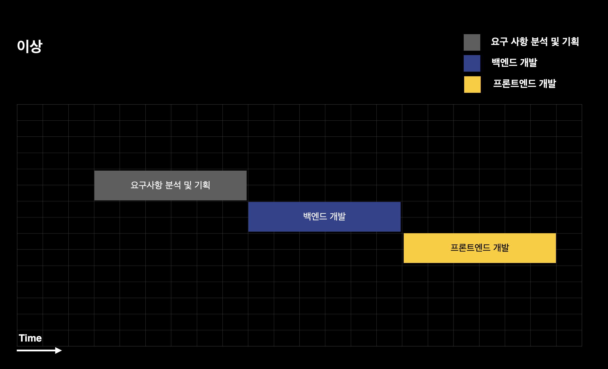
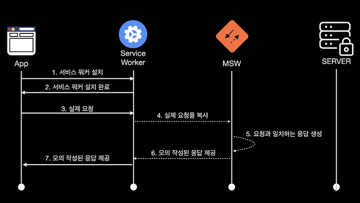

&nbsp;&nbsp;개발 프로젝트를 진행하면서 `Mocking`의 필요성을 느끼게 되어 대표적인 `Mock` 라이브러리 중 하나인 `MSW`의 도입을 프로젝트 팀에 권유해보려고 합니다. 이에 앞서 관련한 내용을 이번 포스팅을 통해 간단하게 다뤄보도록 하겠습니다.

<br>

### 도입 계기

&nbsp;&nbsp;몇 번의 서비스 개발을 진행하면서 느낀 점은 프론트엔드와 백엔드의 개발 진척상황 차이와 서비스의 특성상 불가피하게 프론트엔드의 개발 프로세스가 백엔드에 의존하게 된다는 점입니다. 프론트엔드는 서버로부터 받은 데이터를 토대로 화면을 그려야 하는데 이전에 프로젝트를 진행했을 때에는 만약 해당 API가 아직 개발이 완료되지 않았다면, 비즈니스 로직 사이에 더미 데이터(Mock)를 만들어 화면에 표시하곤 했습니다.

**이상적인 개발 프로세스**

&nbsp;&nbsp;아래 이미지는 카카오 기술 블로그에 한 개발자 분이 `Mocking`과 관련한 포스팅에서 참조했습니다. 그림과 같이 이상적인 개발은 백엔드의 개발이 완료되고, 프론트엔드가 서버 사이드로부터 API를 통해 데이터를 받아 렌더링하는 것이 좋습니다. 하지만 실제 개발은 백엔드와 프론트엔드가 병렬적으로 진행되는 경우가 많죠.



<br>

&nbsp;&nbsp;더미 데이터를 만들어 `Mocking`하는 방식은 빠르게 개발을 진행하는데에는 사실 크게 무리가 없습니다. 다만, 테스트를 위한 코드가 비즈니스 로직 여기저기에 포함되게 되고, 코드 관리가 용이하지 않다는 단점이 있습니다. 또 서버의 데이터에 액세스했을 때, 요청에 대한 성공, 실패, 오류 등 다양한 상황에 대한 로직을 구현하기 어렵습니다. 때문에 이번에는 본격적으로 `Mock` 라이브러리인 `MSW`를 사용해 API를 호출하고, 네트워크 수준의 `Mocking`을 진행해보고자 했습니다.

<br>

### MSW

>[!tip] Mock Service Worker (MSW) is an API mocking library for browser and Node.js. With MSW, you can intercept outgoing requests, observe them, and respond to them using mocked responses.

&nbsp;&nbsp;`MSW.js`는 `Mock Service Worker`의 약자로 `Service Worker`를 통해 `Request`를 가로채 MSW적절한 `Response`를 반환하게 끔 해주는 라이브러리입니다. 사실 네트워크 수준의 `Mocking`을 제공하기 위해서는 별도의 `Mock` 서버를 구축해 여러 요청에 대해 적절한 `Mock` 객체를 반환해주는 방법이 있습니다. 다만 이 방법은 서버를 구축해야한다는 관점에서 원치 않는 개발비용이 추가로 발생할 수 있습니다.

<br>

**MSW 구조, Feat. Service Worker**



&nbsp;&nbsp;`Service Worker`는 `MSW`에서 핵심 역할을 수행하는 기술입니다. `Service Worker`는 메인 스레드에서 벗어나 백그라운드 상에서 특정한 동작을 수행하는 프로그램입니다. 이전에 `Web Push`를 구현하면서 서버가 `Push`한 정보를 받아 `포어그라운드` 서비스로 전달하기 위해 `Service Worker`를 사용했었습니다. `MSW`에서도 메인 애플리케이션과 서버 사이에서 클라이언트의 요청을 가로채 `MSW` 프로그램에 전달하는 역할을 수행합니다.

<br>

### MSW 프로젝트 적용

**1. MSW 추가**

```bash
npm install msw --save-dev
or
yarn add msw --dev
```

&nbsp;&nbsp;먼저 `MSW` 라이브러리를 프로젝트에 추가해줍니다.

<br>

**2. `Service Worker`를 Public 경로에 추가

```bash
npx msw init <PUBLIC_DIR> --save
```

&nbsp;&nbsp;위 명령어를 실행하면 `PUBLIC` 경로에 `mockServiceWorker.js`가 추가됩니다.

<br>

**3. 서비스 워커 등록**

&nbsp;&nbsp;저는 `src/mock/`  경로를 별도로 만들어 다음 파일들을 추가해주었습니다. `browser.js`

```javascript
/* src/mock/browser.js */
const { setupWorker } from "msw";
const handlers from "./handlers";

export const worker = setupWorker(...handlers);

/* src/mock/handlers.js */
import { HttpResponse, http } from "msw";
// 처리할 요청들을 배열로 가지고 있습니다
const handlers = [
	http.get("/api/characters", ({ request, params, cookies }) => {
		const url = new URL(request.url); // queryString 받는 방법
		const name = url.getParams.get("name");
		
		return HttpResponse.json({
			/* 반환할 객체 정의 */
		});
	}),
	http.post("/api/characters"), ({ request, params, cookies }) => {
		/* Post 요청 처리 */
		return HttpResponse.
	}),
];

export default handlers;
```


<br>

**References**
- [MSW Docs](https://mswjs.io/docs/)
- [Mocking으로 생산성까지 챙기는 FE 개발](https://tech.kakao.com/2021/09/29/mocking-fe/)