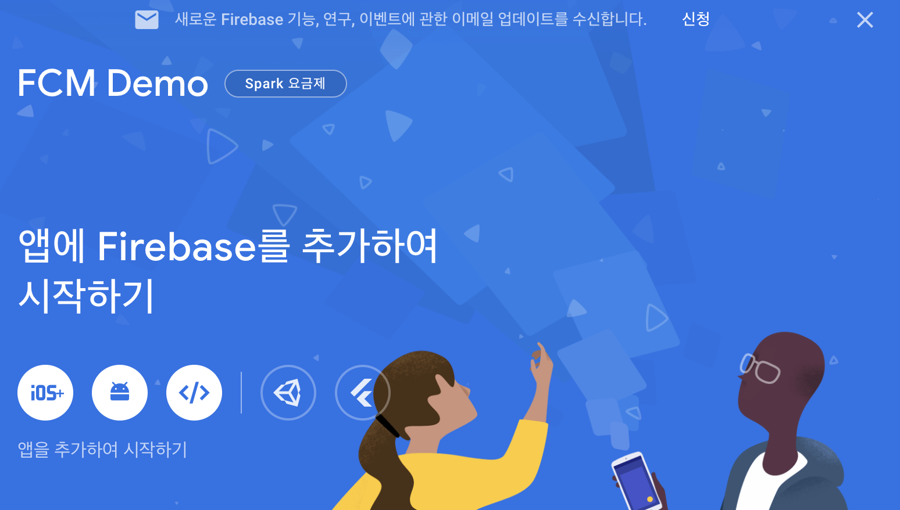
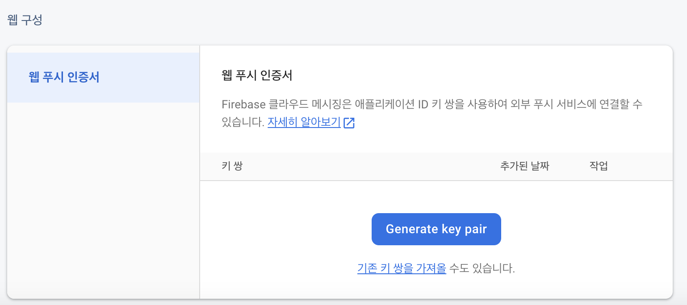

# Web Push 구현

웹에서 네이티브 앱에서 지원하는 기능들에 대한 수요는 꾸준히 있어왔습니다. 푸시 알림은 네이티브 앱에서 제공하는 강력한 기능 중에 하나였지만 이제는 웹에서도 이 기능을 사용할 수 있게 되었습니다. 웹의 사용성을 네이티브 앱과 같이 확장하기 위해 등장한 기술이 PWA(Progressive Web Application) 입니다.

## Progressive Web Application

  [공식문서](https://developer.mozilla.org/en-US/docs/Web/Progressive_web_apps/Tutorials/js13kGames/Introduction)에 따르면 PWA는 웹의 장점과 네이티브 앱의 장점을 결합하여 다양한 기술과 표준 패턴을 결합해 개발된 웹 앱이라고 합니다. PWA에서 제공하는 기술 중에 가장 대표적인 예시는 오프라인 동작, 설치, 동기화, 푸시 알림이며 PWA를 구현하기 위해서는 [서비스 워커(Service Worker)](https://developer.mozilla.org/en-US/docs/Web/API/Service_Worker_API)와 [Web App Manifest](https://developer.mozilla.org/ko/docs/Web/Manifest)에 대해 짚고 넘어가야 합니다.

### 🔧 서비스 워커(Service Worker)

  서비스 워커는 웹 어플리케이션과 서버 사이의 프록시 서버 역할을 수행합니다. 오프라인 기능과 네트워크 요청을 가로채거나, 서버에서 유지되는 데이터를 업데이트 하기 위해 사용됩니다. 서비스 워커는 작업자 컨텍스트에서 실행되기 때문에 DOM에 대한 접근권한이 없으며, 웹의 기능을 수행하는 다른 Javascript 코드와는 다른 스레드에서 실행되고 완전히 비동기식이기 때문에 XHR이나 Web Storage와 같은 기술은 사용할 수 없습니다.

  한 가지 알아두어야 할 점은 서비스 워커는 보안상의 이유로 HTTPS 환경에서만 실행되며, Firefox 브라우저에서는 프라이버시 모드에서 서비스 워커가 실행되지 않습니다.

  서비스 워커가 제공하는 기능은 여러 가지가 있지만 본문에서는 아래 2가지에 대해서만 간략히 다루겠습니다.

1. **오프라인 동작(Offline capabilities)**

  앞서 언급 했듯 서비스 워커는 브라우저와 서버 사이에서 프록시 서버처럼 동작합니다. 브라우저가 서버에 fetch 요청을 보낼 때 서비스 워커는 해당 요청이 캐시에 있는지 확인하고 만일 있다면 불필요한 요청을 보내지 않도록 합니다. 서비스 워커의 이러한 기술을 활용하여 PWA에서는  오프라인 동작 기능을 수행할 수 있습니다.

1. **웹 푸시(Web Push)**

  서비스 워커의 본질은 클라이언트의 Javascript 코드로 브라우저에서 백그라운드에서 실행되는 코드입니다. 백그라운드 환경에서 서비스 워커는 실행되고 있기 때문에 네트워크에서 Push 방식으로 전달된 데이터를 받을 수 있습니다. 

<aside>
💡 Pull VS Push
  Pull은 일반적인 브라우저와 서버의 통신 방식으로 브라우저가 서버에 fetch 요청을 보내면 서버가 fetch에 대한 결과로 응답하는 방식을 의미합니다. 반면 Push는 브라우저의 ‘요청’이 없어도 서버가 자체적으로 데이터를 밀어넣어(Push) 준다는 특징이 있습니다. 서비스 워커는 백그라운드 환경에서 실행되기 때문에 Web Push는 서비스 워커를 사용하여 구현할 수 있습니다.

</aside>

### 📄 Web App Manifest

  Manifest 파일은 웹 앱에 대한 설정들을 명시한 JSON 파일입니다. Manifest에 작성된 값들은 앱이 설치되었을 때 보여줄 정보, 이름, 아이콘 등의 데이터를 포함하고 있습니다.

## FCM(Firebase Cloud Message)

  서버에서 브라우저로 푸시 알림을 위해서는 웹 푸시 프로토콜(Web Push Protoco)l이라는 별도의 프로토콜을 사용해야 합니다. 웹 푸시를 사용하기 위해서는 VAPID라는 특별한 인증 방식을 사용하여 메시지를 암호화해야 합니다.

  웹 푸시 프로토콜을 따르는 라이브러리는 여러가지가 있지만 여기서는 파이어베이스 기반의 FCM(Firebase Cloud Message)를 사용하여 테스트 코드를 작성해보겠습니다. FCM에 대한 자세한 내용은 [공식문서](https://firebase.google.com/docs/cloud-messaging?hl=ko)를 자세히 설명되어 있습니다.

### React.js + Typescript + FCM을 활용한 웹 푸시 구독

1. **Install Firebase**

  FCM을 사용하기 위해서는 클라이언트에 firebase 라이브러리를 설치해야 합니다. 저는 이전에 작성해둔 채팅 테스트 프로젝트에서 설치해주었습니다.

```bash
npm install firebase
```

1. **Firebase 프로젝트 생성**

  Firebase SDK를 사용하려면 [Firebase Console](https://console.firebase.google.com)에서 새로운 프로젝트를 생성해야 합니다. 적당한 이름으로 프로젝트를 생성한 뒤, </>(웹) 버튼을 클릭하여 나의 웹 앱을 등록합니다(호스팅은 설정하지 않아도 됩니다). 이후 보여지는 Firebase SDK 코드를 복사해 나의 프로젝트에 App.js(React.js 기준)과 같은 depth에 파일을 하나 생성하여 코드를 붙여 넣어줍니다. 저의 경우에는 Firebase-Cloud-Message.js 라는 이름으로 생성해주었습니다.



  Firebase SDK 코드를 확인해보면 아래와 같이 작성되어 있는데 API KEY와 같이 외부로 노출되어 보안 이슈를 발생할 수 있는 요소들은 따로 환경변수로 관리하는 것이 좋습니다.

```jsx
// Import the functions you need from the SDKs you need
import { initializeApp } from "firebase/app";
// TODO: Add SDKs for Firebase products that you want to use
// https://firebase.google.com/docs/web/setup#available-libraries

// Your web app's Firebase configuration
const firebaseConfig = {
  apiKey: "<MY_API_KEY>",
  authDomain: "<MY_AUTH_DOMAIN>",
  projectId: "<MY_PROJECT_ID>",
  storageBucket: "<MY_STORAGE_BUCKET>",
  messagingSenderId: "<MY_MESSAGING_SENDER_ID>",
  appId: "<<MY_API_ID>"
};

// Initialize Firebase
const app = initializeApp(firebaseConfig);
```

1. **VAPID 키 자격증명**

  앞서 웹 푸시 프로토콜을 사용하기 위해서는 VAPID라는 표준 인증방식을 사용해야한다고 언급했었습니다. FCM에서는 VAPID 인증을 하기 위한 기능을 제공합니다. VAPID 인증서 발급은 [Firebase Console](https://console.firebase.google.com) 에서 다시 내 프로젝트 페이지 → 좌측 네비게이션 → 프로젝트 개요 옆 설정 버튼을 눌러 프로젝트 설정 페이지로 이동합니다. 이동한 페이지 상단 탭에서 클라우드 메시징을 클릭한 다음, **Generate key pair** 버튼을 클릭해 인증서를 생성합니다. 생성된 VAPID 키는 마찬가지로 보안을 위해 환경변수에서 관리합니다.


