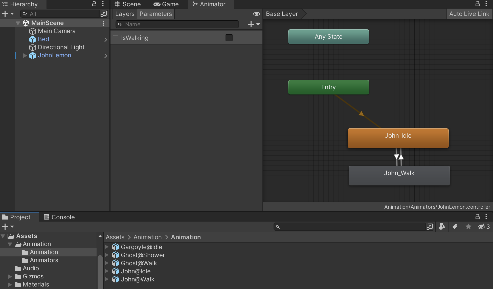
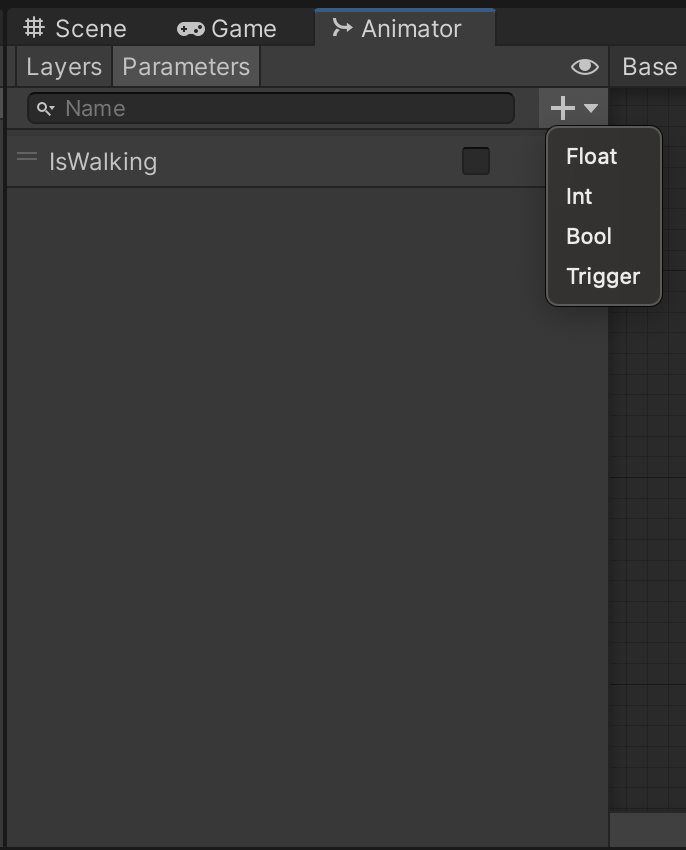
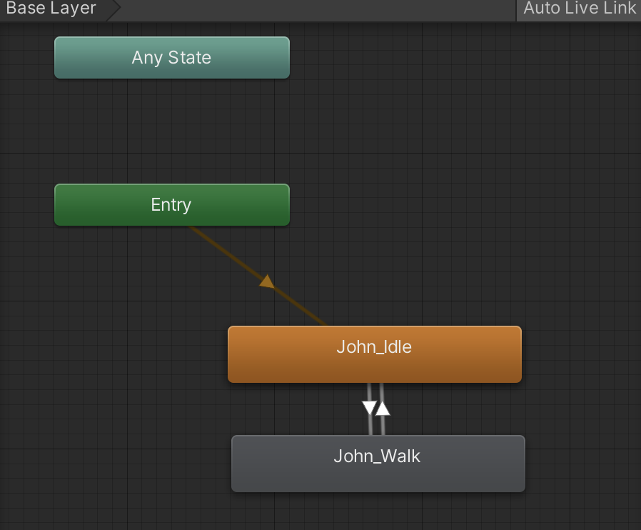

## **물체에 애니메이션 컴포넌트 추가**

---

&nbsp;&nbsp; 유니티 물체에 애니메이션을 추가하기 위해서는 Animator 컴포넌트가 필요하다. Animator 컴포넌트에는 Animation을 컨트롤 할 수 있는 Animation Controller를 지정할 수 있는데, Assets 내부에 Animation Controller를 생성하고 더블 클릭으로 실행하면 아래와 같은 화면을 볼 수 있다.

<p align="center">
    
</p></br>

<br>

### **Parameters**

---

&nbsp;&nbsp; Animator의 상태 머신은 Animator 파라미터의 현재 값의 영향을 받게 되는데 Animation Controller 상단 Parameters 탭을 클릭하면 float, int, bool, trigger 4가지 타입의 파라미터를 추가할 수 있고, Controller가 지정된 유니티 물체는 자신과 관련된 파라미터의 값에 따라 서로 다른 애니메이션을 실행하게 된다.

<p align="center">
    
</p></br>

**4가지 Parameter Type**

1. flaot : 부동 소수점 변수(소수점 포함)
2. int : 소수점이 없는 정수
3. bool : 참 또는 거짓
4. trigger : 값을 갖지 않는 특별한 형태의 파라미터로, 한 애니메이션에서 다른 애니메이션으로의 전환을 유발

</br></br>

### **base Layer**

---

<p align="center">
    
</p></br>

&nbsp;&nbsp; Animation Controller의 우측을 보면 Base Layer를 확인할 수 있다. 이 레이어에는 생성된 Animation을 추가할 수 있는데 가장 처음 추가된 애니메이션은 default state로 지정되어 가장 먼저 실행된다.

</br>

&nbsp;&nbsp; 각 상태머신은 paramter의 값에 따라 서로 다른 상태머신으로 전환이 이루어지는데 위의 그림에서는 isWalking의 bool 값에 따라 idle과 walk 상태로 전환된다.

<br><br>

### **Animator 컴포넌트에 레퍼런스 설정**

---

&nbsp;&nbsp; 스크립트 상에서 Animator가 지정된 물체에 대한 레퍼런스를 설정하는 방법이다. Start 메서드는 MonoBehaviour에 대해 가장 먼저 호출되는 메서드이므로 Start 메서드가 호출될 때 변수에 Animator 컴포넌트에 대한 레퍼런스를 설정한다.

```c#
Animator m_Animator;

void Start()
{
  m_Animator = GetComponent<Animator>();
}
```

<br><br>

### **Animator Paramter 설정**

---

&nbsp;&nbsp; 위에서 Animator 컴포넌트에 대한 레퍼런스를 지정했으므로 이제 애니메이션의 전환을 유발할 파라미터의 값을 지정할 수 있다.

```c#
m_Animatior.SetBool("IsWalking", isWalking);
```
